## 简介

这篇文章是《[编程之道]({})》的延续。个人认为从事软件开发工作有两件事比较忌讳，一是*只会说不会做*，二是*只会做，但不知道为什么要做*。所以接下来打算分享一下，关于我自己学习编程这十年来，认为真正有用的东西。这些方法和工具，可以降低软件开发过程所产生的摩擦；能够让小团队，以一种比较优雅的方式来开发和运维软件系统。

阅读这篇文章，你可以获悉如下知识：
* 敏捷开发、领域驱动设计（DDD）
* 影响地图、领域故事、事件风暴、快速原型设计、用户故事地图
* 单一代码仓库（Monorepo）、静态代码分析、架构决策记录（ADR）、C4模型、上下文画布
* 契约式开发（API Design-First）、行为驱动开发（BDD）、测试驱动开发（TDD）
* 尖叫架构、无头组件、设计令牌
* 模块化单体架构、端口-适配器架构、防腐层、命令查询职责分离（CQRS）、演进式数据库设计
* 单元测试、契约测试、架构测试、集成测试、验收测试、性能测试
* 服务网格、可观察性
* DevOps（GitOps + CI/CD）、基于主干开发（TBD）、功能开关、蓝绿部署、金丝雀发布、暗发布
* 站点可靠性工程（SRE）、混沌工程、基础设施即代码（IaC）
* 制作基线系统镜像、无人值守系统安装

以免篇幅过长，我不会详细讲解每项内容，但必要时会提供相关参考资料。另外，我也不会反复强调概念性的知识，因为我知道有部份人对概念性的东西比较抗拒。所以除非个人认为确实有这个必要，否则我会尽量以通俗的方式来展示它们。

与《[编程之道]({})》不同，要想谈论实现细节就无法避免编写代码（主要是 TypeScript、Python、Java，以及 Groovy）。但无需担心，因为我主要想表达的内容不是工具，而且使用的例子也比较简单。所以个人认为，不会因此而造成阅读障碍。

## 核心概念

### 敏捷开发
在软件工程发展初期，普遍采用的开发流程是*瀑布式开发*。这是一种线性模型，它的步骤通常包括但不限于*系统需求调研 > 软件需求调研 > 各种分析  >  各种设计  >  编码  >  测试  >  验收  >  部署 >  维护*。该模型最大的魅力在于它符合管理层思维。因为固定的工作模式方便估算和计划。但对于研发团队来说，它有两个致命的问题：
- 反馈周期太长：客户只在流程尾部参与验收工作。如果此时提出问题，那么返工成本就会剧增。严重起来甚至会导致项目失败。
- 过于理想化：要想该模型有效就必须能够确保每个步骤都正确无误，否则前面的错误会引发后面一系列错误。这本身就是一个不切实际的要求。因为人与人之间接收信息的能力有所差异，所以几乎无法避免理解偏差。而[墨菲定律（Murphy's Law）](https://zh.wikipedia.org/zh-cn/%E6%91%A9%E8%8F%B2%E5%AE%9A%E7%90%86)早就告诉我们，只要一件事存在出错的可能，那么它就一定会出错。而且据我所见，使用*瀑布式开发*的项目就没有一个是做得好的。

其实时间早就给了我们答案。现在几乎见不到纯粹的*瀑布式开发*。因为它根本就不科学，甚至可以说是一种错误。所以后来才有一群杰出的工程师，联合发表了著名的[敏捷宣言](https://agilemanifesto.org/iso/zhchs/manifesto.html)。

敏捷的目的是 *为了寻求更好的软件开发方法*。所以它才强调*乐于倾听、拥抱变化、以最大化客户利益为目标* 这些价值观。从开发层面，为了能够践行这种价值观，通常采取的开发策略是“*小步快跑，快速迭代*”，以及*在迭代循环中，持续并紧密地与客户合作*。

这种开发方式与*瀑布式开发*截然不同。因为它并不要求一开始就理解和规划所有东西，而只需分析出一个[最小可行产品（Minimum Viable Product，MVP）](https://zh.wikipedia.org/wiki/%E6%9C%80%E7%B0%A1%E5%8F%AF%E8%A1%8C%E7%94%A2%E5%93%81)即可。之后只需在该基础上进行增量迭代。更重要的是，它还将客户纳入到每个迭代循环中以缩少反馈周期。它不会勉强人类做一些超出自身能力范畴的决策，因为任何决策或者问题都可以灵活地安置在某个迭代循环中进行解决。

敏捷其实没有固定的流程规范，只要确保团队能够践行相关价值观即可。虽然市面上有一些声称为敏捷框架的东西（如：Scrum）。但即便采用这些框架，也不能代表确实在践行敏捷价值观。一定要提防形式主义和[古德哈特定律](https://zh.wikipedia.org/wiki/%E5%8F%A4%E5%BE%B7%E5%93%88%E7%89%B9%E5%AE%9A%E5%BE%8B)。另外，让敏捷持续有效的方法通常是自省。定期检讨问题，再根据需要来调整开发流程。所以从管理文化角度来说，越是传统的公司就越难实践敏捷。

### 领域驱动设计
*领域驱动设计（Domain-Driven Design，DDD）* 是一种经过验证，用来设计复杂业务系统的方法论。在欧美甚至有自己的[讨论社区](https://dddeurope.com/)。虽然 DDD 本身并不是什么复杂的东西，但它确实存在理解门槛。或者说，想真正理解 DDD，其实事前需要明确两件事。

DDD 必须基于敏捷开发。我经常见有人问“应该如何划分限界上下文（Bounded Context，BC）大小”。我在这给大家一个“标准”答案 — 它并不需要很精确。因为需求会一直变化，而且它完全可以在后续迭代中自然成型。不要试图期望一次就能够设计出完美的东西 —— 好事多磨。个人建议最好遵循“先大后小”的设计原则。这样做得好处是，可以在后续迭代中逐渐将不需要的东西排除出去。另外，DDD 强调，需要与*领域专家*紧密合作。这里的*领域专家*其实是指熟悉业务的人。他们可能是客户，又或者是懂业务的同事（如：产品经理）。设计人员需要和他们展开深入讨论，然后总结出已达成共识的*通用语言（Ubiquitous Language，UL）*。这些*通用语言*将会贯彻整个软件生命周期。例如包括但不限于用来*沟通、建模、编码、测试*等。

不要用开发（或编码）思维来理解 DDD，应该从设计角度思考问题。个人认为这是理解 DDD 最大的门槛。我之前有段时间一直在网上和人讨论相关问题。但发现有不少人认为，只要用了某种设计模式来写代码就叫  DDD（。[这和那些认为只要将应用容器化，或者用了某种声称是“微服务框架”的工具，就觉得自己在做微服务的人如出一辙]({})）。其实并非如此。DDD 本质上是一种*自上而下*的方法论。它强调的是*模型驱动设计*。简单来说，需要先从需求分析过程中建模得出 *（业务）分析模型*，然后再根据*分析模型*探索和设计出*领域模型*，最后再将*领域模型*映射为代码。换言之，*代码在 DDD 中主要承担的职责是，尽最大能力表达领域模型*。所以，在 DDD 过程中，代码其实并非关键。可能因为部份开发人员习惯了[ER 建模](https://zh.wikipedia.org/wiki/ER%E6%A8%A1%E5%9E%8B)的工作方式，所以思维总是自下而上。但这在业务系统设计中，其是一种错误实践 —— 我就没有见过用 ER 建模，然后还做得好的业务系统。只能算是“能用”的程度。但值得一提，因为 DDD 普遍使用*领域模型*，而它的设计成本相对较高。所以在方案选型时，应该根据实际情况来权衡。例如它并不适合以 CRUD 操作为主的应用。或者说，鉴于成本考虑，只需确保在 *（企业战略的）核心域*中应用 DDD 就可以了。

### 软件质量属性

软件质量属性是一种可测量和可测试的属性。所谓架构设计，其实本质上就是在各种质量属性之间进行权衡取舍。这些质量属性大体可以被划分为两类：
- 外部属性：为用户服务，被用户感知。例如，可用性、易用性、可靠性、性能 等。
- 内部属性：为开发团队服务，被开发团队感知。例如，可理解性、可读性、可维护性、可测试性、可伸缩性、弹性 等。

注意，当内部质量差到一定程度时，就会影响外部质量。此时，这种糟糕的状况不仅会降低开发效率，还会影响用户体验，甚至导致他们难以正常使用系统。

有人曾经做过[相关调查](https://ar5iv.labs.arxiv.org/html/2203.04374)。他们对 39 个（闭源）生产系统进行了分析。发现低质量代码的 BUG 数量比高质量代码多出 15 倍。而且在低质量代码中解决问题所需的时间将近是高质量代码的两倍。更重要的是，他们发现低质量代码会导致交付周期不确定（最糟糕的情况是被延长了 9 倍）。

> 这就是为什么我到目前为止，仍然对 AI 编码保持怀疑态度的原因。有句话说得好 —— 软件开发的瓶颈从来不是打字速度。当然，其实我并非在抗拒 AI 编码。但至少就目前而言，大部份人都仍然在摸索阶段，而且还有很多问题待解决。

关于软件质量问题，除了日常需要培养良好的专业素养之外，定期处理*技术债务*也至关重要。简单来说，技术债务与内部质量有关。当交付团队过度追求交付速度时，开发人员就很可能会采用一些不太妥当的实现方案来满足要求，从而导致内部质量下降。而这种不良做法所带来的代价就叫*技术债务*。但*技术债务*本身其实并非问题所在。因为真实工作中，被压榨时间是常态。问题在于*技术债务*应该被发现，然后得到解决。所以较好的做法是主动记录*技术债务*，并引入静态代码分析。


### 测试驱动开发

据我了解，*测试驱动开发（Test-Driven Development，TDD）* 这种编程理念最早源自 Kent Beck 的《[解析极限编程：拥抱变化](https://book.douban.com/subject/6828074/)》一书。个人很清楚，代码测试在国内其实并不普及。但它确实很有用。虽然在此之前我已经写过一篇[相关的文章]({})。但为了让当前文章饱满一些，重新写一下也无妨。

其实 TDD 的价值不止于代码测试。它还是*一种遵循测试优先的代码设计方式*。或者可以这么理解，我们最终得到的测试套件，只不过是 TDD 工作流的“副作用”。明白这一点至关重要。这也是我推荐 TDD 的主要原因 —— 是为了设计，而非测试。

TDD 工作流可以被简单概括为 *红-绿-重构* 循环
* <font color="red">红色</font>：针对未被真正实现的目标代码，编写一个只包含简单断言条件的测试用例。该用例会理所当然地失败
* <font color="green">绿色</font>：以尽可能简单和快速的方式实现目标代码，以求测试用例通过
* 重构：在不改变目标代码外部行为的情况下，优化内部结构。

一次 *红-绿-重构* 通常不足以完成目标代码。而且 TDD 也不建议一次过写太多代码。因为写得越多，引入 BUG 的机率就越大，而后续修复成本就会增加。所以建议最好采用增量迭代方式来完善代码实现。不难看出，这其实是编码层面的“*小步快跑，快速迭代*”实践。

从设计角度，TDD 最大的好处是，它强迫开发人员在编写目标代码之前先思考设计，从而提高最终实现的质量。如果不是这样，开发人员就会凭直觉写代码。这样写出来的代码通常会难以理解和使用。因为它们一开始就没有站在客户端角度设计和实现。而在 TDD 中，测试用例就相当于客户端。开发人员为了更加容易测试，就会有意或无意地使目标代码变得易于使用。我想这并不难理解。

值得一提，TDD 是一种需要额外学习的技能。并非会写代码就会 TDD。此外，如果目标代码足够简单，简单到不需要测试（当然不能盲目自信）。那么就不需要 TDD 或专门的测试用例。切记，不要为了覆盖率而编写大量低级测试用例。因为它们和普通代码一样需要维护成本。而且低级测试用例会极其不稳定。这也是为什么一些人会觉得代码测试没有用的原因。我不想说这些人不懂测试，但我建议大家可以考虑用集成测试来覆盖这部分代码。


## 开始

整个故事将围绕着“定制博客系统”这个需求展开。因为内容管理系统（CMS）一般比较简单，用它作为例子几乎不会造成任何心智负担，所以无需担心因为不懂业务而造成阅读障碍。

故事人物
* Chris：一名平时喜欢写博客的初级开发人员
* Dik（我）：受 Chris 雇佣，负责设计和开发博客系统

需要强调，接下来展示的方法和工具都只是例子。你不一定需要这样用。个人建议，要学会把工具放进工具箱，然后再根据需要进行选择。而不是试图用同一种工具去处理所有问题。要警惕[工具定律](https://zh.wikipedia.org/wiki/%E5%B7%A5%E5%85%B7%E8%A7%84%E5%BE%8B)。

另外，<font style="text-decoration: underline wavy; ">读者应该将当前例子想象成一个，具有一定复杂度的项目</font>。否则整件事就会不太合理。因为单纯一个博客系统其实可以做得很简单。

## 坚持使用直接、简单的方式来沟通

《[将工作可视化](https://book.douban.com/subject/37000152/)》的作者在书中提到，有相当大一部份人借助视觉工具（如：图表）可以提高信息吸收效率。我发现自己就属于这类人。有时单靠文字，会难以理解某些软件中的概念，但如果给我一张示意图或者内置有 GUI，那么我就可以在短时间内理解它。

这其实是一种启示。特别是与非技术人员进行交谈时就更加如此。所以在敏捷实践中，通常建议优先使用简单的工具（如：白板/纸、笔、便利贴、相机）来辅助交流，而不是专业软件。因为简单的东西不会对人造成心智负担，大家可以很快上手，然后融入其中。在交流结束后，可以用相机把内容记录下来，然后共享给其他人。必要时也可以将其转为其它电子格式。

## 先理解需求背景，而不是需求本身

在敏捷开发社区中，有这么一个观点：“只有真正理解用户目标并以此作为行动宗旨时，才能打造出优秀的软件”。类似的话还有“开发优秀软件的道路困难重重，但技术问题却很少造成阻碍”。个人很认同这些观点。因为在实际工作中发现，即便团队中有技术好的人也未必能做出好东西。情况可能恰恰相反。因为技术好的人一般只关注技术（或工具）本身，反而容易把问题复杂化 —— 经常如此。

为了践行这些价值观，可以借助一种叫*影响地图（Impact Mapping）* 的工具来达到目的。利用它，我们可以从沟通中发掘出“为什么要做”、“做什么”，以及“两者的因果关系”等信息。除此之外，还可以大致分析出日后需要交付的内容。

影响地图的组成结构很简单，它只包含 4 个问题
1. Why：目标是什么？
2. Who：该目标（Why）会影响到哪什么人？
3. How：这些人（Who）会有什么改变？或者需要做什么才能帮助达到该目标（Why）？
4. What：具体应该做什么？或者说，需要团队交付什么？

随即，我和 Chris 展开了第一次讨论，并得到了下面这张影响地图。
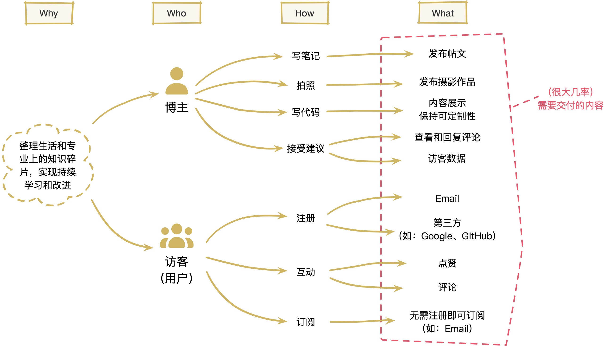
看吧，虽然这只是一张简单的示意图，但从该图中完全可以理解 Chris 的动机，以及日后可能需要交付哪些内容。而更重要的是，它们具有因果关系，可以作为交付优先级的参考。

💡 如果希望进一步了解影响地图，可以参考《[影响地图：让你的软件产生真正的影响力](https://m.ituring.com.cn/book/1395)》一书。

## 对齐业务理解

在进一步推进故事前，我认为有必要先澄清一下到底什么是业务。以免理解上有偏差。虽然这字眼经常被提及，但很多人的回答都不一样。以下是个人理解：
* 业务（能力）：为特定群体创造价值而展开的活动。这些活动会受到企业自身（或所在行业）的规则、流程约束
* 业务逻辑：不依赖软件的流程或规则。换句话说，即便没有数字化，这些流程和规则都依然存在

可以这么说，如果搞不清楚这些概念，其实是写不好代码的。因为一旦无法区分业务逻辑和应用逻辑，两者就会耦合，从而导致软件内部质量变差。

继续故事。

在交流期间发现，其实 Chris 目前正在使用 Hugo（一款名为静态网站生成引擎）来构建个人博客。但出于各种原因，他希望重新定制一个专用的博客系统。因此，我决定使用*领域故事（Domain Storytelling）* 来理解 Chris 目前博客的使用状况，以及痛点在哪里。

在对齐业务理解方面，领域故事是一种相当友好且自然的方法。参与者几乎不会有任何心智负担，因为只是讲故事和澄清某些已知的业务问题。

领域故事工作坊中的角色
- 讲者：负责讲述领域故事的人。通常是领域专家
- 主持人：负责引导讲者有条理地讲解故事，以及在必要关节上向讲者发出提问。与此同时，还需要跟随讲者的步伐在白板上绘制示意图
- 听众：关心业务，或者需要学习和理解业务的人

随即，我和 Chris 展开了第二次讨论。他负责担任讲者，而我则担任主持人。最后得到了如下示意图。
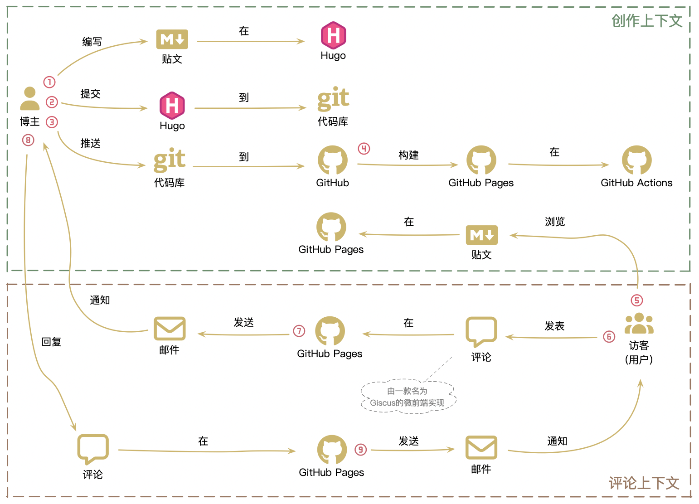
在 Chris 讲解故事期间，我很容易就划分出了创作和评论两个上下文。并且得知他希望两个上下文都重新定制，但需要保留目前的发布模型 —— 用 Markdown 创作，并通过推送代码库来完成发布。

严格来说，上面这张图在领域故事中属于 *As-Is* 故事图。它用于描述当前状态。如果只是希望讨论或者展示纯业务流程，则可以用 *Pure Domain* 故事图。例如下面这张图。
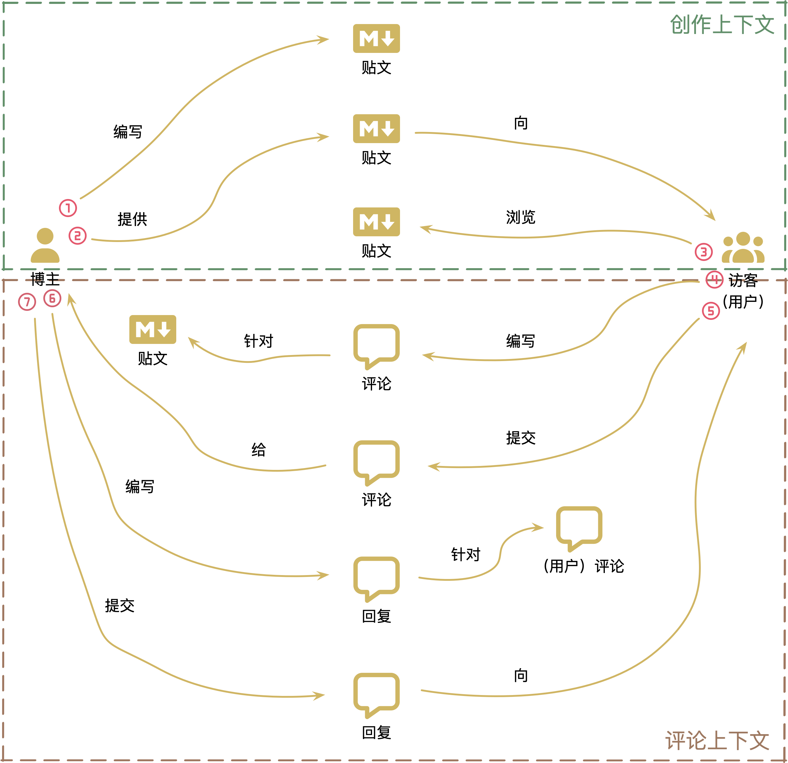

在这次工作坊中，我和 Chris 不仅对齐了业务理解，还完善了*通用语言* —— 图中的动词、名词，及其活动句子等。这为后续建模和编码提供了基础。

💡 如果希望进一步了解领域故事工作坊，可以参考《[领域故事会](https://book.douban.com/subject/36937772/)》一书。

## 进一步探索，以发掘更多细节

因为决定使用 *（DDD）领域模型模式* 进行编码实现，所以这次我觉得选择最为契合的建模工具 —— *事件风暴（Event Storming）*。

事件风暴工作坊主要使用的工具是便利贴。利用颜色差异代表不同的元素。虽然具体什么颜色代表什么并不是固定的，但社区常见做法如下：
- 橙色：具有业务价值的<font color="#D79449">领域事件（Domain Event）</font>
- 浅紫色：<font color="purple">策略</font>。一个由领域事件驱动的处理流程，而且通常会产生新的领域事件。注意，策略既可以由程序实现，也可以由人工实现
- 黄色：<font color="#F4D570">聚合/实体</font>。一个需要被上下文持续跟踪（具有生命周期）的业务概念
- 蓝色：<font color="#538CD9">命令</font>。会导致聚合状态发生变化的指令
- 黄色（小便利贴）：<font color="#F4D570">角色</font>。发起命令的用户
- 绿色：<font color="#99D58E">读模型/视图</font>。表示角色在发起命令之前需要得知的信息
- 粉红色：<font color="#EBC7D6">上下文/外部系统</font>。业务能力的逻辑边界。在该边界内，通用语言必须语义明确且一致
- 深粉红：<font color="#CA5E82">热点</font>。在当前阶段存在歧义的问题。表示后续需要进一步讨论

事件风暴的三种建模级别。它们没有严格的依赖关系，可以自行决定如何使用

Big Picture（全景建模）
- 用途：抽象级别最高。用于探索或疏理业务时间线，以及规划初步 BC 边界
- 便利贴：<font color="#D79449">领域事件</font>、<font color="#F4D570">角色</font>、<font color="#CA5E82">热点</font>、<font color="#EBC7D6">上下文/外部系统</font>
- 起始步骤
  1. 让领域专家尽可能罗列出所有领域事件
  2. 根据领域事件发生的先后顺序从左往右排列

Process Modeling（流程建模）
- 用途：疏理某个具体的业务流程。明确业务规则，并确保没有歧义和遗漏
- 便利贴：在 Big Picture 的基础上加上 <font color="#538CD9">命令</font>、<font color="purple">策略</font>、<font color="#99D58E">读模型</font>

Software Design Modeling（软件设计建模）
- 用途：针对当前需要编码实现的部分进行设计。明确聚合边界，以及各实体之间的协作关系。在该工作坊中，领域专家不是必须的
- 便利贴：在 Process Modeling 的基础上加上 <font color="#F4D570">聚合</font>

个人认为，对于非技术人员来说，事件风暴的门槛要比领域故事高不少。感觉光是解释什么是*领域事件*就比较费劲。所以一般做法是，不要使用专业术语，而是尽可能用非技术人员容易适应的称呼。譬如将“领域事件”改为“事件”、“读模型”改为“信息”、“聚合/实体”改为“数据”，诸如此类。

继续故事。

虽然经过前面两次工作坊后，我已经大概知道该系统需要实现点什么。但从细节层上来看仍然有些不足够。所以我决定和 Chris 展开第三次讨论，目的是让他澄清更多的细节信息。（以评论上下文为例）这次工作坊得到了如下示意图。
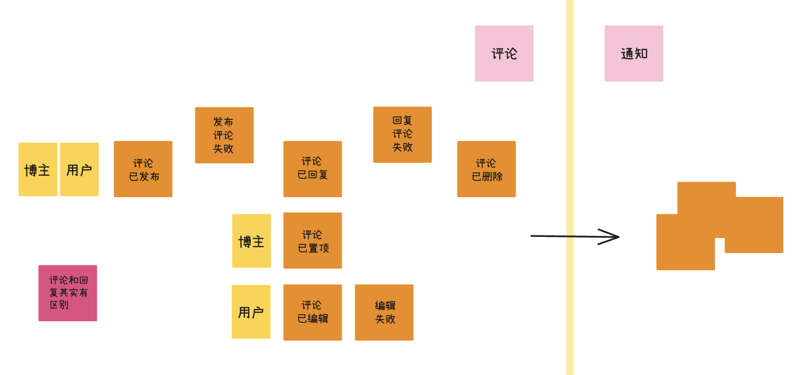

和预期一样，经过这次工作坊我得到了更多的细节信息。而且将通知从评论上下文中分离了出来。这是因为在现阶段我已经明确得知用户可以订阅博客，并且会在新作品发布时得到通知。而且评论和通知本身就属于松耦合关系，所以将它们分离不会有任何问题。

> 假设有两个对象 a 和 b，并且它们之间存在依赖关系。现在需要对它们进行修改。如果变更其中一方时，另一方也需要修改，那么它们就属于*强耦合*。否则就属于*松（散）耦合*。

因为 Big Picture 本身比较简单，所以我没有进行 Process Modeling，而是顺势进入了 Software Design Modeling。以下是产出示意图。
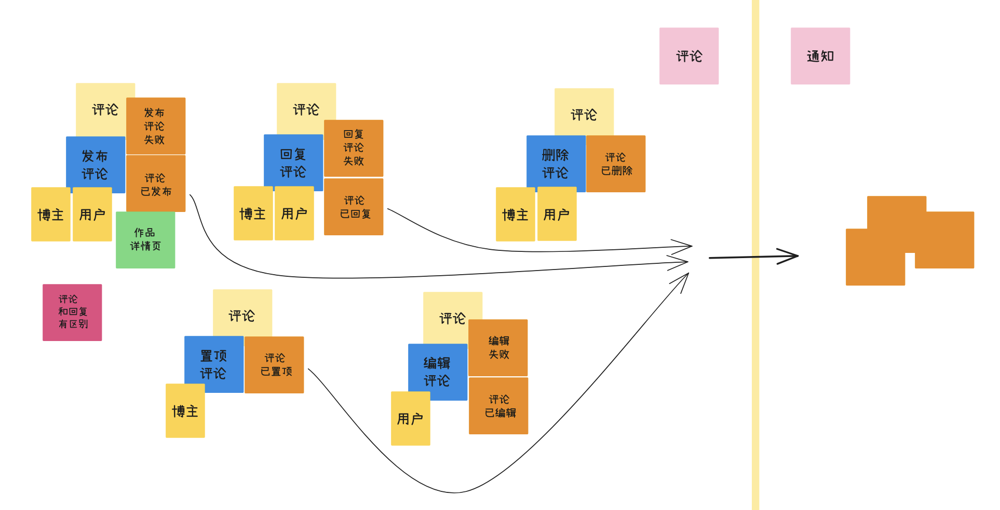

可以看到，与 Big Picture 相比其实变化不大，只是补充了一些设计元素。

💡 如果希望进一步了解事件风暴工作坊，可以参考：[EventStorming](https://www.eventstorming.com/)

## 使用快速原型设计来获取客户意见

到目前为止，其实已经有足够的信息支撑我展开编码工作。但因为我两都尊重敏捷价值观，希望做出一个“好”而不是“能用”的软件。所以仍然有一些工作可以做。

我决定使用*快速原型设计*来验证 UI 猜想。快速原型设计是指，用最快的方式来模拟系统未来状态，并以此作为验证手段来获取反馈的过程。因为在软件工程中有一个观点：客户在一开始通常不知道自己要什么（或者说，不太会表达想要的东西），直到他们见到实物（如：UI）才会有各种想法。这就是快速原型设计的价值所在。它可以缩短需求暴露周期，从而减少潜在的需求变更数量。

所以我用线框画图工具快速地制作了一个 UI 原型，并向 Chris 征求反馈意见。
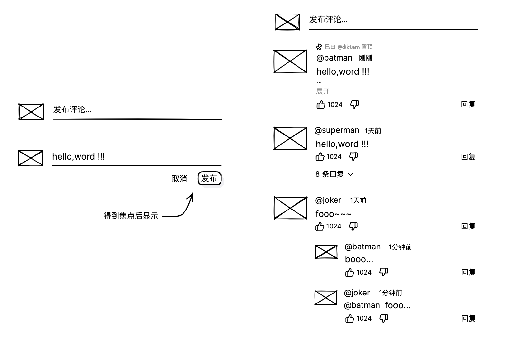
庆幸的是 Chris 很满意，因为这是参考 YouTube 设计的。

注意，其实快速原型设计并非 UI 专属。但凡在展开编码工作之前，存在某种疑问或者希望验证一些东西时，都可以透过该方法来进行验证。譬如，我可能想，比较一下同一个功能的不同实现方案，然后根据比较结果来决定最终方案。此时我就会使用未经设计的一次性代码，并以一种尽可能快的方式将它们做出来。至于是否真的必须做到百分百完成度，其实并不重要。因为只要能够得出结论，就已经达到了目的。其实 AI 工具非常擅长这方面的工作，因为它足够快。而且在这种场景下，我无需担心它的代码质量。因为它们会用完即弃，不会延续到生产环境。

## 规划发布路线

正如前文所说，在敏捷开发中不会一次过分析和设计整个软件，而是采用增量迭代的方式循序渐进地实现和完善。虽然前面几个工作坊貌似已经探索了大部份内容，但这只是因为例子简单而造成的错觉。通常情况下，只要有必要，就会开展不同类型的工作坊来理解和完善设计。它们都是迭代循环中的工具。

现在我需要规划第一个交付版本， 也就是*最小可行产品（MVP）*。MVP 只需包含最基本的核心业务功能，因为该版本主要用于客户验证。譬如验证客户的使用感受。因为客户在使用系统过后，很可能会有各种意见，又或者决定后续交付内容的优先级等。如果在一个版本中交付太多内容，那么潜在的[变更成本](https://www.pmi.org/disciplined-agile/agile/costofchange)就会增加。

虽然*影响地图*也能够发现交付内容的优先级，但它没有*用户故事地图*直观。而且个人认为最适合用来寻找 MVP 的工具就是*用户故事地图*。

> 用户故事是一种承载需求的媒介。它并不需要描述完整的需求。因为它只是一种引子，用来提醒交付团队需要针对某个需求展开讨论。所以不少敏捷团队都会用它来征集软件需求。而用户故事地图则是按照一定的逻辑顺序和规则将相关用户故事组织起来。

因此，我和 Chris 展开了第四次讨论，目标是确定 MVP 版本应该包含什么内容。以下是这次工作坊中得到的示意图。
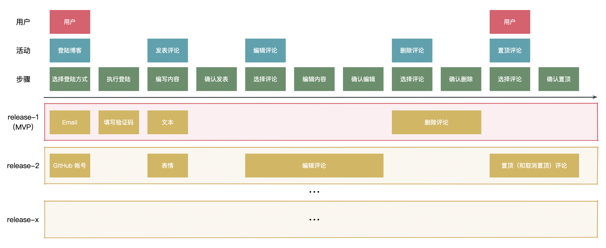

> 以评论上下文为例是因为写作需要。正常情况下，博客系统的 MVP 应该是创作上下文。

💡 如果希望进一步了解用户故事地图，可以参考《[用户故事地图](https://book.douban.com/subject/26760348/)》一书。

## 确认验收标准

不得不说，我之前待过的团队都没有该环节。或者说“验收标准”就是 QA 人员自己的理解，或者是直觉。这很糟糕。个人认为，但凡跨职责协作都应该有相关标准或者规范（就如同 API 规范一样）。只有这样才会少一些扯皮和甩锅。另外，如何需求涉及客户，那么让客户确认验收标准也至关重要。因为交付团队本质上不是为自己做软件。所以如果有必要，甚至应该让其签字确实。

至于该活动应该如何进行，可以让客户遵循 [Gherkin](https://cucumber.io/docs/gherkin/reference) 规范来编写验证标准。例如，以下是我要求 Chris 给出的其中一个例子：

```
功能: 评论
  场景: 用户针对贴文进行评论
    假设: 用户已经注册
    并且: 已经登陆
    当: 用户编写完评论
    并且: 点击了发布
    那么: 当前评论应该出现在评论区域
```

出于成本考虑，通常不需要为每个功能路径编写验收标准。一开始只需关注重要的部分即可，譬如[乐观路径](https://en.wikipedia.org/wiki/Happy_path)。另外，一旦验收标准被确认，相关 Gherkin 文件就应该得到版本管理。因为它们既是规范也是契约，所以不应该被随意修改。除非经过协商并得到同意。

## 技术选型

### 前后端分离架构

因写作需要，决定采用*前后端分离架构* —— 这也是目前企业比较普遍的做法。

> 关于前后端分离问题，其实现在[有人将其视为一种反模式](https://www.thoughtworks.com/insights/blog/dividing-frontend-backend-antipattern)。
\
\
他们的观点认为，如今前端已经和后端面临着同样的问题。例如*可测试性、架构、异步、状态管理*等，这些原本属于后端的工作逐渐在前端出现。而该问题正在加大开发摩擦。譬如，会话状态应该由谁来管理、变更 API 会影响前端、前后端人员在 API 职责上存在歧义 等，这些都是摩擦，需要协调。而更大的问题是，按（前后端）职能来划分工作任务容易引发*信息孤岛*，不利于高质量地完成工作，而且还容易出现互相推卸责任的情况。
\
\
个人理解，以上问题并非前后端分离所致。而是（团队）组织架构层面的问题。其实现代软件工程更鼓励按照业务能力来划分团队，以及允许跨职能工作。换句话说，不严格区分前后端人员，除非任务极具专业性。

注意，*契约式开发（API Design-First）* 才是前后端分离团队正确的协作方式。据了解，大多数团队只是在技术层面上进行了分离，但工作层面仍然耦合严重。比较典型的例子是*后端驱动开发*。在该工作模式下，前端往往需要等待后端完成设计 （甚至完成开发 ） 才能完善自己的工作。这样不仅会推迟集成，而且最后大概率会因为 API 设计不周而需要返工。所以较好的方案是，在开展编码工作之前，双方先一起进行 API 建模和设计。这样做的好处是，能够得到一份被双方认可的 *API 契约*。在此之后，相关人员（包括 QA 在内）只需遵循这份 *API 契约*就可以并行地开展各自的工作。甚至可以利用代码生成器，直接根本契约来生成相关实现代码。

在契约开发中，代码生成器其实不仅仅是一种提效工具，它还是一种校验工具。因为一旦契约发生变化，代码就会改变。此时借助编译工具可以轻而易举地发现相关改动。这有利于提前暴露集成问题。但要注意，代码生成器无法覆盖所有场景（如：限制属性值的范围）。针对该问题，可以引入*消费者驱动的契约测试*来进行补充。它的工作流程也很简单，（前端）消费者负责针对特定场景定义请求和响应格式，然后基于测试用例生成相关契约文件。而（后端）提供者则负责根据契约文件实现相关 API。当前项目使用 Pact 实现该需求。

> *消费者驱动的契约测试*无法替代 *API 契约*。因为后者使得工作能够并行化，而前者则无法做到这一点。


### DevOps

在传统组织架构中，软件会先由开发团队开发，然后交给实施团队部署，最后交由运维团队确保日常运作。但这种工作方式会一定程度降低交付质量。因为开发团队无需承担实施和运维的责任，所以自然地就无意去确保后续工作的简易性 —— 软件可能难以部署和维护。而且在交付软件后，很可能会马上投入到其它项目中。此时如果后继团队遇到问题，其处理成本就会增加。类似的问题会蔓延到各个环节，最终导致团队之间的矛盾加剧。

DevOps 就是为了化解这些矛盾而诞生。所以它才提倡 “你构建，你运行” 这一核心理念。实际上 DevOps 只是一种研发团队文化，与具体技术无关。这种文化呼吁交付团队应该将软件视为持续性的产品，而不是阶段性，可以丢弃的项目。所以不难理解，如果交付团队要想实践这种文化，就必须做到“持续参与”。确保不同职能人员之间的工作能够互相融合。因为只有“互相干预”，大家才会上心。而不是“你的事，不关我事”。

为了践行这种文化，个人认为比较有效的方法是，落实 GitOps 和 CI/CD 实践。

GitOps 是一种，以代码库为唯一真理来源的运维方式。在该实践中，相关人员只需通过修改配置（或代码）就能完成软件交付和运维工作。如果结合 CI/CD 和[基础设施即代码](/posts/vintage-software-development/#基础设施即代码) ，甚至可以做到完全自动化运维。

CI/CD 可以说是落实 DevOps 文化的核心手段。因为它能够作为“持续参与”平台。其中 CI（持续集成）负责集成所有人的工作内容。而 CD（持续交付）则负责软件交付工作。两者存在依赖关系，CI 需要向 CD 交付可部署的软件构件。

当前项目选择了 Argo CD、Argo Rollouts，以及 GitHub Actions 来支持 GitOps 和 CI/CD 相关实践。

### 单一代码仓库
 
*单一代码仓库（Monorepo）* 是一种代码库组织策略。简而言之就是，把系统所有代码放在同一个库中进行管理。该策略能够一定程度打破*信息孤岛*，并促进团队成员跨职能协作和学习；而且还可以降低集成成本。所以目前该策略被不少大公司青睐（如：Google、Meta、Microsoft）。

### 前端

目前已知的需求
- 对于内容系统而言，SEO 比较重要。所以 Web 应该属于 *服务端渲染（SSR）* 或 *静态站点生成（SSG）*
- Chris 希望保留目前的发布模型
- 当我再次浏览*影响地图*时发现，Chris 希望内容展示部分能够足够灵活和可定制

结合这些需求，我决定继续延用*静态网站生成引擎*作为解决方案。目前发现比较适合的工具是 Astro 和 Svelte。因为它们都足够简单。前者内置  Markdown 支持，负责生成静态内容和页面。而后者则用于 Web 组件开发。它们完全能够胜任创作上下文的需求 —— 至少目前来说是这样。

### 后端

由于先前已经决定采用 *（DDD）领域模型模式* 进行编码，所以会优先考虑支持 *面向对象（OO）* 规范的编程语言。当前项目决定选择 Java 和 Gradle。其实即便是现在，无论 生态、特性、性能、兼容性，还是市场，Java 的表现都十分出色。并非一般工具能够取代。所以多年来一直是企业级开发的首选。

API（协议）层面将会使用库来实现，而非框架。原因早在《[编程之道]({})》中提及 —— 高抽象的工具会丧失一定的灵活性。个人认为，对于一个需要持续演进的系统来说，为了少写几行代码而丧失灵活性（主要是设计的自由度）并不值得。所以当前项目决定使用 Vert.x。它是一个渐进式的反应式应用开发工具集。目前生态还算不错，支持大部份常用协议和功能场景。能够覆盖一般开发需求。

数据库方面，我决定使用 PostgreSQL  和  JOOQ。主要原因是，功能比较丰富。而且在数据量不大的情况下，关系型数据库其实适用于大部份场景 —— 几乎总能作为默认选择。特别是高版本的关系型数据库，不论 MySQL 还是 PostgreSQL，都支持 JSON 数据类型。所以现在它们不仅支持严格的 ACID 特性，还支持半结构化模型设计。这种灵活性对于刚起步（设计还不太确定）的系统来说，有莫大好处。而  JOOQ 则是一个类型安全的 SQL 库。其灵活性和可扩展性较高，是目前个人比较推荐的持久化工具。另外，我还会引入*渐进式数据库设计*。这是一种用于记录关系型数据库迁移历史的技术 —— 迁移（Migrate）这个术语泛指增量变更。它可以降低开发人员和数据库管理员（DBA）之间的协作摩擦。因为生产数据库很可能不由开发人员管理。此时开发人员就需要将所有变更的 SQL 交给 DBA。但就个人而言，有时可能会忘记做了哪些变更。而该技术就可以优雅地解决相关问题。目前常见方案有 Flyway 和 Liquibase。当前项目选择前者，因为它相对简单。

至于*架构风格*方面，我会优先采用*模块化单体*。其实大部份场景下，只要设计得当，单体架构的优势远比想像中大。特别是项目初期，调整设计的成本会更低。而且实际上，并非所有团队都有能力设计和维护分布式系统。很多人低估了它的复杂性，导致最终开发出[分布式单体系统 —— 一种集合了单体和分布式所有缺点的架构]({})。

### 部署环境

软件部署本身并没有什么标准方案。严格来说，如何部署软件完全取决于交付需求 —— 定制化软件更是如此。但如果问我的话，个人会建议优先考虑容器化。

容器化是现代 Web 软件的标志之一。如果你不知道我在说什么，或者可以去 GitHub 逛一下。几乎所有新的 Web 项目都支持容器部署。当然，我并非因为它是一个“标志”，所以建议大家考虑容器化。

在软件交付方面，容器化已经是一种标准规范（如：OCI）。在此之前，只有类似于 Java 这种使用虚拟机运行的软件才能做到跨平台。但如今几乎所有软件都可以基于容器化来做到这点。更重要的是，容器化之后，无需再担心因为环境差异而导致部署失败 —— 除非硬件不匹配（如：CPU 架构不支持、资源不足）。

在技术方面，目前几乎所有先进的解决方案都优先（甚至只）支持容器环境。例如当前项目的解决方案之一，Argo CD 和 Argo Rollouts 就只支持 Kubernetes 环境。除此之外，像混沌工程、服务网格此类实践，在容器环境中也支持得很好，而且通常更加简单。

所以，当前项目会优先支持容器部署方案。而运行时选择 K3s —— 一个支持单节点部署的轻量级 Kubernetes。

> 通常而言，开发活动不会只有一个软件环境。例如至少会有测试和生产两个。我发现个别团队会在不同环境中使用不同的运行时。不要这样做，不要增加无谓的负担。所有环境都应该尽可能保持一致，否则出现线上问题就可能会难以复现。相较之下，统一环境有利于提升操作能力和熟练度。而且在遇到问题时，往往可以更好更快地处理。


## 契约优先

前面已经说过，前后端分离正确的工作方式是契约式开发。所以在展开编码工作之前，相关人员应该先根据已知信息（如：软件模型、快速原型设计 等）进行 API 建模。

建模过程最好是自上而下。因为过早摄入底层细节会让问题变得复杂，把控不好甚至会偏离真实需求。所以，可以先从需求中提取出相关操作，并记录在一个简单的表格中。

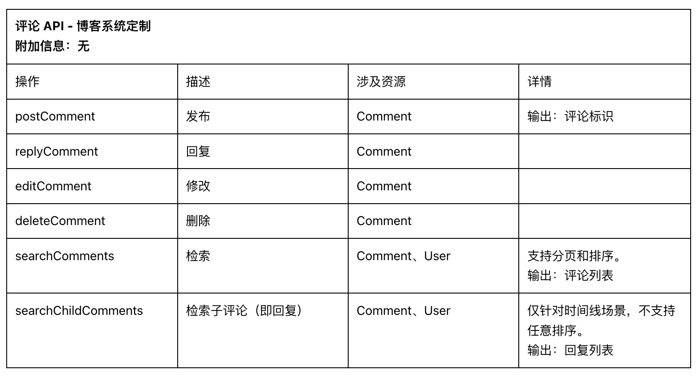

结束“操作建模”后，可根据需要选择具体的 *API 风格*，然后执行进一步设计。以当前项目为例。因为打算采用 [CQRS 模式（相关内容参考下文）](/posts/vintage-software-development/#cqrs) ，所以决定同时支持 GraphQL 和 RESTful 两种 *API 风格*。

**读模型（GraphQL Schema）**
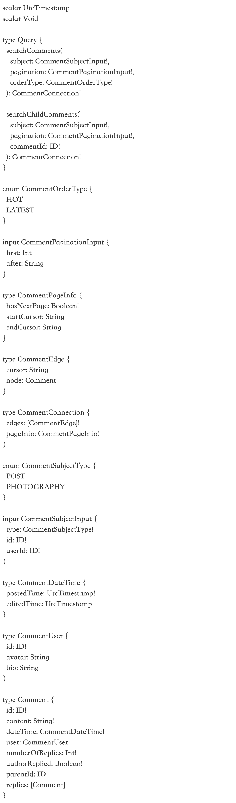

**写模型（RESTful OpenAPI）**
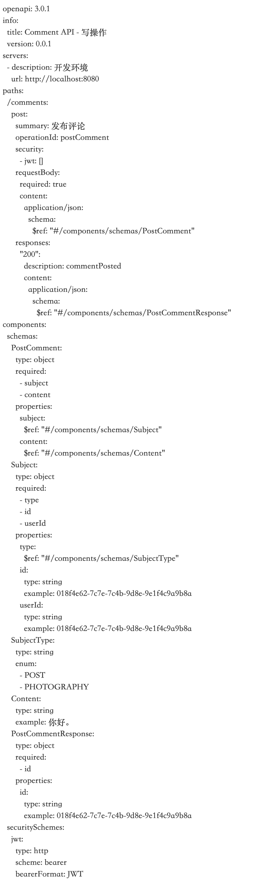

💡 如果希望进一步了解契约优先，可以参考《[Web API设计原则](https://book.douban.com/subject/36683614/)》一书。

## 单一代码仓库

以当前项目为例。
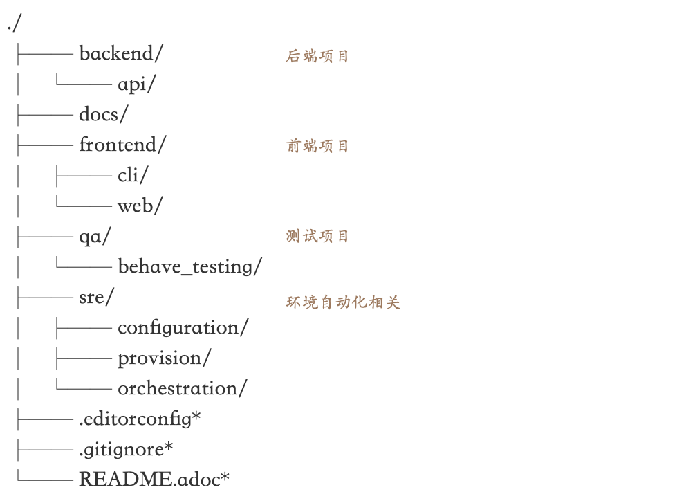

## 静态代码分析

### 是什么？

静态代码分析是指，检查源码（或静态文本）是否符合编码规范，以及是否存在[异味代码（Code Smell）](https://zh.wikipedia.org/wiki/%E4%BB%A3%E7%A0%81%E5%BC%82%E5%91%B3)。它的目的也很明显，希望规范化开发人员的编码行为。因为在协作开发中，每个人都可能有各自的风格。这会导致代码的可读性变差，从而降低工作效率。

就目前而言，静态代码分析比以往更加重要。因为越来越多人开始使用 AI 辅助工具来编程。而 LLMs 输出的内容，实际上来自于网络的各个地方。它们不仅存在[版权争议](https://techcrunch.com/2025/12/05/the-new-york-times-is-suing-perplexity-for-copyright-infringement/)，而且风格也参差不齐。

它的工作逻辑很简单。先由开发人员定义规范，然后将规范和源码作为静态代码分析工具（统称 Linter）的输入，最后 Linter 就会根据规范给出相应的分析报告。
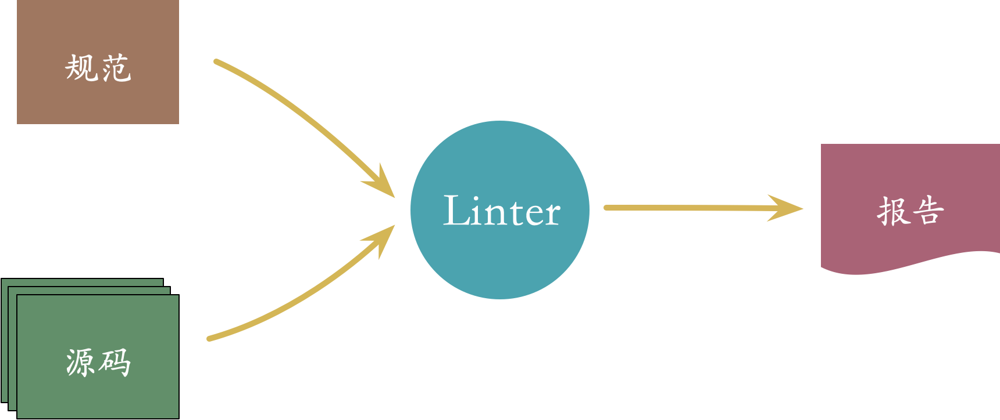

> 代码分析工作，一般会在开发和（项目）构建两个阶段中进行。前者的反馈时间短，利于开发人员纠错。后者将其视为“质量门槛”，用于兜底 —— 预防不自觉的开发人员。

### 一个简单例子

每种编程语言和数据序列化格式（如：JSON、XML、YAML）都有自己的 Linter，而且通常还不止一种。例如，Java 有 pmd 和 checkstyle；JavaScript 有 eslint 和 prettier；SQL 有 sqlfluff、Dockerfile 有 hadolint 等等。

当前项目选择的方案是 [MegaLinter](https://megalinter.io/latest/)。它相当于是一个 Linter 门面工具，内置了很多常用的 Linter。

以分析 YAML 为例，需要用到的 Linter 是 yamllint。首先是定义 YAML 规范。
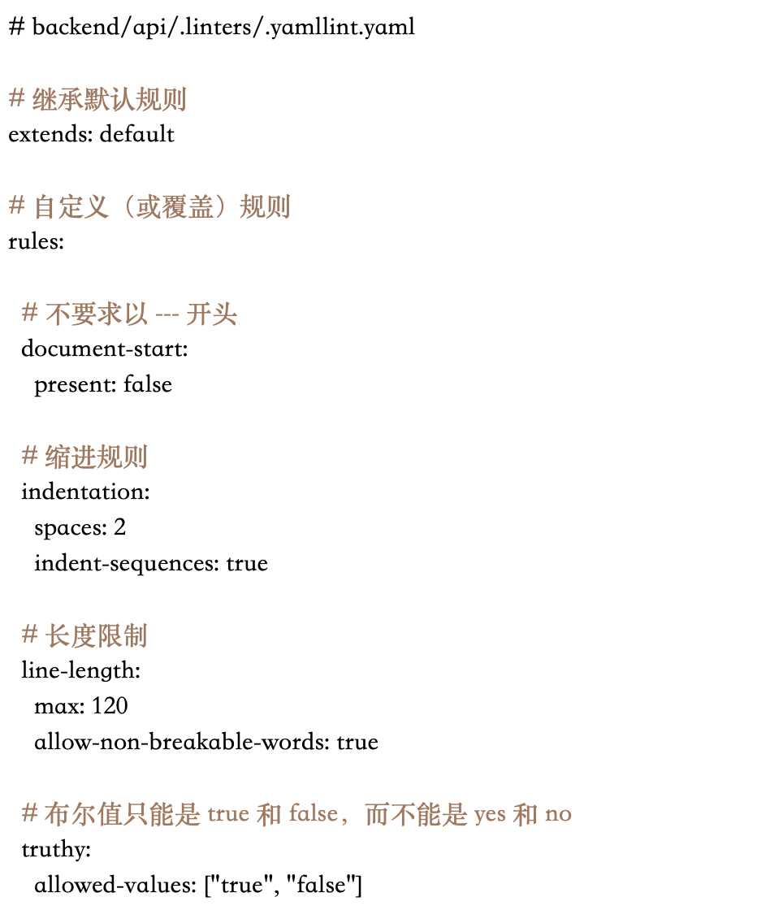

然后是配置 MegaLinter。
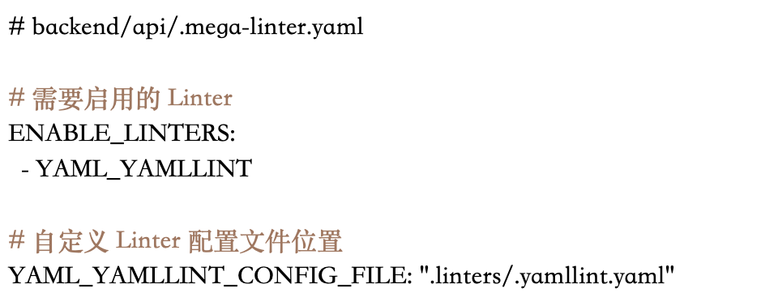

最后通过以下命令运行 MegaLinter。
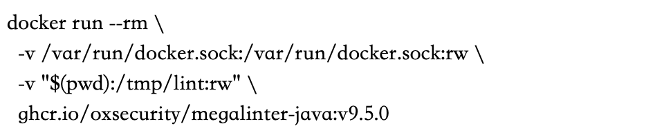

控制台输出如下。
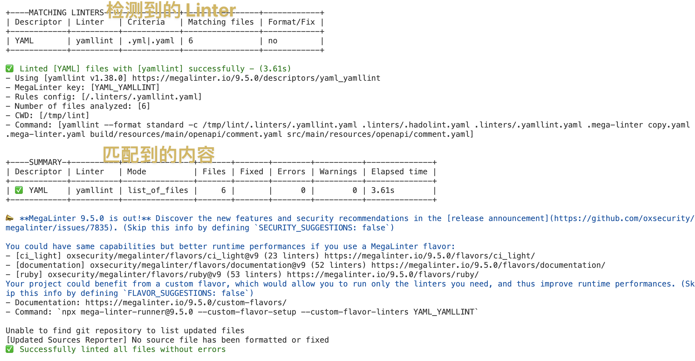

虽然当前例子使用 Docker 来运行 MegaLinter，但实际上它也支持其它方式。具体可以参考官方文档。


## 前端

### 项目结构

Web 目录本身也是一个 Monorepo，它由 pnpm workspace 提供支持。
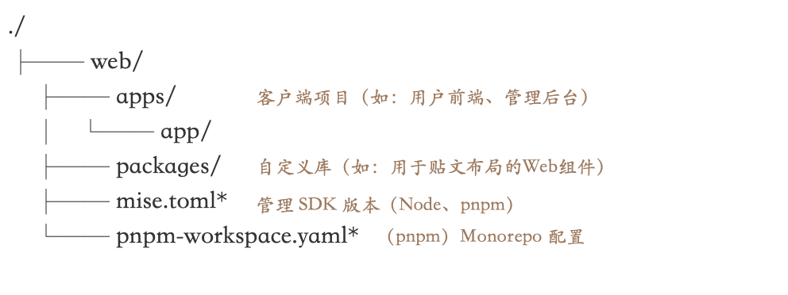

### 尖叫架构

*尖叫架构（Screaming Architecture）* 指的是，使用文件目录结构来表达项目相关含义 —— 看上去就像是在自我介绍一样。

这样做，不仅能够降低理解成本，而且还可以令相关内容变得更内聚，从而使项目更易于维护。

以当前项目（web/app）为例。一般可以围绕业务能力进行组织。
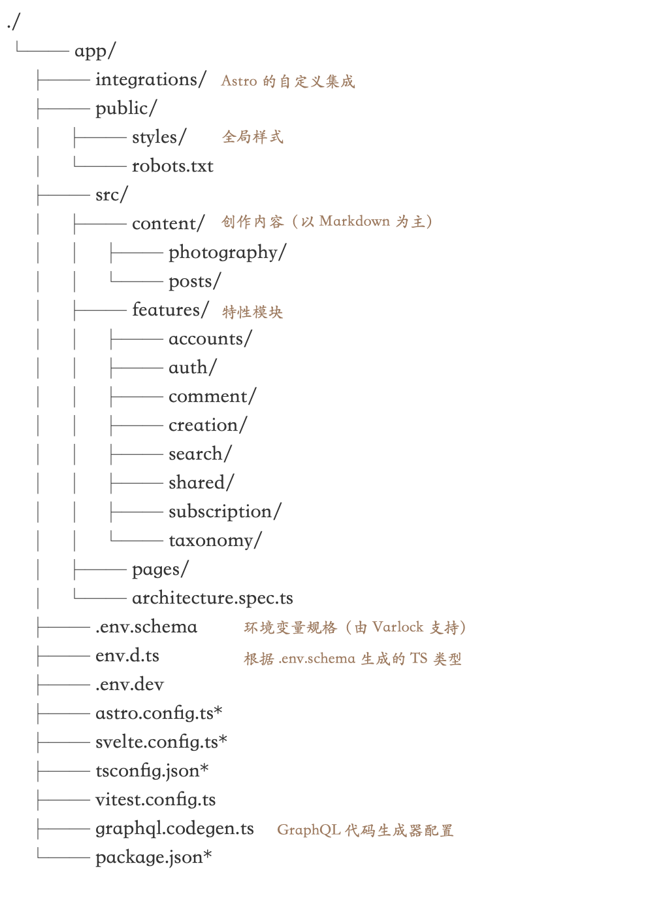

### 架构测试

随着时间推移，原来定义的架构规则可能会变得面目全非。针对该问题，可以使用架构测试来解决。

当前项目使用的架构测试库是 [ArchUnitTS](https://github.com/LukasNiessen/ArchUnitTS)。

**一个简单例子**
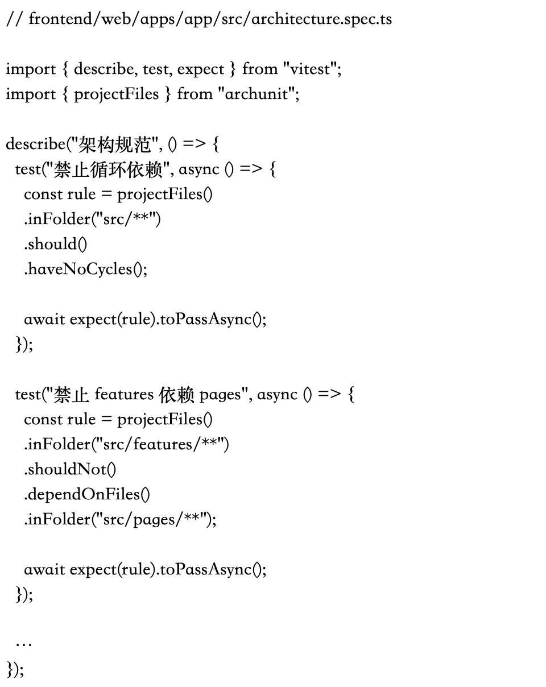

### 代码生成

API 契约不只是一种承诺，还可以用它来生成代码。目前常用的 API 契约（如：OpenAPI、GraphQL、gRPC）都有对应的代码生成工具。

**OpenAPI**

可以用 *openapi-typescript* 生成 TypeScript 类型，也可以用 *openapi-fetch* 生成 HTTP 客户端。

当前项目主要用 *openapi-typescript* 生成类型。它使用方面相当简单，只需执行以下命令即可。
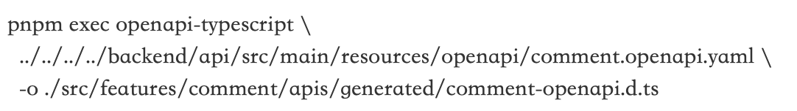

**GraphQL**

当前项目主要使用 *graphql-code-generator*。但它的使用要略微复杂一些。因为它是一个插件化的工具。开发人员[需要根据场景，选择不同的插件](https://the-guild.dev/graphql/codegen/plugins)。

以生成 TypeScript 类型为例，会用到  *typescript* 和 *typescript-operations* 两款插件。此时 *graphql-code-generator* 的配置如下：
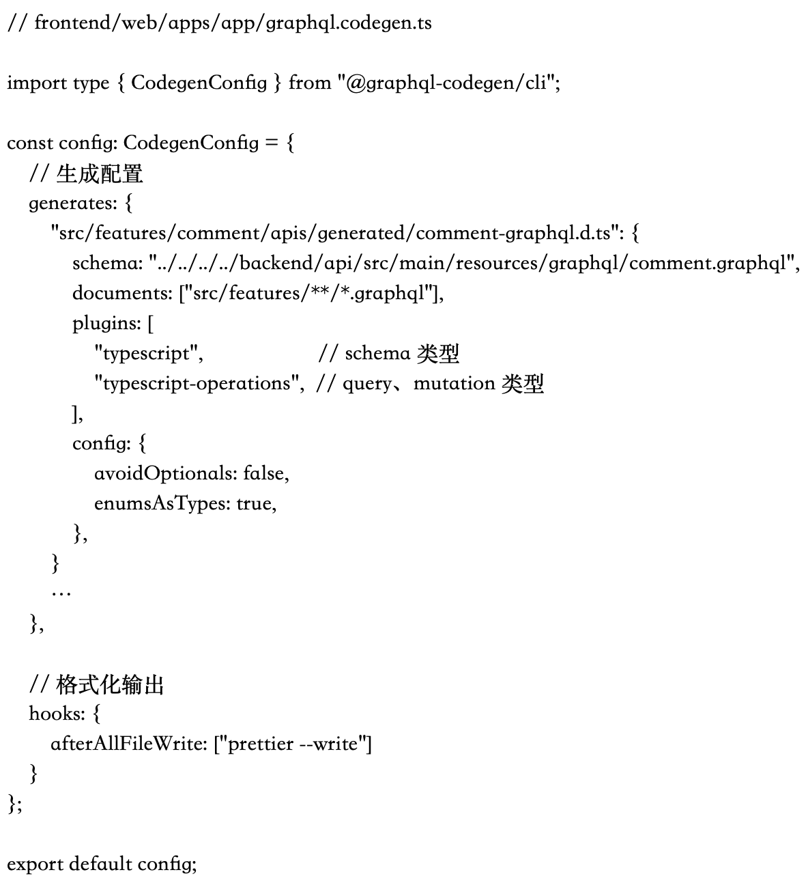

然后执行以下命令即可。
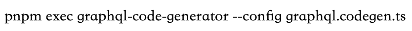


### 消费者驱动的契约测试

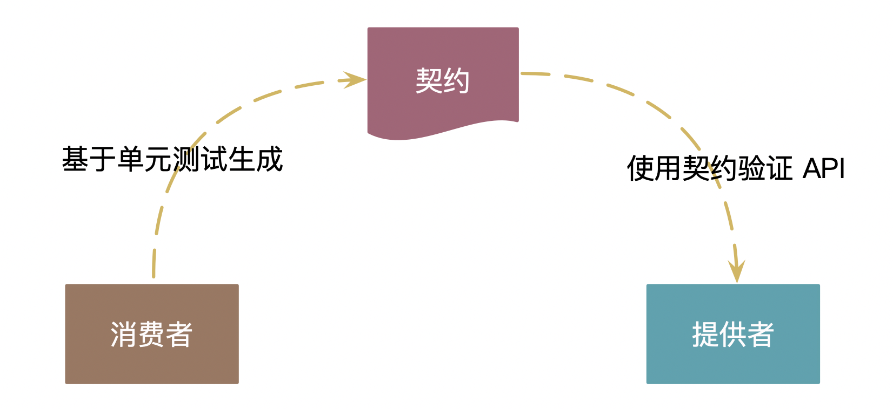
前面提到，在契约测试中，前端（消费者）需要针对特定场景定义请求和响应格式，然后利用测试生成契约。之后需要将相关契约文件交给后端（提供者）作为 API 验证的依据。

当前项目使用 [Pact](https://pact.io/) 作为解决方案。有两种方式，可以把契约文件交给后端：
- 直接把契约文件交给后端。这在 Monorepo 中能够轻易实现，只需把文件生成路径设置为后端规定的路径即可
- 使用 [Pact Broker](https://github.com/pact-foundation/pact_broker)。前端将契约上传到 Broker，然后让后端自行拉取。该方案对于同一 API，但需要支持多个版本的场景很有用。因为 Broker 能够根据版本号，识别前后端是否能够集成

当前项目选择第一种方式。

**一个简单例子**
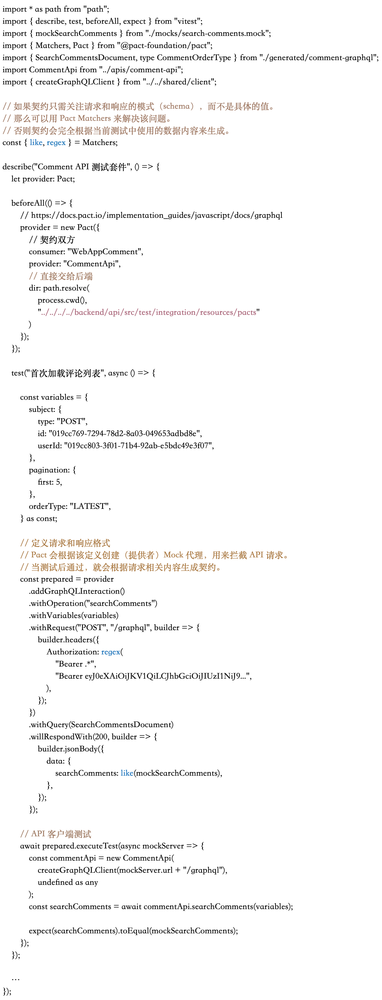

### 无头组件

无头组件（Headless Components）基于[展示对象（又叫 MVVM）](https://www.geeksforgeeks.org/websites-apps/introduction-to-model-view-view-model-mvvm/)设计模式实现。其特征是，逻辑（状态和行为）与视觉样式彻底分离。这样做的好处显而易见。同一个（无头）组件，可以根据上下文需要来变换形态。而且因为只包含  JS/TS，所以会更容易测试。

> 目前比较受欢迎的无头组件库有，React 的 [radix-ui(primitives)](https://www.radix-ui.com/primitives)、[base-ui](https://base-ui.com/react/overview/quick-start)、Svelte 的 [bits-ui](https://bits-ui.com/)，以及 Tailwind CSS 的 [headlessui](https://headlessui.com) 等。它们没有内置样式，需要用户自己定制。

**一个简单例子**
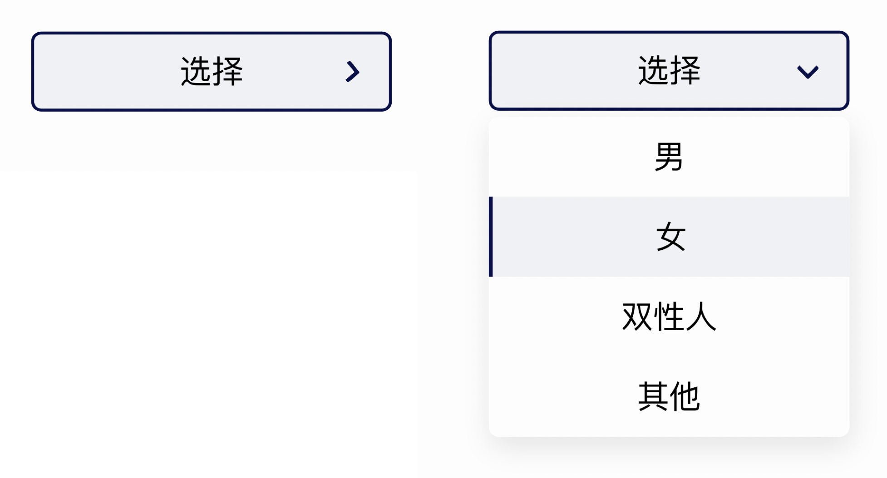

这是一个用 Svelte 实现的 Select 组件。以下是它第一个版本的代码：
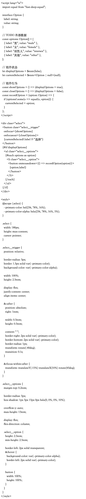

客观来说，其实这样实现并没有什么大问题。但我很清楚，我之所以会这么想，完全是因为当前需求比较简单。但在实际开发中，Select 组件也可以变得复杂。例如，加入键盘选择、分组、搜索，或者多级联动等 。这些需求在企业系统中并不少见。所以我决定基于 TDD 方式，将其重新实现为无头组件。

根据无头组件的用例，编写测试 —— 这其实是设计过程。
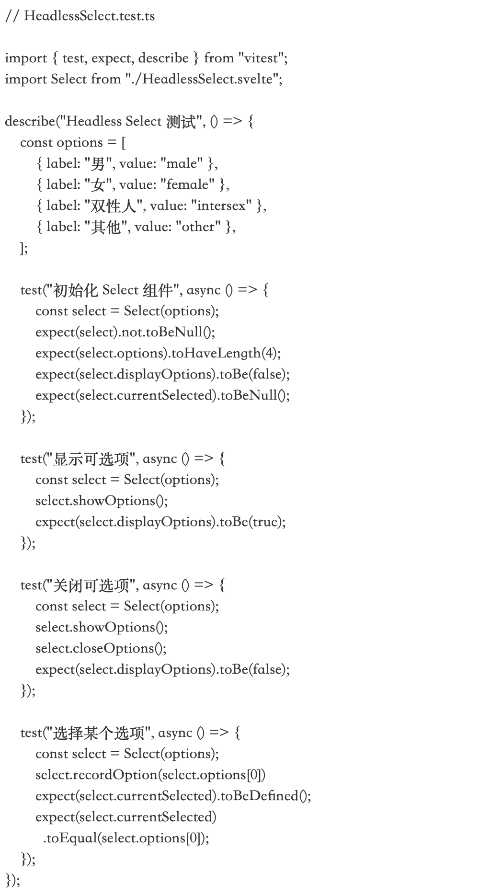

实现无头组件。
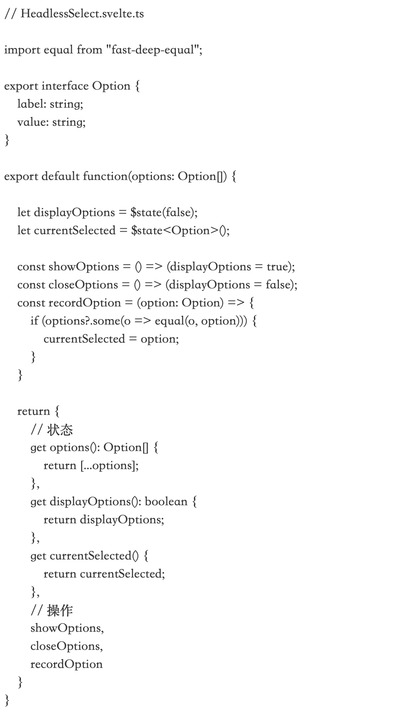
可以看到，该组件只有状态和行为，没有任何视觉样式。

最后，头部（视觉样式）组件可以根据自己的需要来使用它。
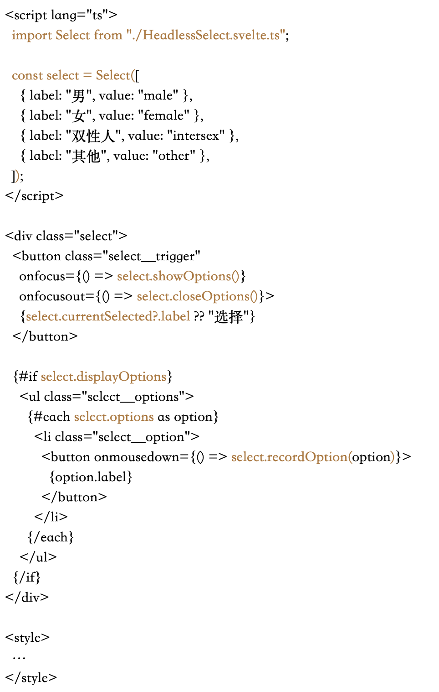

### 设计令牌

可预见地，当前项目不会只有一个客户端。因为常见的系统组成通常至少包含用户端和管理后台 —— 大部份系统都是如此。而目前面临的问题是，如何统一样式风格。特别是一些系统需要实践*微前端架构*，在不同的项目和技术栈，甚至连团队都不同的情况下要统一风格其实并非易事。

设计行业针对该问题，提出了[设计令牌（Design Token）](https://www.designtokens.org/technical-reports/) 作为解决方案。虽然该规范在去年（2025.10）才转为稳定状态，但目前已经得到不少知名设计软件的支持（如：Figma、Sketch、Adobe XD）。该规范除了能够标准化设计之外，它还将 UI/UX 设计师融入进了开发流程。因为在该规范下，UI/UX 设计师可以直接向代码库提交 Tokens 文件，然后让构建工具将其转换为代码可用的元素。
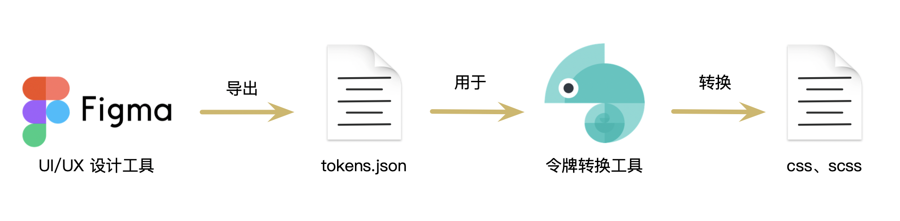

**一个简单的例子**

以 Figma 为例。
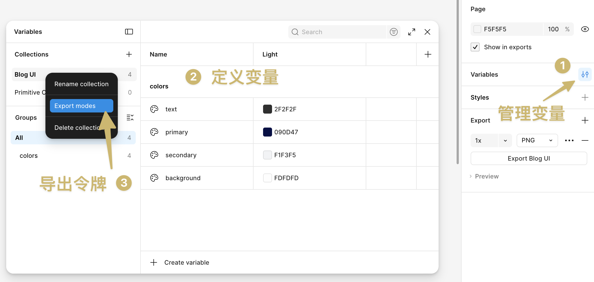

导出的令牌内容大致如下。
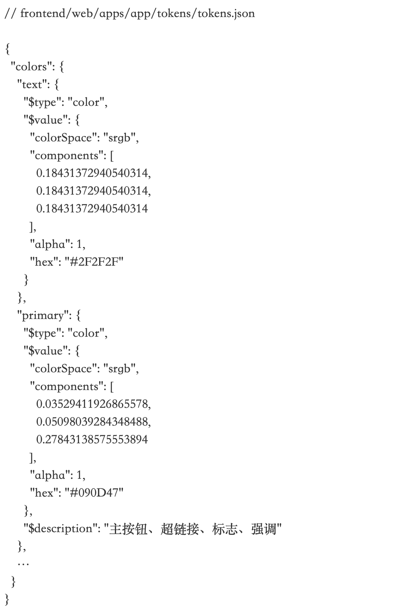

在项目中添加一个名为 `style-dictionary` 的工具。
```
pnpm add -D style-dictionary
```

然后再添加一个配置文件。
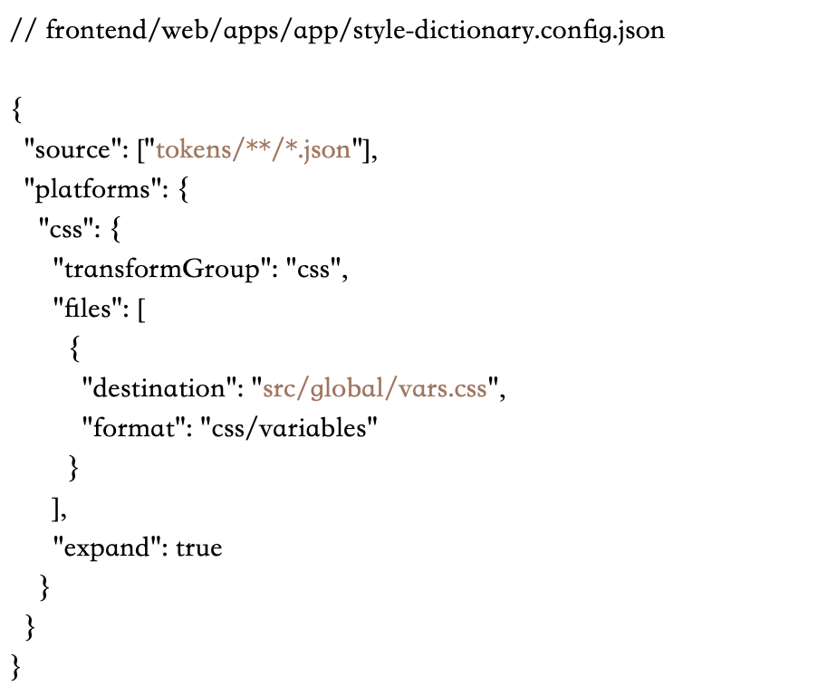

最后执行以下命令。
```
pnpm dlx style-dictionary build \
  --config style-dictionary.config.json
```

如无意外会得到以下 css 文件。
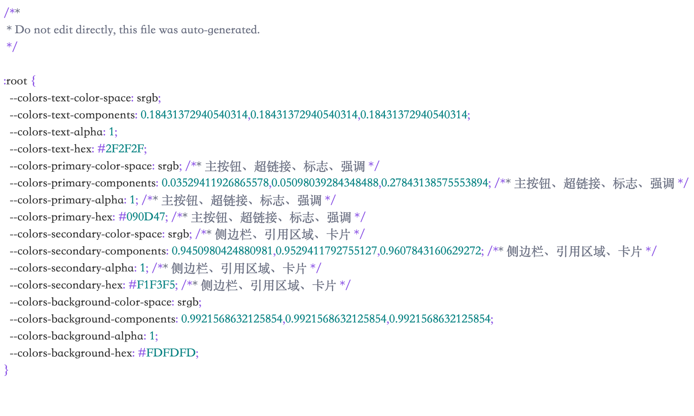

💡 关于设计令牌的其它使用方式，可以参考：[规范说明（2025.10）](https://www.designtokens.org/tr/2025.10/#modules)。


## 后端

### 架构风格

在软件设计中，模块化是指，根据技术或业务能力边界来组织代码程序。比较常见的实现方案有，*基于文件目录结构（Package）*、*依赖构建工具（如：Maven module、Gradle subproject）*、*微服务* 等。它们各有优势。Package 方式最轻量；构建工具方便替换具体实现；微服务方案最重，但适用于技术异构和团队工作解耦等场景。

当前项目选择了 Package 方式。以下是后端 API 的目录结构为例。
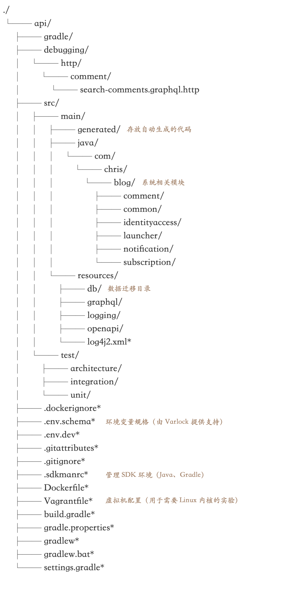

采用 DDD 的模块还会使用*端口-适配器架构*。在该架构中，可以把端口简单理解为是一种抽象或者通用的能力。譬如接口，又或者是应用服务。而适配器则是端口的实现者或者客户端。

另外，代码组织架构本身就是多维度的，而且支持混搭使用。例如在日常中最常见的是分层架构，其目的是为了分离关注点。目前该理念几乎已经成为了一种共识。不论是 *端口-适配器架构* ，还是洋葱架构、简洁架构，其实都建立在该理念之上。它们的区别只是角度稍微不同。
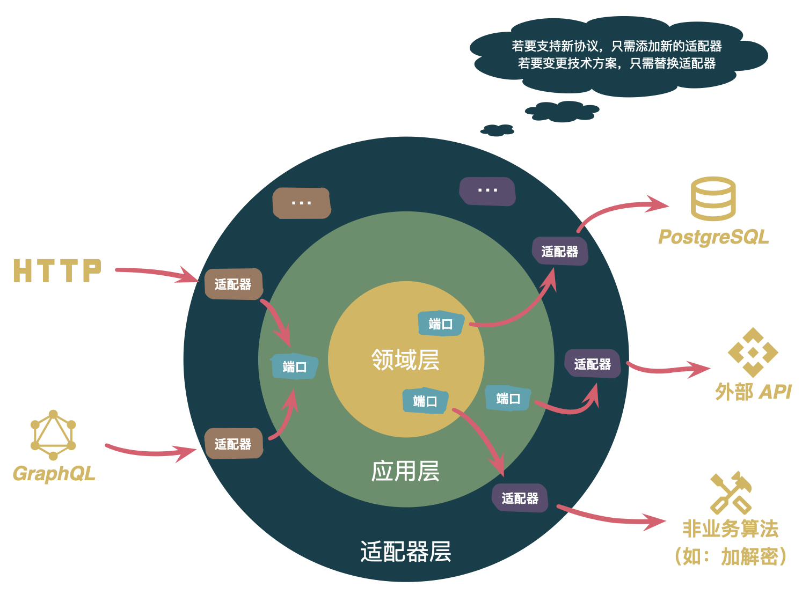

以评论上下文为例，它的目录结构如下。
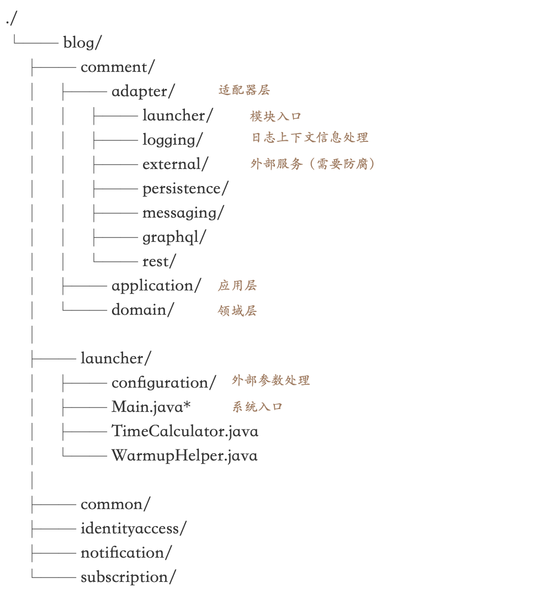

### 分离测试套件

通常来说，项目只有一个测试目录（src/test）。但个人认为，这在大部份情况下都不是一种好实践。因为这样会导致 `gradle test` 操作执行所有测试用例。所以更好的做法是，将不同类型的测试套件分开。

当前项目使用 gradle 的 jvm-test-suite 插件来实现该需求。
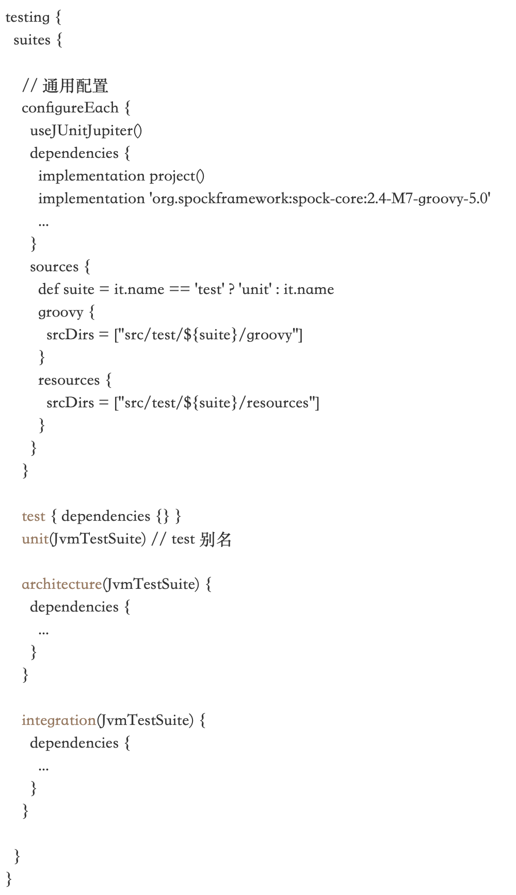


### 领域层

DDD 的关键在于，落实并贯彻 *领域模型* 和 *通用语言*；不要让编码反作用于设计。因为代码只是设计的实现手段，而非最终目的。之所以有不少人认为 DDD 只是一些编码模式。一方面可能是被技术固化了思维，而另一方面则可能是因为《[领域驱动设计](https://book.douban.com/subject/26819666/)》作者 Eric Evans 在书中用了大篇幅讲解各种元设计模式的缘故。其实这本书最重要的部分是他和客户的对话内容 — 透过层层对话，从中提取出相关模型和通用语言。而该书后半部分讲解的元设计模式只是辅助内容。透过应该相关模式，可以更好地讲设计模型落地，仅此而已。

从编码层面，设计模型的实现应该被组织在独立的分层中。该分层一般被称作领域层 — 只包含业务逻辑，并且注重可理解性。为了能够独立测试和审计，领域层不应该有外部依赖。建议通过 TDD 方式来实现领域层。因为即便只是先写测试用例，也能够从中得到设计方面的好处。
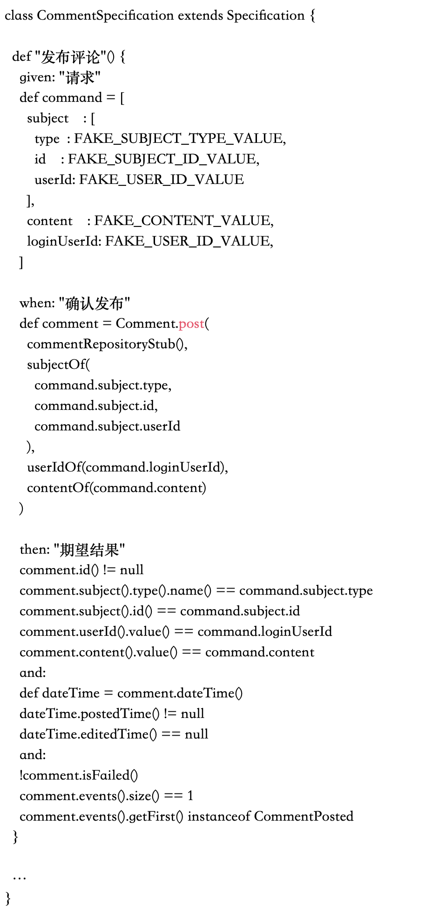
如果读者对相关逻辑不理解，可以回看建模小节。

一旦有了测试用例，就可以开始编写目标代码。
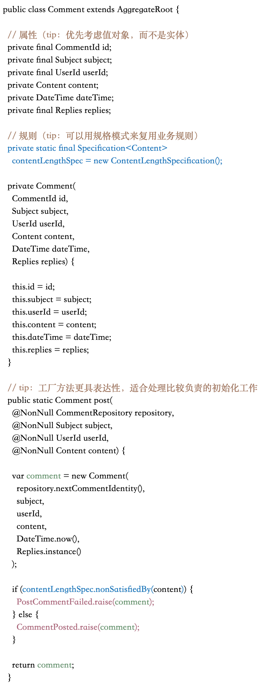

注意，不要混淆*代码逻辑错误*和*业务失败*两个概念。这是很多人容易犯的错误。例如，拿着一张没有余额的银行卡去提款会理所当然地“失败”。但种“失败”实际上并非错误，而是一种明确的业务处理结果。所以应该避免使用编程语言的异常处理机制来捕获它们，因为这样会混淆两种概念。个人推荐做法是引入通知模式来捕获业务失败信息。其优点是能够分离两种概念；缺点是无法自主中断程序执行，需要客户端自行查询处理。

据我了解，通知模式（Notification patterns）最早被表现层用于采集校验（错误）信息。但既然它是一种设计模式，那就意味着，一旦领悟用意就可以将其应用于任何需要的地方。该模式本身非常简单，使用一个对象记录相关信息，然后供调用者查询。在领域模型模式中，可以结合领域事件一起实现。以下是当前项目的领域事件拓扑。
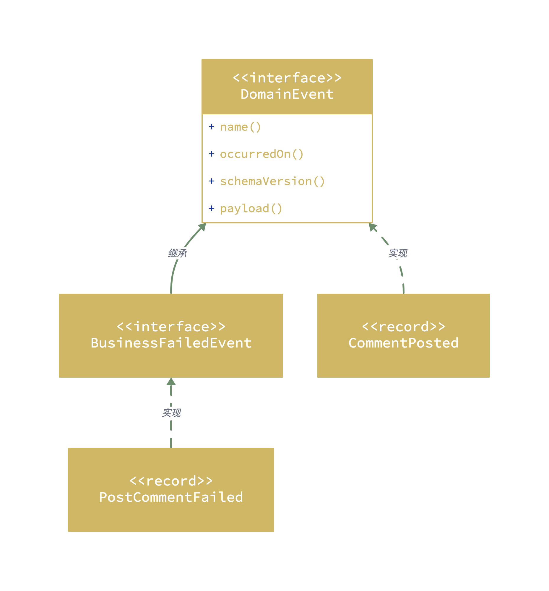

一个简单例子
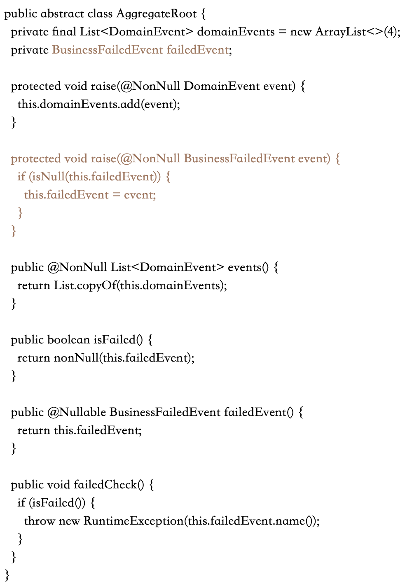

另外，在 DDD 中懂得分离领域模型其实至关重要。如果一个模型承载了多个职责，那么随着时间推移，它就会变得复杂且难以理解。以当前评论聚合为例，评论和回复在数据结构上大致相同，但严格上它们并非同一种概念。评论针对的主体是创作内容（譬如：帖文），而回复针对的主体则是评论或回复。而且两者在功能上也有区别，评论通常具有更复杂的排序规则，或者支持置顶操作。而回复则一般只能按顺序来排序，否则就会破坏对话的逻辑性。

因此，我需要对回复模型进行设计。同样地，先编写测试用例 —— 从乐观路径开始。
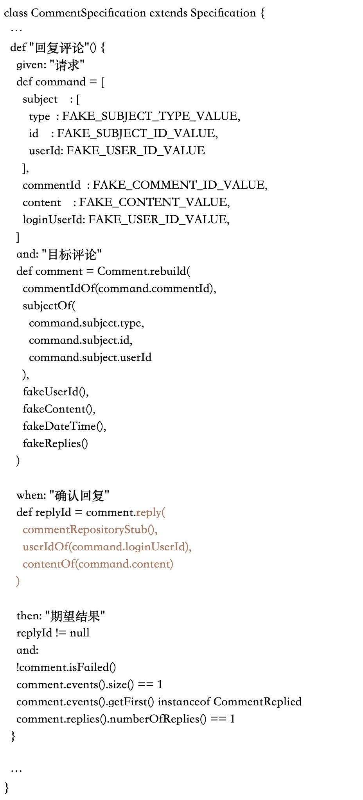

然后再编写目标代码。
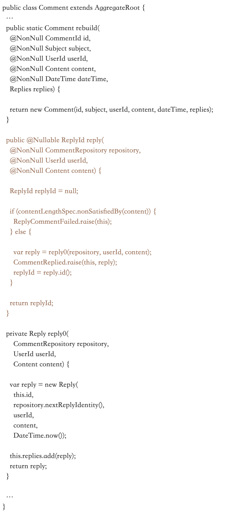

这是最终得到的回复模型。因为与评论概念存在差异，所以使用不同的模型来区分它们。另外可以看到，回复是一个实体，而不是值对象。这是因为它和评论一样，虽要被跟踪生命周期。
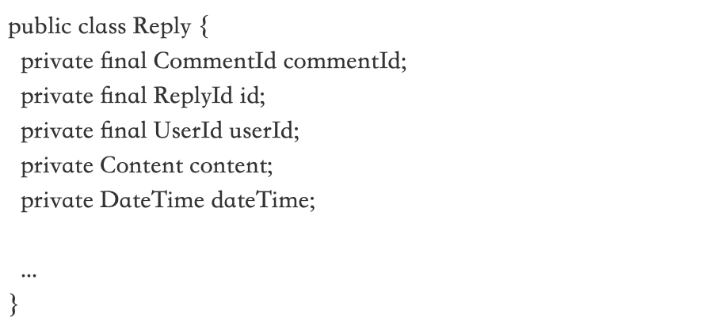

### 应用层

应用层的主要职责是，编排用例和执行事务管理。但如果系统本身足够简单，那么它就不是必需的。此时可以把相关职责交给表现层来实现。譬如 Controller 或 Router。但若然需要支持多种网络通协议，那么相关逻辑就应该能够被复用。此时应用层的价值就会体现出来。而且从长远看，这绝对是一种良好的实践
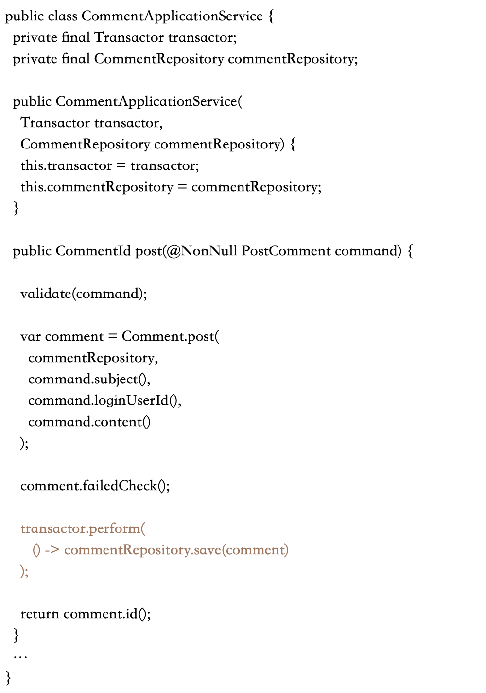

我这里使用的是自定义事务管理器。其实大多数情况，根本没有必要使用复杂的框架。

首先创建一个 DataSource 代理（静态或动态都可以），然后控制 getConnection() 的访问。
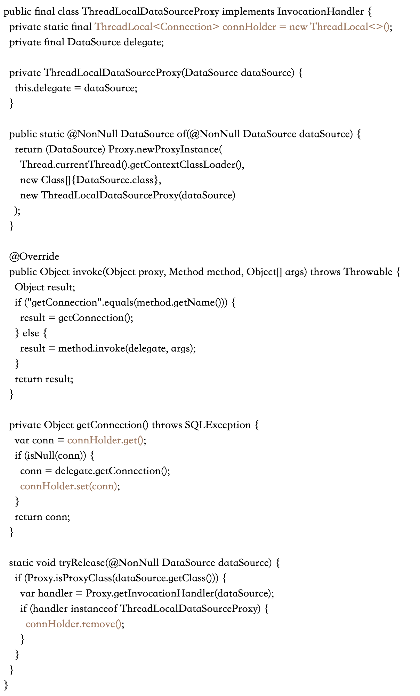

> 这里使用 ThreadLocal 来实现事务管理的原因有两个，一是用例本身并不存在并发性 — Connection 始终位于同一条线程上。二是 ThreadLocal 能够方便地跨组件共享依赖。因为当前项目中，并非只有事务管理器在引用 DataSource，其实相关仓储（如：CommentRepository）也在引用它。

然后再基于 Data Source 实现事务管理 API。
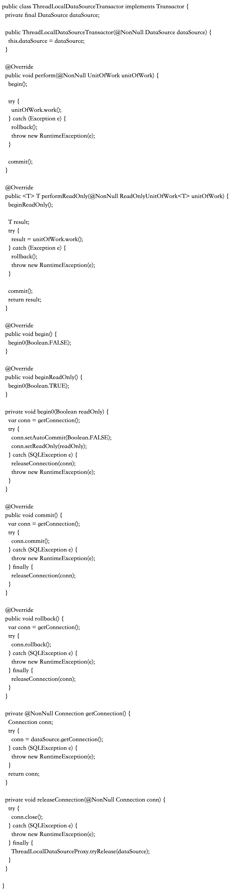


### 渐进式数据库设计

渐进式数据库设计使用*不可变脚本*来记录数据库变迁。

在项目初期（或者引入渐进式数据库设计前）会存在一些用来构建数据库的 SQL 语句。假设这些语句构成了一个 *V1__Initial_design.sql* 脚本。但随着时间推移，设计发生变化是最正常不过的事情。此时会新增或修改一些语句。在渐进式数据库设计中，我们不会修改原脚本文件 *V1__Initial_design.sql*，而是创建一个新脚本 *V2__ Incremental_design.sql* 来存放这些迁移。另外，在执行这些脚本之前，还需要在数据库中新建一张 *schema_ history* 表，用来记录已经生效的脚本信息。

该实践的好处在于，任何数据库变更都会被记录在脚本中。而且因为和源码放在一起，所以会得到更好的版本控制。此外，还有一个莫大的好处是，可以轻而易举地在任何环境中快速重建整个业务系统数据库。

在技术选型小节中已经提到，当前项目会使用 Flyway 来实现渐进式数据库设计，所以其实无需手动操作。Flyway 会自动创建 *schema_ history* 表，以及执行并记录脚本相关信息。而且 Flyway 支持多种客户端（如：CLI、嵌入式程序库、构建工具插件 等），所以不会影响任何人使用这些脚本。

以 gradle 的 *org.flywaydb.flyway* 插件为例。
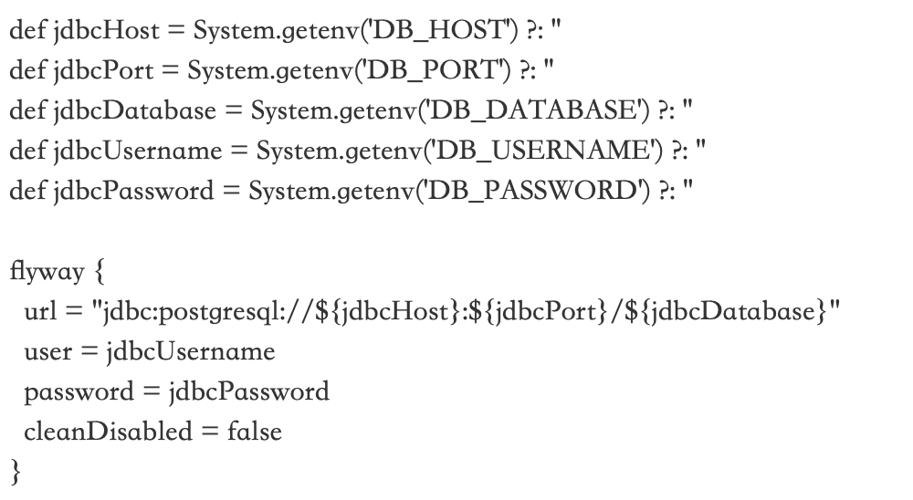

当执行 *gradle flywayMigrate* 命令时，Flyway 会默认从 src/main/reousrces/db 下读取脚本并执行相关迁移。

### 代码生成

和前端一样，只要有契约文件就能够利用工具自动生成类型和 API 实现代码。

然而，虽然代码生成工具能够提高开发效率和验证契约（依赖编译器），但它会损失一定的灵活性。所以个人更倾向于生成类型，而不是完整的 API 实现代码。而且如今的 AI 辅助工具完全可以做到快速生成模板代码，所以这种比较“死板”的代码生成方式通常并非首选。

当前项目主要用到 *org.jooq.jooq-codegen-gradle* 和 *io.github.kobylynskyi.graphql.codegen* 两款 gradle 插件。
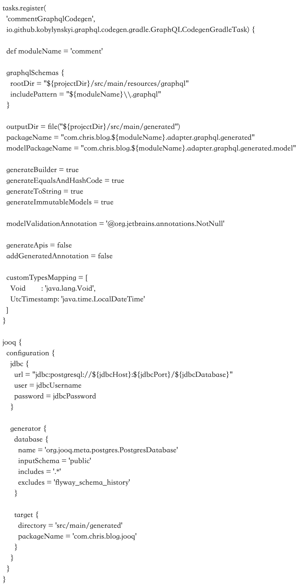

### 持久层

在软件设计中，设计模型大致可以被划分为 3 种：
- 资源模型：从API设计中产出。关注可用性
- 领域模型：从业务分析和设计中产出。关注业务逻辑组织和表达能力
- 数据模型：根据领域模型设计而成。关注数据完整性、性能，以及可扩展性

区分并分离这些模型，有利于提高相关设计的可维护性。因为这样使它们能够根据自身需要进行演进。如果不这样做，就需要在同一个模型中处理所有问题。而这是大部分项目都存在的通病。它们无一不例外，最终都会变得难以理解和难以维护。

另外，在早期的关系型数据库中，面向对象的内存数据结构无法直接影射到（关系型数据）表上。该问题被称为*阻抗失谐*，而 ORM 就是为了解决该问题而诞生的。但近年来关系型数据库开始逐渐支持 JSON 数据类型，所以该问题在如今其实已经有所改善。但即便如此，无论环境如何变化，设计人员都应该意识到不同模型之间的需求是不一样的。

以 DDD 仓储模式为例，它只是一个负责存放和重建聚合的抽象。至于如何实现它，完全是一个开放性话题。譬如它可以由多张表共同构建而成，而不是非得要将聚合映射到一张（数据模型）表上。至于实际如何实现，需要根据情况而定。

**一个简单例子**
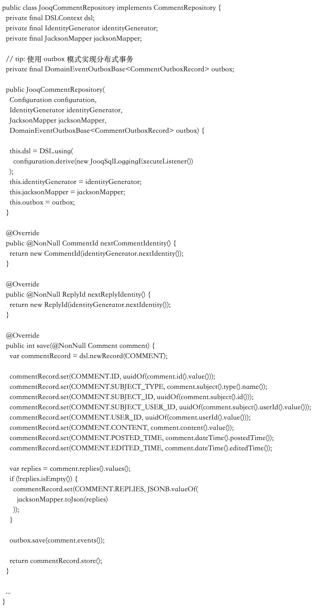

> 并非只有分布式应用才需要分布式事务。只要涉及异步（跨上下文）协作，就需要确可靠和一致。而且该问题还不能一概而论，因为不同类型的系统对一致性的要求并不一样。譬如 CMS 对一致性的要求就不高。我这里使用分布式事务更多是因为写作需要，其次才是确保一致性。例子使用 *Outbox 模式*（国内又叫“本地事务表”）进行实现。它的原理比较简单，先用一张 Outbox 表记录待发送消息，然后让其他并发工作线程抓取这些消息，并将其发送到 EventBus 即可。该模式之所以可行，是因为 Outbox 表和聚合表位于同一个本地事务。

### 防腐层

防腐层主要承担翻译工作，以免外部（或遗留）概念污染当前上下文。因为在真实场景中，很少会有系统真的以单体形式存在。它们或多或少都会有一些外部依赖。譬如网络支付、第三方登录，又或者是遗留系统（严格来说，数据库也属于外部系统。但嵌入式除外）。问题在于和外部打交道时，它们的响应通常会包含一些对当前上下文无用，或含义不匹配的内容。比方说外部 API 响应了一个 full_name，但当前上下文只有 first_name 和 last_name 的概念。那么此时就需要防腐层介入处理。

> 防腐层和普通（数据结构）影射器的区别在于，前者着重将外部内容翻译为适用于当前上下文的通用语言，而后者则没有这种要求。是的，虽然两者都在充当影射器，但概念稍微不一样，其职责就会有所区别。而优秀的设计人员往往能够捕获到这种细微差异，然后通过单一原则分解职责，以此提高设计的可维护性。

但需要注意，防腐层只是一个逻辑层，一般位于上下文边界。例如在 *端口-适配器架构* 中，它可以位于适配器内部。因为越早防御，被渗透的范围就越小。

以下是一个重构外部 API 调用的例子。

**引入防腐层之前** - UserExternalService 给客户端返回的是外部模型 User
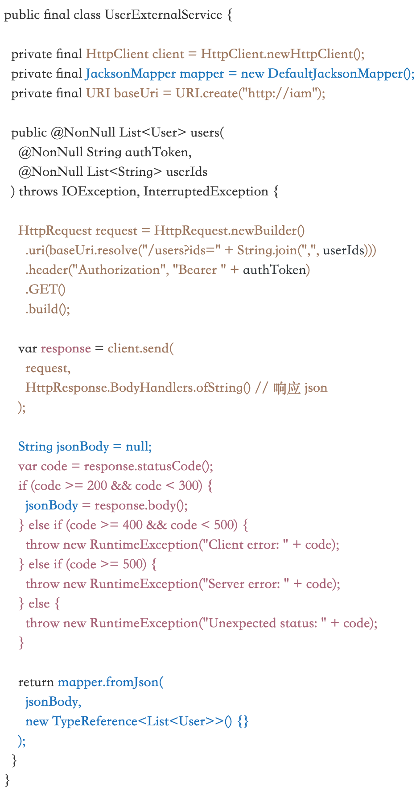

**引入防腐层之后** - UserExternalService 给客户端返回的是经过防腐的 CommentUser
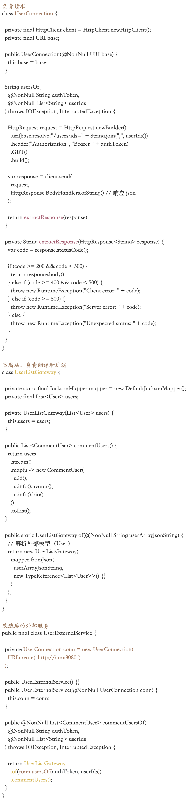


### Web API

Vert.x 的核心是一个基于 Netty 实现的 EventLoop 调度模型 —— 相当于高配版的 Node.js 运行时。虽然 Vert.x 本身没有固定的编程方式，但它提供了一个名为 Verticle 的抽象概念，用来组织组件或者模块。是目前普遍推荐的用法。

当前项目使用 Vert.x 的 Web 模块来处理网络请求。
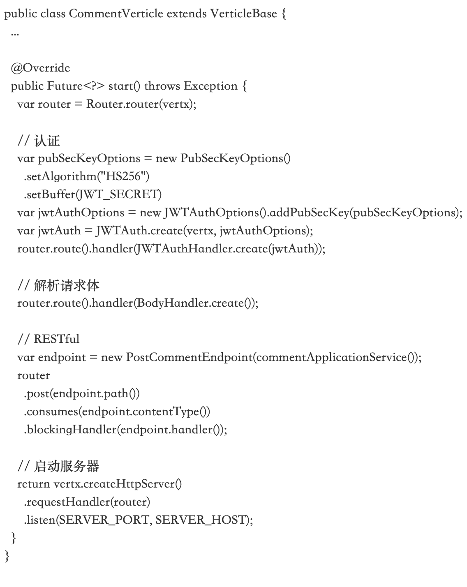

因为是库，而非框架。所以使用起来十分灵活。开发人员完全可以根据需要来做一些基础性设计。譬如，根据使用模式抽象出一个 Endpoint 概念，用来规范 RESTful 请求处理。
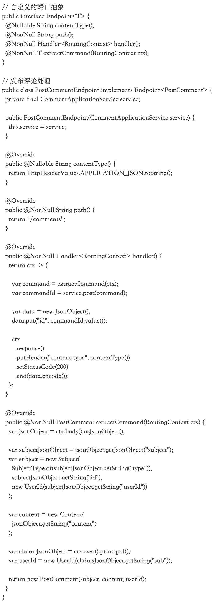

### 命令查询职责分离

*命令查询职责分离（CQRS）* 可以理解为是对命令查询分离原则（CQS）的延伸。其中，“命令”泛指会引起状态变化的操作。两者的共通点是强调职责单一：命令不应承担查询职责，查询也不应产生副作用。这种职责分离的设计，能够提升相关代码逻辑的可理解性、稳定性，以及安全性。而它们的区别只是关注点不同：CQS 主要针对方法和函数，因为它诞生于过程式编写。而 CQRS 则上升到模型层面的划分。

使用 CQRS 可以得到一个重大好处，能够避免查询和报表需求对领域模型造成干扰，从而保持纯粹和稳定。另外，CQRS 本质上只是一种架构思想，并不存在标准的实现方式。譬如，它可以表现为“读写模型分离，但不分表（数据模型）”，也可以是“分离模型和表，但不分库”，甚至是“完全读写服务拆分”。当前项目采用第一种方案，并结合 GraphQL 进行实现。因为该方案的实现成本较低，而且足以应付当前需求。

> GraphQL 是一种由客户端驱动的查询协议。因为可以自行决定返回字段，所以能够一定程度减少后端零碎接口。但它的缺点也比较明显，性能会逊色于 RESTful。因为属于动态查询，所以可缓存性较差，而且攻击面也会更大。但如果用这些根灵活性和稳定性比较，那么多数情况下我会更加更倾向于后者。

**一个简单例子**

这是一个用于处理查询请求的 GraphQL DataFetcher。
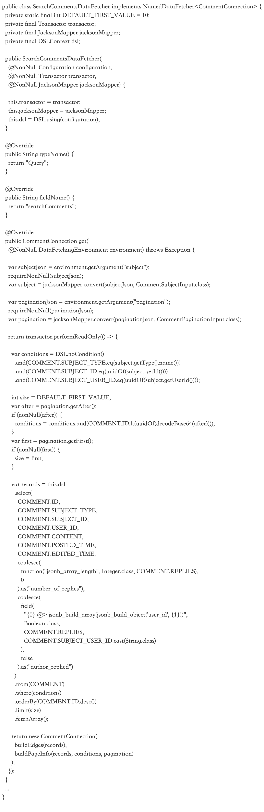
可以看到，在 DataFetcher 中并没有使用领域模型，
而且还直接根据请求执行数据库查询。因为 CQRS 的查询层应该足够薄。这样做的好处是，能够随时根据需要调整查询，而且变更成本较低。

### 应用入口

纵观整个应用，入口是涉及最多细节的地方。因为它需要采集各种配置参数来构建相关组件。

Java 不像 Python，没有内置的参数解析模块。但可以使用第三方库 *picocli* 来实现该需求。
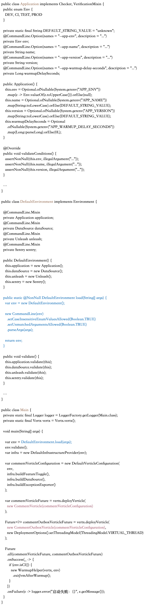

如果有细心留意，例子中有个接口叫 VerificationMixin。这其实是一种叫做 Mixin 的设计模式，用来避免以继承方式复用代码 —— 继承并非为复用代码而设计。在面向对象编程中，一般建议通过组合委托的方式来实现代码复用。而相较于组合委托，Mixin 的耦合性要小一些。比较适合用来组织，稳定且通用的能力。

在  Java 中，可以用接口（interface）的 *default method* 来实现该模式。
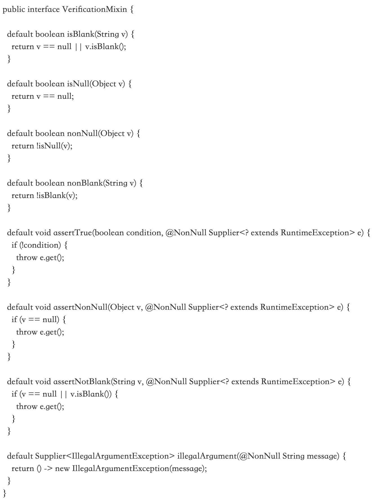

### 架构测试

先前在前端小节已经展示过架构测试。其实 ArchUnitTS 完全受启发于 ArchUnit。而且相较之下，ArchUnit 更加灵活和强大，并且内置了一些常见的架构规则。
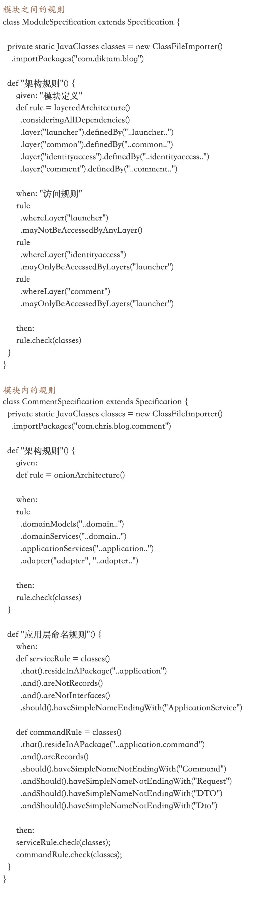

> 如果正在使用 Spring Boot，那么可以考虑 [Spring Modulith](https://spring.io/projects/spring-modulith) 方案。它是一个建基于 ArchUnit 之上，用来构建模块化系统的框架。只需按照约定规则来使用，就可以实现类似功能。但还是那句话，高抽象的工具通常固执己见，而且灵活性相对较低。

### 集成测试

集成测试的目的是，验证接口契约，以及组件或模块之间的协作能力。
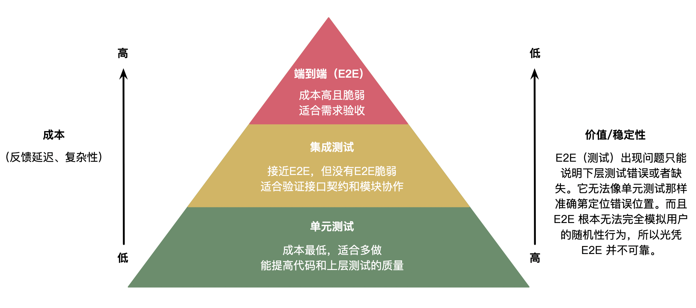

以评论聚合仓储为例。因为涉及数据库集成，所以这里会使用 *testcontainers* 来构建测试数据库 —— 它依赖本地 Docker 环境。
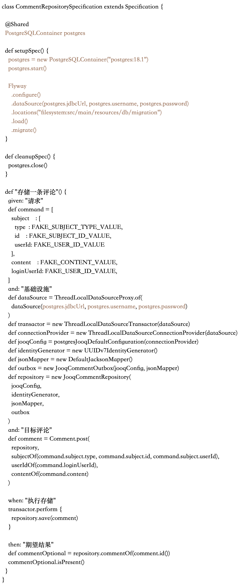

另外，在集成测试中很可能还会有涉及外部调用，但它们未必会提供测试环境。此时可以使用 *wiremock* 来模拟外部调用响应。该工具和普通 Mock 库不一样，它会走真正的网络调用。换言之，它能够覆盖网络协议。使集成测试更贴近于真实环境。
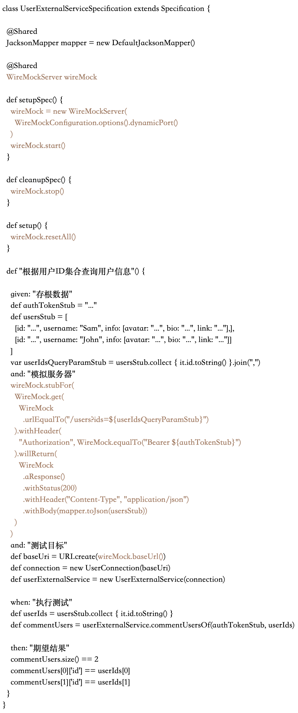

### 契约测试

在前端小节已经展示过如何生成消费者契约。后端测试程序只需获取相关契约，然后用它来验证接口规格即可。
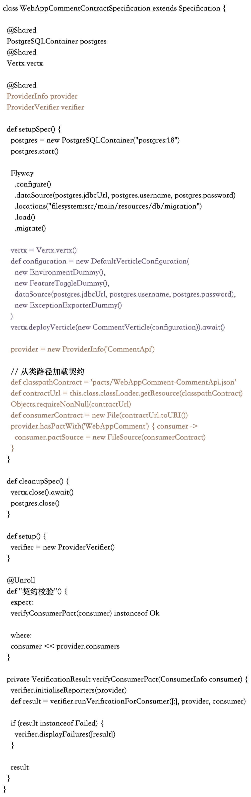

在该例子中，能够感受到低抽象工具带来的优势。Vert.x 可以轻而易举地启动一个仅包含待验证接口的 Web 服务器，而无需开发人员理解那些复杂多变的框架注解。

### 容器镜像构建

虽然镜像构建本身没什么特别，但个人认为到目前为止仍然有不少人不知道 jlink 的存在。

自 Java 9 开始，JDK 引入了*模块化系统（ Java Platform Module System，JPMS）*，并对 JDK 进行了模块化重构。开发者可以根据自身需要来增减 JDK 模块。而 jlink 则是一个内置，用于构建最少依赖运行时（JDK）的工具。利用 jlink 可以极大地缩少 JDK 体积。是目前 Java 镜像构建的绝佳实践。


> 拓展：性能优化时，可能会希望缩减  Java 应用的冷启动时间。目前发现侵入性较低的方案有 CDS 和 Leyden —— 两者（目前）无法一起使用。经测试发现，后者的效果要更好一些。代价是会增加构件的体积。如果这两个方案都无法满足要求，那么可以尝试更激进的方法，譬如使用 JVM CRaC 或者 GraalVM。但它们都具有侵入性，而且 GraalVM 本地镜像的构建成本并不低。所以在方案选型时，应该根据重构成本、构建成本，以及最终收益等方面进行衡量。


## 可观察性

### 为何如此重要？

*可观察性（Observability）* 在维基百科中的定义是，系统能够通过其外部输出反映内部状态的程度。

对于生产级别的系统来说，可观察性至关重要。它是发现问题和定位问题的核心手段，甚至会直接影响系统的服务质量。因为可观察性越强，异常状况就越能被及时感知。这使得相关人员能够在问题扩散之前及时干预，从而降低潜在的损失风险。而且相较来说，等故障发生后再被动排查，往往会带来巨大的心里压力。换言之，可观察性不仅是系统运维的基础，而且还是一种可用来缓解心理压力的实践。

在真实环境中，其实很少见完全不可观察的系统。它们一般至少会使用日志文件来记录内部执行信息。但这其实远远不够。因为未经设计和结构化处理的日志往往价值有限 —— 信息离散、缺乏上下文，且检索成本较高。而另一个问题是，在不少系统中，日志的作用往往被局限于用来记录异常摘要（Error log）。但它的价值不止于此。它还可以用来分析执行轨迹（Trace log）、记录具有业务或系统价值的事件（Info log）、标注可能影响系统外部质量的问题（Warn log），甚至作为聚合统计的基础数据。

不过需要注意。日志（Logs）本身是一种极其原始的遥测数据。虽然理论上可以基于日志聚合统计出很多有价值的信息，但日志的设计初衷一直是辅助排查和定位问题，而不是面向聚合统计。所以一般不建议将日志用于制作实时仪表盘用途。若然有这方面需要，应该优先考虑指标。指标（Metrics）是一种面向聚合统计的遥测数据。特别适用于，不关心文本信息，只关心统计结果的场景。例如，统计接口执行次数或 QPS，计算内存、CPU、磁盘 I/O、网络I/O 的使用情况、记录 Page View（PV）和 User View（UV）等。

另外，虽然我一直强调软件开发应该避免过早优化，但在性能需求确实存在的情况下，就需要有具体方案用来定位性能瓶颈。但性能优化并非本文谈论范畴，这里只会浅谈一下如何通过可观察性定位性能瓶颈。其实除了日志和指标之外，还有两种常用的遥测数据，而且都适用于性能观察。它们分别是追踪和分析。

追踪（Traces）用于记录一个请求的完整执行路径。它由一到多个跨度（Span）组成，而跨度则代表某个具体调用。而重要的是，跨度具有开始和结束时间，可以计算出调用耗时。另外值得注意，并非只有分布式系统才可以采集追踪数据。其实只要对性能有要求就可以进行采集。譬如可以用追踪来观察数据库调用。因为慢查询日志并不包含网络延迟，所以追踪数据可能会更有价值。

分析（Profiling）用于记录代码执行性能，以及运行时状态（内存分配、线程信息、GC 执行情况）。相关数据依赖诸如 Java Flight Recorder（JFR）、async-profiler、eBPF 等技术进行采样。利用这些工具，开发人员可以捕获一个堆栈中各个方法的执行时间。这对于性能优化来说，意义重大。如果说追踪偏向于观察服务调用，那么分析则更偏向于方法调用。


### 捕获异常

大部份系统会用（错误）日志来记录异常信息。但正如前面所说，原始日志本身的价值较低，这导致从中提取有用信息的成本变高。

以异常告警需求为例。日志采集器需要先对原始文本进行格式转换、信息填充和过滤，然后再将其导出到列存储或对象存储中进行持久化。之后，应该有一个组件可以周期性地对这些数据执行过滤查询，并在必要时触发钩子。而这个钩子可以与告警系统进行集成，以此实现通知能力。

虽然整个过程并不复杂，但实际上通常需要联合多个组件和系统才能实现它，而且时效性还不好。另外还有一个问题，传统日志系统一般不会覆盖客户端（如：WEB、APP），因为这样会极大地增加存储和维护成本。但这并非意味着客户端日志不重要，它只是在特定条件下的一种取舍。

针对以上问题，现在有专门的异常监控系统可作为解决方案。和传统日志系统不同，它只会捕获异常及其上下文信息。所以存储成本较低，客户端也同样适应。而且一般还可以针对同一个异常执行去重，能一定程度减少信息负担。当然它也支持异常告警，因为这是最基本的需求。除此之外，该类型的系统可以对异常处理进行跟踪。例如包括但不限于设置优先级、标记处理状态，以及自动识别回归问题等。而部分产品甚至会提供会话重放功能，用于捕获在异常发生之前用户在客户端上的操作轨迹（如：页面跳转、DOM 变化等）。

目前比较流行的异常监控系统是Sentry。上面提及的特性它几乎都具备。问题在于它是一个 SaaS。虽然也支持 Self-Hosted 部署，但相当重量。对于一般团队来说，可能并不是一个好的选择。而同类型产品还有 PostHog、Highlight、GlitchTip，以及 Bugsink 等。个人比较推荐 Bugsink 或 GlitchTip。因为足够轻量，而且兼容 Sentry SDK。缺点是（目前）不支持会话重放。若然真有这方面需要，可以考虑 PostHog 或者 Highlight。

以 Web 前端和 Bugsink 为例。
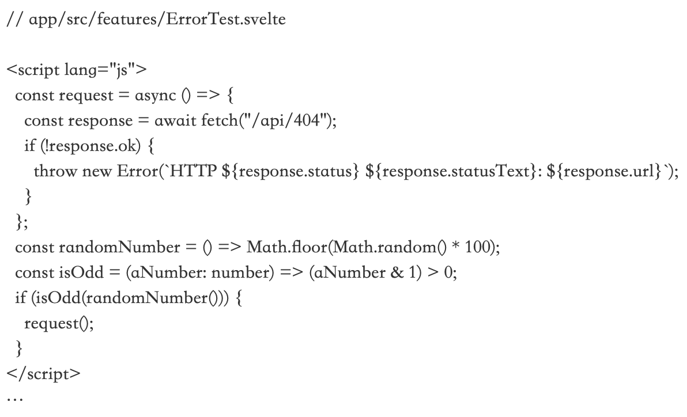

这是一个 Svelte 组件。它做的事情很简单，在刷新页面时随机发出一个 HTTP 请求。因为 `/api/404` 并不存在，所以它最终会抛出一个 Error。而该 Error 将会被 Sentry SDK 拦截，并上报给 Bugsink。
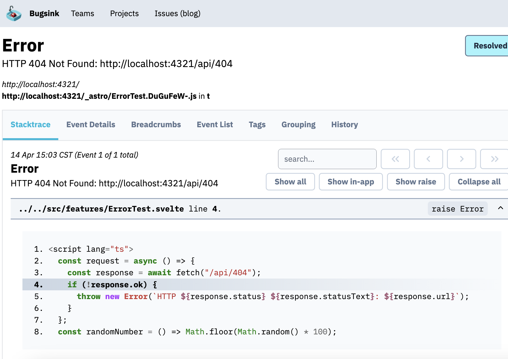
可以看到。Bugsink 不仅捕获到异常，而且还能展示所在位置。

注意，“展示错误位置”这个功能是通过 Source Maps 实现的（一种用来关联编译码和源码的技术）。换言之，在此之前，开发者需要先将 Source Maps 上传到 Bugsink，否则就无法看到这般友好的提示。例如，前端项目可以用构建工具轻松实现这个需求。
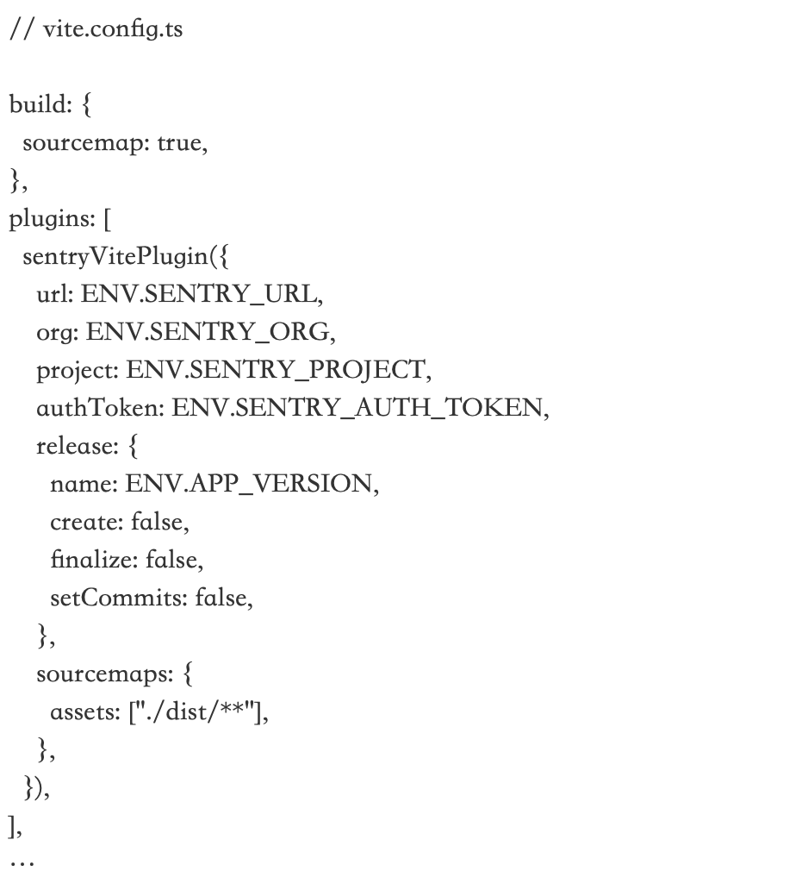
利用 @sentry/vite-plugin 插件，可以在项目构建期间将 Source Maps 上传到 Bugsink。如果有必要手动操作，则可以用 @sentry/cli。


### 遥测数据采集

在开源软件世界中，几乎从不缺乏工具。重要的是，需要知道如何进行选择。

记得在我刚毕业出来工作那会，有一次和同事闲谈。他说到，学编程最好是学习规范（协议），而不是学习某个具体的工具。这话即便放到现也相当正确。因为规范不只是契约，它还是信息隐藏的体现。换句话说，一旦工具实现了某种规范，那么用户就不再需要理解该工具本身的复杂性，而只需按照规范来使用它即可。

在可观察性方面，近年 CNCF 正在孵化 OpenTelemetry 项目。这是一个致力于标准化遥测数据采集的规范。是目前比较推荐的方案。它采集（目标应用）遥测数据的方式有两种：SDK 和 Agent。但后者并非所有编程语言都支持，它依赖于运行时特性。虽然没有前者通用，但胜在侵入性低。所以如果编程语言支持 Agent，那么就应该优先选择它。

以下是当前项目的可观察性拓扑。
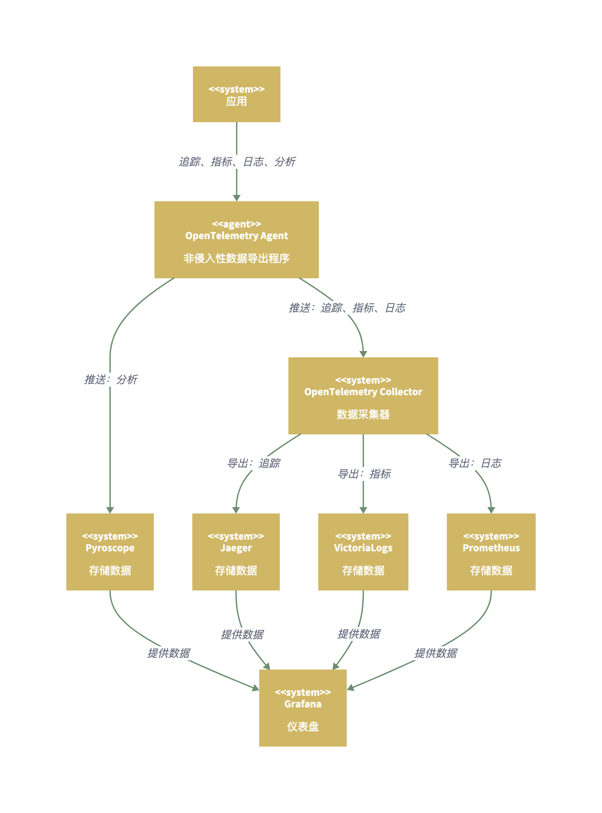
图中只有 Agent、Collector 以及 Pyroscope 是必须的，其它系统只要支持规范就可以进行集成，所以具体使用什么并不是重点。

> 其实目前市面上有一站式解决方案，而且支持 OpenTelemetry 规范。譬如 SigNoz 和 OpenObserve。但前项目之所以不选择它们，是因为考虑到可集成性问题。因为我发现部份系统（如：Kiali）会直接依赖 Jaeger、Prometheus 的 API，而它们目前并没有提供相关兼容性方案。

在 Java 中使用 Agent 很简单。先下载好[ Agent 构件](https://github.com/open-telemetry/opentelemetry-java-instrumentation/releases)，然后将其配置到启动参数即可（相关系统参数也可以用环境变量来替代。只需将“.”改为“_”，再转为大写即可）。
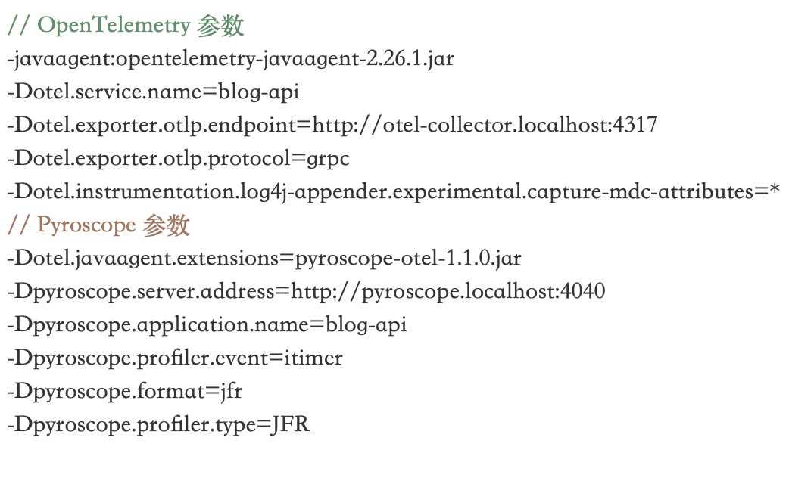
> 因为 Java Agent 是独立存在的构件，所以（应用的）系统参数 *-javaagent* 应该是文件系统路径。它可以是绝对路径，也可以是相对路径（相对于应用启动命令）。

虽然 Pyroscope 提供了独立的 [Java Agent](https://github.com/grafana/pyroscope-java)，但这里用的是 [OpenTelemetry 扩展](https://github.com/grafana/otel-profiling-java/releases)。因为这样可以关联追踪信息。

完成 Agent 配置后，另一个关键是 Colletor 配置。因为 Colletor 应该在处理完数据后，将其导出到对应的可视化系统中。
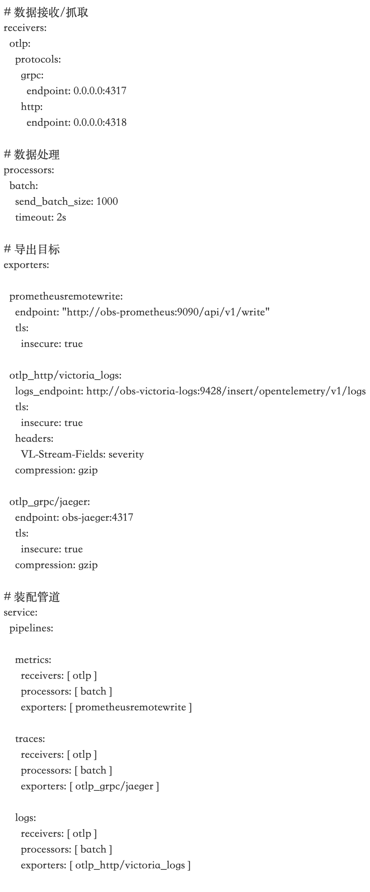

这里以 Pyroscope 为例。它会利用分析数据生成一张（可交互的）[火焰图（Flame Graphs）](https://pyroscope.io/blog/what-is-a-flamegraph/#how-to-interpret-a-flamegraph)。
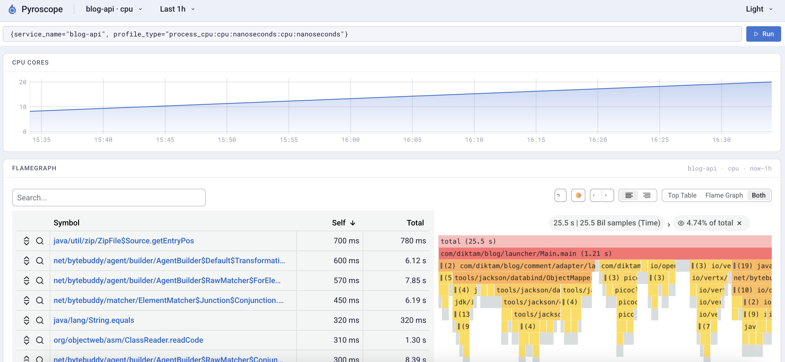


## 服务治理

### 是什么？

服务治理的核心理念就一句话 —— 让服务运行得更好。但凡被这句话所涵盖，就属于服务治理范畴。例如包括但不限于，安全、流控、熔断、服务注册和发现、高可用、伸缩性等。但具体实践会因系统部署环境而有所区别。一个比较典型的例子是服务注册和发现。在传统部署环境中，需要有专门的组件来负责该工作，而容器环境则通常内置支持 —— 用 DNS 实现。

另外，在容器环境中，其实大部份服务治理工作都可以通过服务网格（Service Mesh）实现。这样做的好处是，可以将服务治理工作从应用逻辑中抽离出来，使开发人员能够专注于业务逻辑。

### 一个简单例子

以安全授权为例，相关策略逻辑一般会被硬编码在应用层中。但从可维护性角度来看，这种方式其实并不利于修改和审计。更好的做法是，将策略逻辑从应用中抽离出来管理。这样做的好处有不少。例如，能够提升策略的可维护性和可复用性。同时也能够更好地审计和测试。

当前项目选择 [Open Policy Agent（OPA）](https://www.openpolicyagent.org/) 作为解决方案。以 API 授权场景为例，相关策略如下：
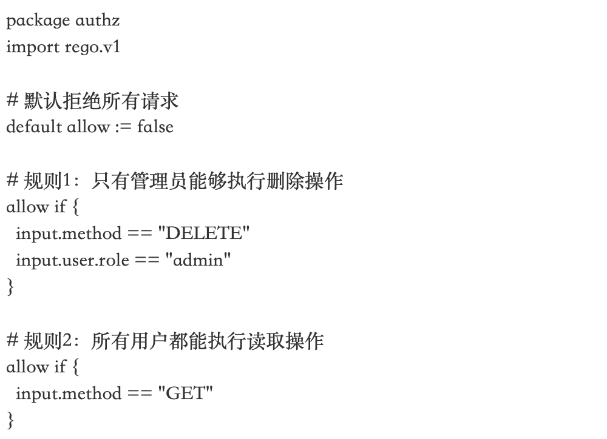
注意，规则之间属于 OR 关系，规则内的条件属于 AND 关系。

场景 1 - 管理员执行删除操作。因为满足规则 1，所以会返回 true。
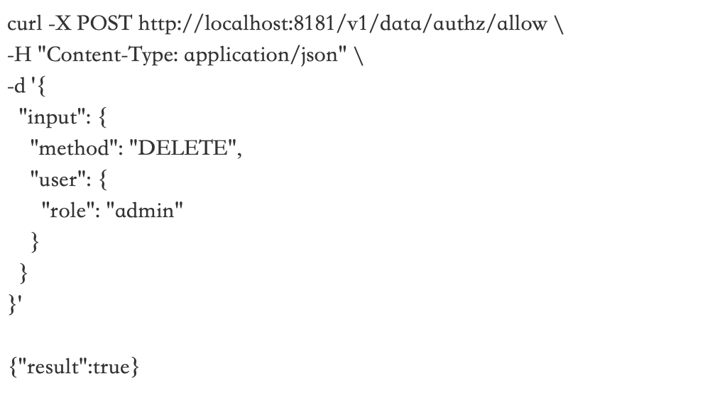

场景 2 - 普通用户执行删除操作。因为无法满足规则 1，所以会返回 false。
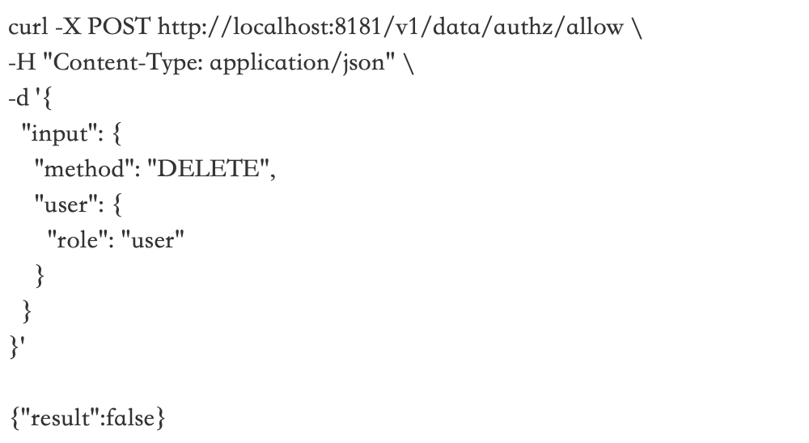

场景 3 - 普通用户执行读操作。因为满足规则 2，所以会返回 true。
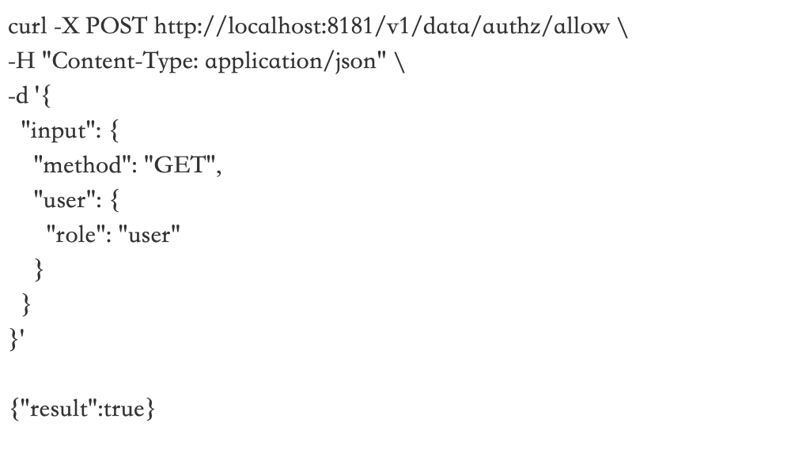

### 服务网格

*服务网格（Service Mesh）* 是一种强大的网络代理技术。其实核心理念是，运用代理技术，将服务治理和可观察性相关内容，从业务系统中抽离出来。

目前在该领域中，比较知名的开源项目有 Traefik Mesh（不活跃）、Consul、Linkerd、Istio 等。建议优先考虑 Istio 或 Linkerd。因为社区比较活跃，而且生态完善。当前项目选择了 Istio。

以断路器（Circuit Breaker）为例。
> 断路器是一种能够让下游服务（客户端）保持弹性的机制。确保即便上游服务发生问题，下游仍然能够正常响应请求，而不至于被级联故障。断路器本质上只是一个状态机，达到预设条件就会变换状态。例如，一旦上游服务的异常响应比率超过特定阈值后它就会被打开（Open）。之后所有针对该上游服务的请求都会被快速失败（或者降级）。打开状态在持续一段时间后会进入半开状态（Half Open），在该状态下断路器会放行部分请求。一旦正常响应的比率满足要求，断路器就会关闭。反之重新进入打开状态。

在传统部署环境中，断路器需要在应用内部进行实现。而容器化之后，就可以将其抽离到服务网格中。
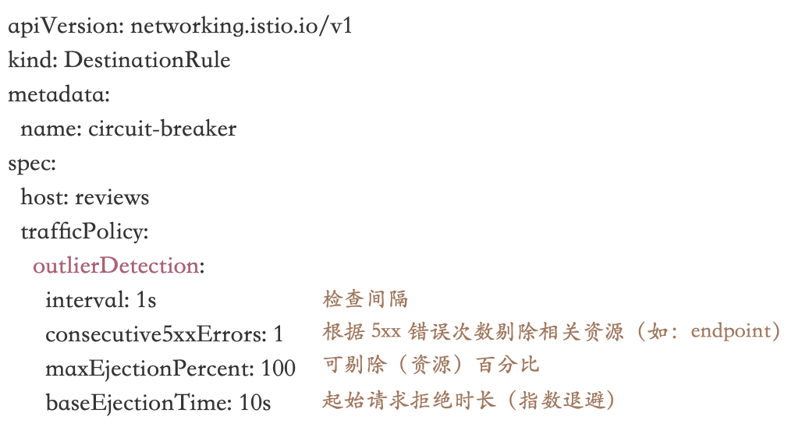

熔断器规则最终会被应用在网格代理（Envoy）上，所以一旦被触发就可以在  Jaeger、Prometheus、Kiali 等系统上观察到。
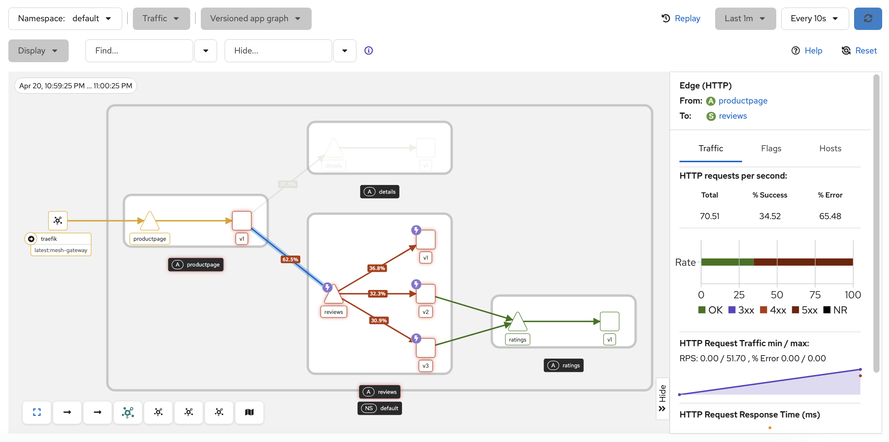
[Kiali](https://kiali.io/) 是 Istio 的可视化工具。它整合了 Prometheus 和 Jaeger，能够清楚地展示网格拓扑和[黄金指标（延迟、流量、错误、饱和度）](https://sre.google/sre-book/monitoring-distributed-systems/#xref_monitoring_golden-signals)。

## 持续集成（CI）

### 是什么？

CI 的核心理念是，透过频繁地集成工作增量来加速问题暴露和反馈周期，以此提高软件的交付质量和稳定性。为了实践该这种理念，目前有两种比较有效的方案：基于主干开发（TBD）和集成管道（Pipeline）。

TBD 就如字面意思一样，所有人都基于主分支进行开发、集成和发布。因为临时分支的生命周期越长、体积越大或者数量越多，其集成成本和风险就越大（如：合并冲突）。以特性分支策略（PR/MR）为例，每个人都可以有自己的分支，而且只需确保在软件发布前完成集成即可。但一些需要频繁交付软件的工程团队（如：Google、Meta、Netflix 等）发现，这种策略其实代价大于收益。因为延迟集成会导致风险后移，加大交付工作的不确定性 —— 严重的集成冲突甚至会导致交付延期。但这并非说特性分支策略毫无价值。个人认为，对于任务决策比较松散的团队，特性分支策略可能更能发挥作用。譬如开源项目团队。因为任何人都可以贡献代码，而且无需追求交付速度。所以比较适合使用流程明确的工作方式和策略。

Pipeline 对于开发人员来说，我想不会太陌生。因为很多自称是 DevOps 或微服务开发的团队都会有自己的 Pipeline。但个人认为，单纯的 Pipeline 只能算是一种构建软件的方式，而不是 CI。因为是否属于 CI 完全取决于工作增量的集成频率，而不是软件的构建方式。但高效的 Pipeline 确实有利于促进 CI。例如，更小的 Pipeline 执行时间，通常意味着反馈周期更短。

### TDB 要的

**软件发布**

软件发布时，需要从主分支（特定标签）创建一条 release 分支进行发布。如果发布后出现 BUG，不是修改 release 分支，而是先在主分支上进行修复，再通过 [cherry-pick](https://git-scm.com/docs/git-cherry-pick/zh_HANS-CN) 操作将该修复 commit 合并到 release 分支上，再进行发布。然而该流程可能会出现一个问题 —— 在此之前 BUG 已经被发现并修复，但目标 commit 包含当前 release 不兼容的内容。此时可以有几种选择：拆分 commit、通过调整代码来形成新的修复 commit、直接在 release 分支上修复。建议优先考虑第二种方案，其次是第三种。因为拆分 commit 会导致（commit）标识改变，这会破坏其他人的历史（除能够协调所有人）。

**隐藏代码**

TBD 比较难的部分是隐藏未完成的工作内容。因为主干需要处于随时可发布状态，但源源不断的增量集成会破坏该目标。因为可集成并不代表可发布。

针对该问题，有两种解决方案：功能开关、抽象分支。

功能开关（Feature Toggles）是一种实践持续交付（CD）的技巧 —— 用来控制特性或功能发布。在 TBD 中，可用它来隐藏未就绪的代码。
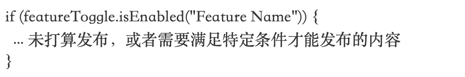
功能开关本质上只是一个依赖外部变量的条件语句。所以最简单的实现方式是基于环境或系统变量来进行控制。但缺点是难以动态调节。所以更好的做法是，使用外部配置服务（如：公共配置中心、Kubernetes ConfigMap），或者专门的功能开关系统。这样做的另一个好处是，前后端可以共用一个开关。但需要强调，功能开关和其它兼容性代码一样存在维护成本 —— 数量越多，成本越高。开发者应该避免大量使用功能开关，而且最好确保它们能够被及时清除。

抽象分支（Branch by Abstraction）主要用于替换代码实现场景。该策略的思路也比较简单，先对旧实现执行提取抽象，然后用该抽象替换客户端中的旧代码。之后的新实现只需满足该抽象就可以随时执行替换工作。整个过程完全可以做到渐进式，而且不会影响集成和发布工作。

最后有一点很重要。代码的兼容性很大程度受限于数据库模式（Schema），所以进行模式变更时应该确保向后兼容性 —— 至少兼容上一个版本。比较好的做法是，隔离持久层实现细节 —— 要做到这点，需要分离不同职责的模型。

### 规范化提交消息

随着 AI 工具盛行，部份人开始发现，LLMs 在具有自描述属性的代码库中可以表现得更好。因为这样的代码库能够为 LLMs 提供更充分的上下文信息。

理想情况下，代码库应该包含所有系统知识 —— Monorepo 和 GitOps 在这方面做得很好。而 Git log 也是自描述的一种体现。Git log 最具价值的地方在于，它记录了当前系统的变迁历史。换言之，Git log 的“故事”写得越好，它所带来的价值就越大。但问题是，怎样的 commit message 才能称得上好。我想很难有一个定论。

个人认为，首先要确保 commit 具备原子性。只要体积足够小，message 编写起来就会变得容易，同时也有利于后续代码审查工作。我知道一些人喜欢用变基（rebase）来整理 Git log 。但这种行为应该适可而止。因为它本质上是在篡改历史。不要为了“好看”而撒谎，除非是找到了更好的描述方法。

至于格式，比较好的方案是[约定式提交](https://www.conventionalcommits.org/zh-hans/v1.0.0/) —— 一种旨在提高信息可读性的规范。它提倡使用以下规范来编写 commit message：
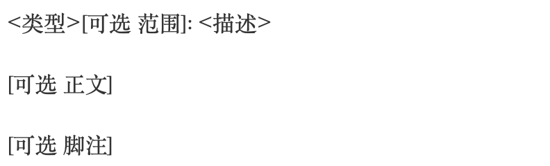

遵循该规范，可以得到类似 Git log。
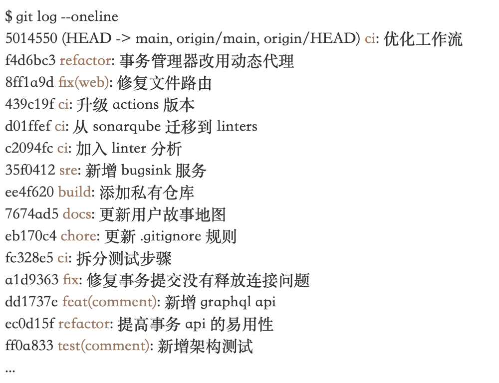

如果想找参考例子，可以浏览 [Angular](https://github.com/angular/angular) 代码库，它是一个典范。另外，为了能够更好地落实规范，可以在 [Git hooks](https://git-scm.com/book/zh/v2/%e8%87%aa%e5%ae%9a%e4%b9%89-Git-Git-%e9%92%a9%e5%ad%90) 中添加相关校验规则。这样可以阻止不合规格的 commit。

### 集成管道

Pipeline 工具选型的主要考量因素应该是易用性和灵活性。

譬如，虽然 Jenkins 足够灵活，可以同时胜任 CI/CD 任务，但它是一个复杂的系统 —— 各式各样的插件和配置，并不直观和易于理解。而且界面操作的管理方式容易发生配置漂移 —— 随着时间推移，很难有人能够完全清楚知道应该如何修改和重现配置。虽然 Jenkins 近年也开始支持[配置即代码（CasC）](https://plugins.jenkins.io/configuration-as-code/)，但整体来说还是比较复杂。更重要的是，它的维护成本较高。以版本升级为例，因为插件大多数都不由官方维护，所以会容易出现兼容性问题。因此，就目前而言 Jenkins 绝对不应该成为默认的选择。

个人比较推荐 GitHub Actions，因为它同时满足易用性和灵活性。而且 Gitea  对其进行了支持和兼容 —— Gitea 和 Gitlab 一样，都是自托管的源代码仓库。但它比后者轻量和简单得多。是目前中小型团队的绝佳方案（Gitea/GitHub + GitHub Actions）。

GitHub Actions 在使用方面相当简单，而且天然就是 CasC。只需两个步骤，就能与其集成。首先将工作流（Pipeline）定义文件放在项目的 `.github/workflows` 文件夹下，然后再进入 GitHub/Gitea 按需添加密钥和变量即可。

以下是 Github Actions 工作流定义的基本结构。
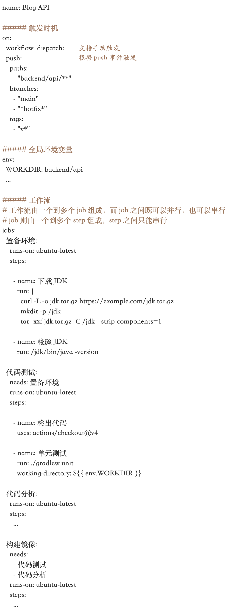

工作流执行信息，可以在 GitHub/Gitea Actions 界面中查看。
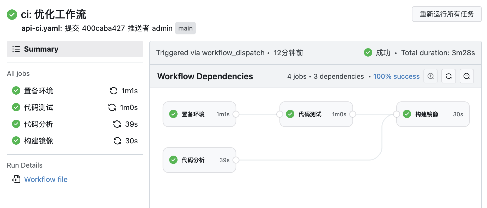

注意，GitHub/Gitea 不只是一个源代码仓库。它的 Package 服务可以存放不同类型的项目构件，而其中就包含 OCI 镜像。换言之，在大多数情况下，其实根本不需要使用类似于 Harbor 这种重量级的注册表。
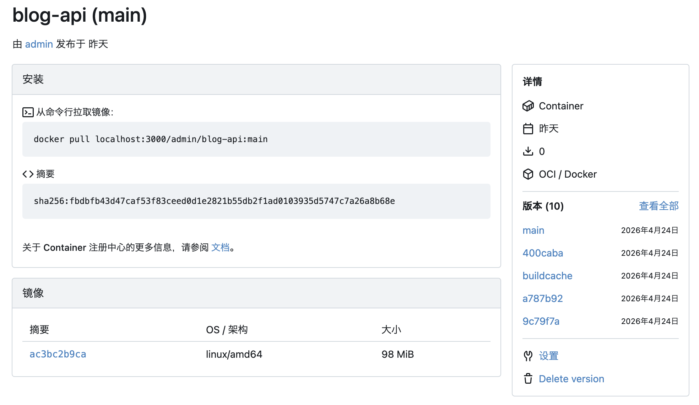


## 持续交付（CD）

### 是什么？

软件发布通常是一件令人心惊胆颤的事情。因为生产环境一旦出错，不仅用户和客户会责备，而且相关问题处理起来也会变得棘手（主要原因是，无法随意变更或者丢失数据。因为这是企业的资产，不是玩具）。更麻烦的是，如果生产数据被扰乱，就需要执行相关容灾方案来补救。譬如包括但不限于执行数据回滚、修复脚本、补偿事务等。而在此之前，很可能还会进行有关数据影响范围的分析  —— 相关依据可以从可观察性中获得。虽然容灾问题不属于本文范畴，但通过实践 CD，可以间接降低错误事件的发生机率。

CD 是指，使软件处于持续可发布状态的过程。前面谈及的 TBD 和功能开关都有利于该实践。此外，符合相同理念的还有*声明式交付*，以及*蓝绿部署*和*金丝雀发布*两种策略。

在技术选型小节中已经提到，当前项目会使用 Argo CD 和 Argo Rollouts 来实践 GitOps 和 CD。之所以选择它们，是因为使用简单，而且内置 UI 支持。
* Argo CD
  * 支持声明式交付和环境管理
  * 是实践 GitOps 的核心工具（，另一个选择是 [Flux CD](https://fluxcd.io/)）
* Argo Rollouts
  * 支持蓝绿部署和金丝雀发布

为了凸显这两款工具的特点，接下来将使用 Argo 官方示例进行演示。

### 声明式交付

在 GitOps 实践中，发布软件只需执行两条命令（`git commit` 和 `git push`）。剩余工作 CD 工具会自动完成。

以 Argo CD 为例，工作流程大致如下：
1. 创建待交付软件的资源清单 —— 除普通定义方式之外，也支持 Kustomize 和 Helm 方式
2. 将资源清单推送到远程代码库
3. 在 Argo CD 中创建（Argo CD）应用 —— 该操作只需执行一次。如无意外，一旦创建成功 Argo CD 就可以自动完成交付工作，并且能够持续监控资源清单的变化以同步软件状态

**待交付软件的资源清单**
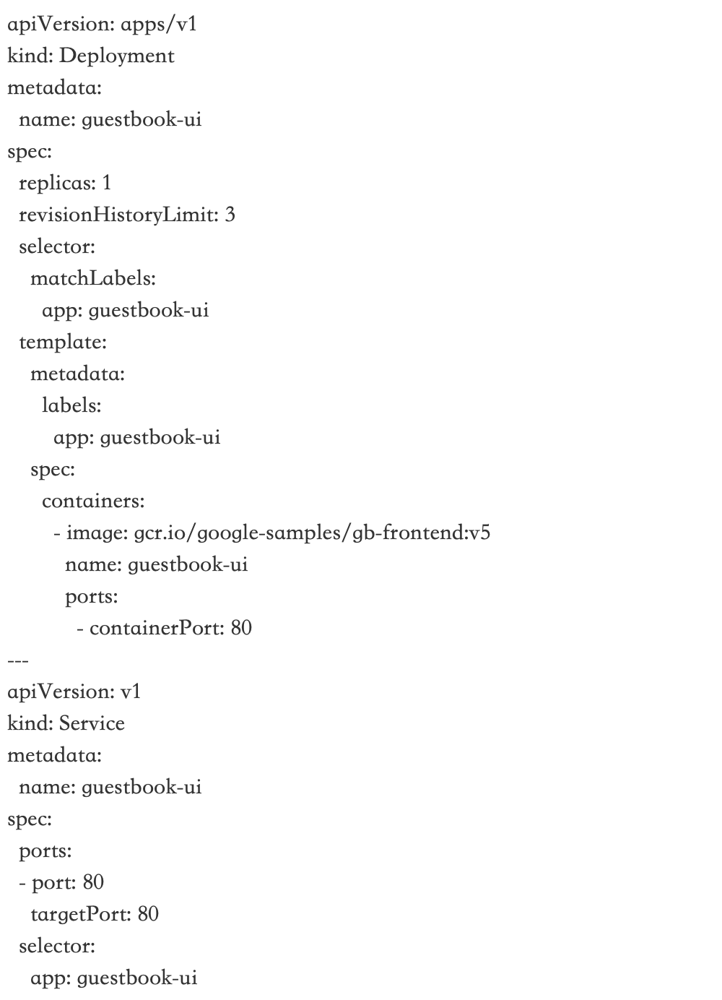

**创建 Argo CD 应用**

虽然 Argo CD 支持 UI 方式创建应用，但推荐做法是使用 K8s CRD。因为 GitOps 以代码版本为准，所以尽可能避免使用 git 之外的操作方式来改变软件状态。以免产生配置漂移。
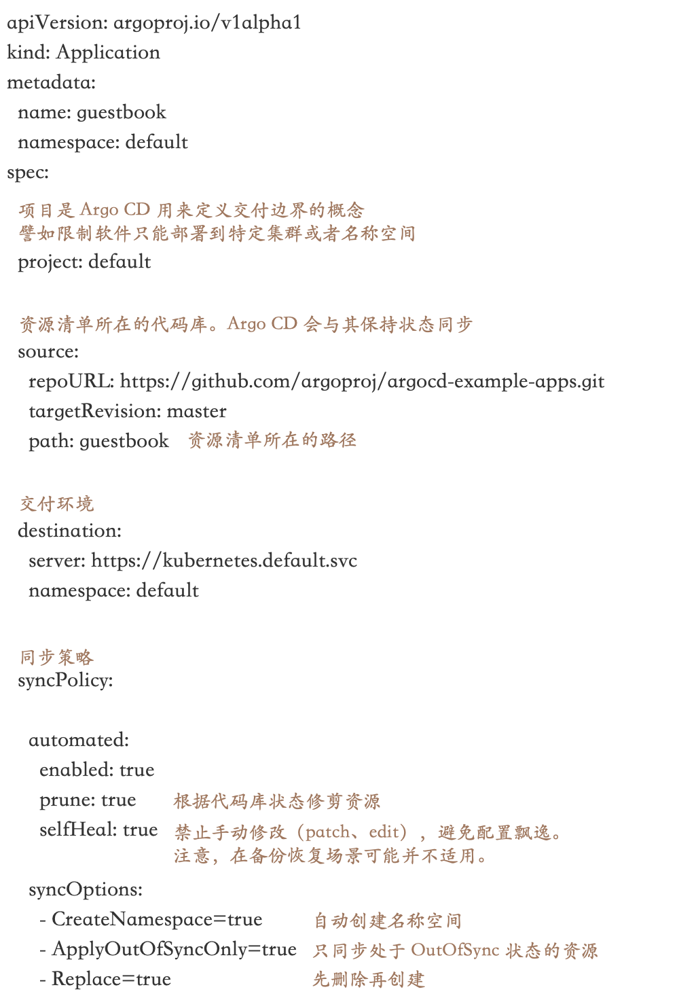

和其它 K8s 资源一样，定义好后，可以通过 `kubectl apply` 进行创建。
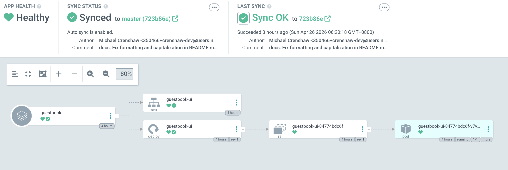
自此之后，每当修改远程代码库上的资源清单定义，Argo CD 就会将其同步为应用状态。

### 发布策略

蓝绿部署（Blue-Green Deployment）的概念很简单。*在发布期间同时运行新旧两套完整的应用，然后通过调节路由规则（如：反向代理）将流量一次过导向新版本*。该策略的目的有两个。一是希望做到零停机时间（又叫“热部署”），二是希望在发现错误时能够马上切换回旧版本进行及时止损。但代价也显而易见，需要两套生产环境。但庆幸我们生活在现代，可以利用容器编排工具模拟出这“两套”环境，所以问题不大。

> 蓝绿部署并没有要求两套环境完全相同，它的关注点只是同时存在，然后允许互相切换流量。换言之，两套环境是可能不兼容的。

金丝雀发布（Canary Release）又叫灰度发布或渐进式发布，它受启发于[矿工利用金丝雀探测有毒气体](https://en.wikipedia.org/wiki/Sentinel_species#Canaries)的做法。因为金丝雀体型小、呼吸快，遇到有毒气体会更容易中毒，而矿工一旦发现就可以及时撤离。所以该策略的核心理念在于*逐步试探*。譬如，先部署少量新版本实例，然后将部分流量导向这些实例进行试验。在确认没有问题之后再逐渐加大流量比例和实例数量，直到 100% 为止。从风险管理来看，该策略比蓝绿部署更胜一筹，而且对资源要求更低。但代价是更高的操作成本。

至于这两种策略应该如何选择。个人建议优先考虑金丝雀发布，除非新旧版本不兼容。

> 注意，部署和发布不是同一个概念。部署是一个技术过程，关注点在于如何将交付内容架设到特定环境上 —— 这些内容未必对用户可见。发布是一种业务决策（发生在部署之后），它强调交付内容对最终用户（或客户）具有价值，所以这些内容可以被外部感知。例如在 TBD 中，虽然被集成的代码未必都达到就绪状态，但它们完全可以被部署到生成环境。因为他们并没有被发布，而是被功能开关隐藏了起来。
>
> 我曾试图查找料理解为什么蓝绿部署属于 Deployment 而不是 Release，但没有得到想要的结果。目前个人认为比较合理的理解方式是，它的关注点在于架设两套环境，而发布操作位于“调节路由规则”。而它采用了基于关注点的方式来进行命名，就如同金丝雀发布一样。

**蓝绿部署**

Argo Rollouts 在使用方面同样简单。只需将原生 Deployment 资源改为 Rollout 即可。一旦创建成功，Argo Rollouts 就会持续监控该资源，并接管发布工作。
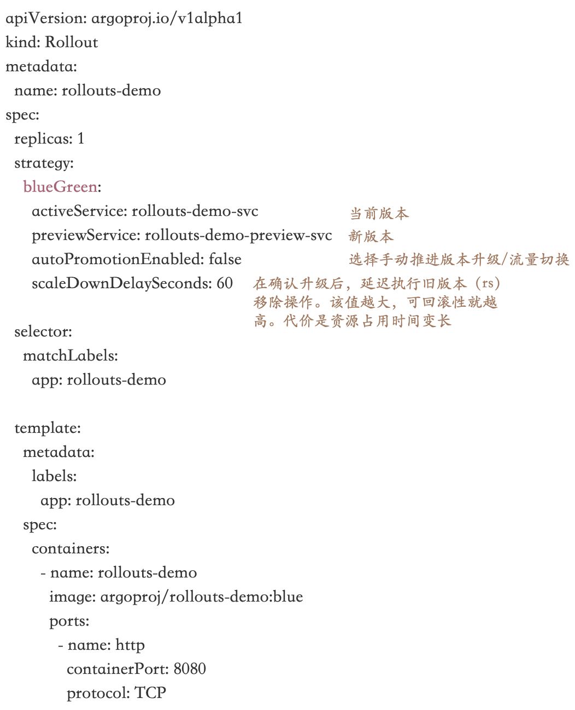

以上资源清单，如无意外会得到以下示例应用。
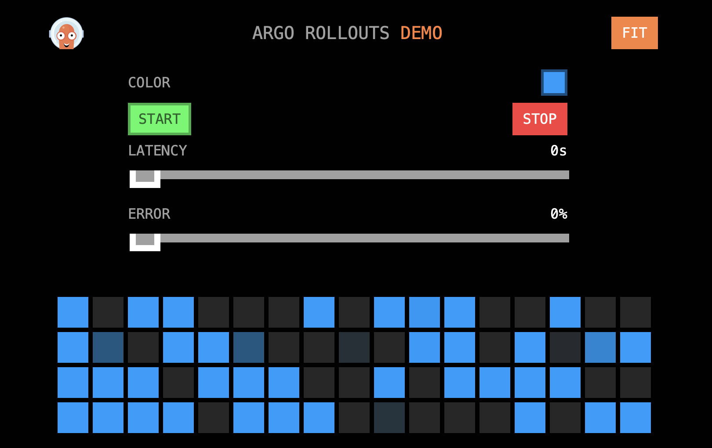
注意， 因为是首次部署（环境中只有一个软件版本），所以无需执行推进（Promote）操作也能够发布成功。否则需要通过 Arogo rollouts 执行推进（Promote）才能够完成发布 —— 因为当前示例应用设置了 autoPromotionEnabled：false。

相关状态信息，可以在 Arogo rollouts UI 中查看。
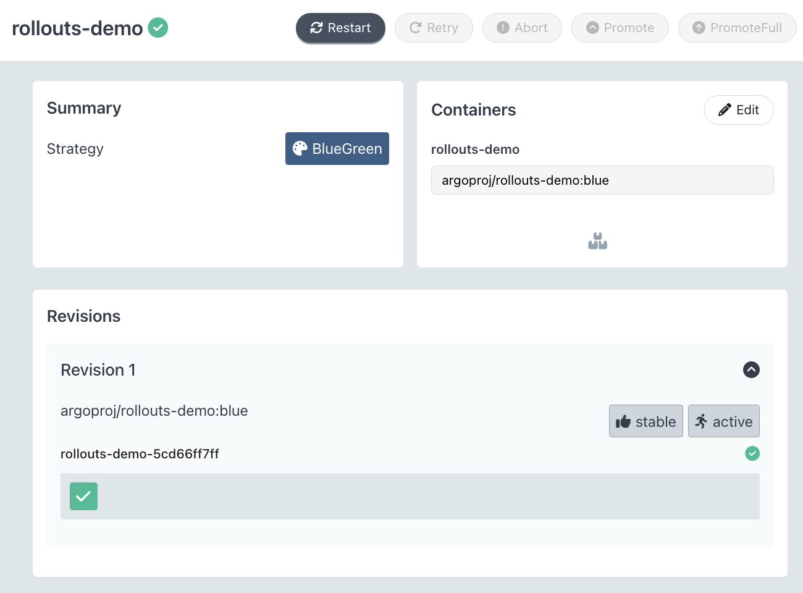

在此之后，如果需要发布新版本，只需和平时一样修改资源清单定义即可。譬如将镜像版本由  *blue* 改为 *green*。一旦应用（apply）成功，Argo Rollouts 就会捕获到相关状态。
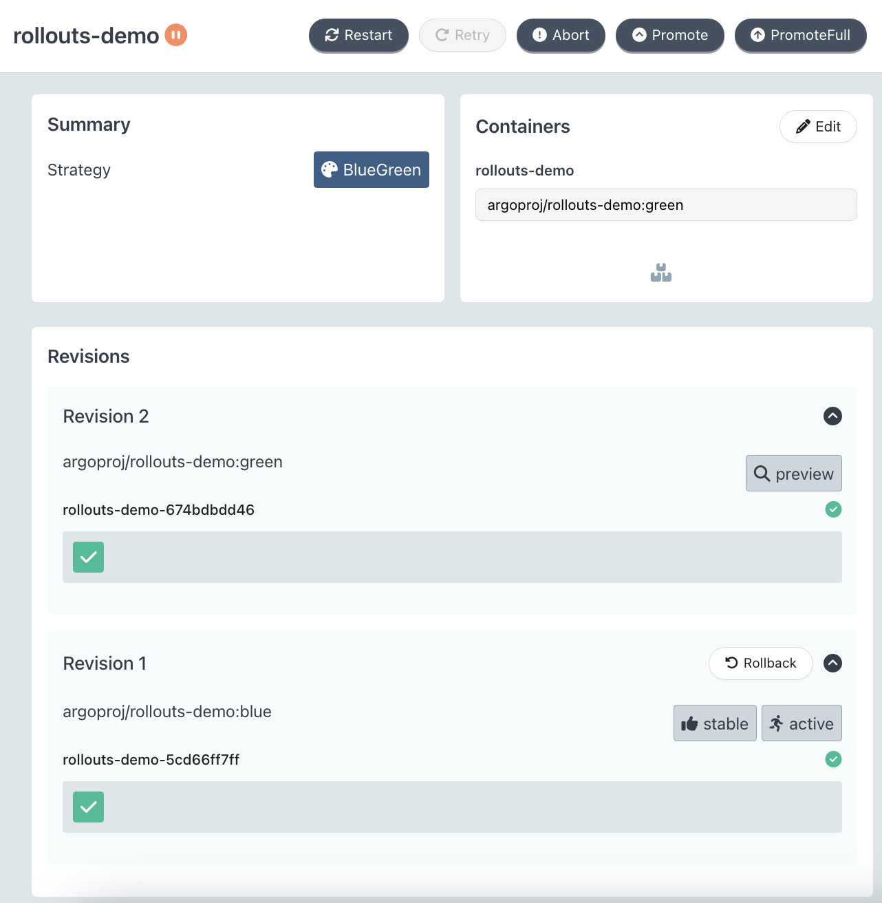

可以看到，目前环境同时存在两个版本的实例。这是因为我还没有确认推进（Promote），所以 UI 才会出现“暂停”图标提示。此时如果点击推进（Promote）按钮，流量就会被切换到 *green* 版本。

此时再浏览示例应用，就可以发现已经完成升级。
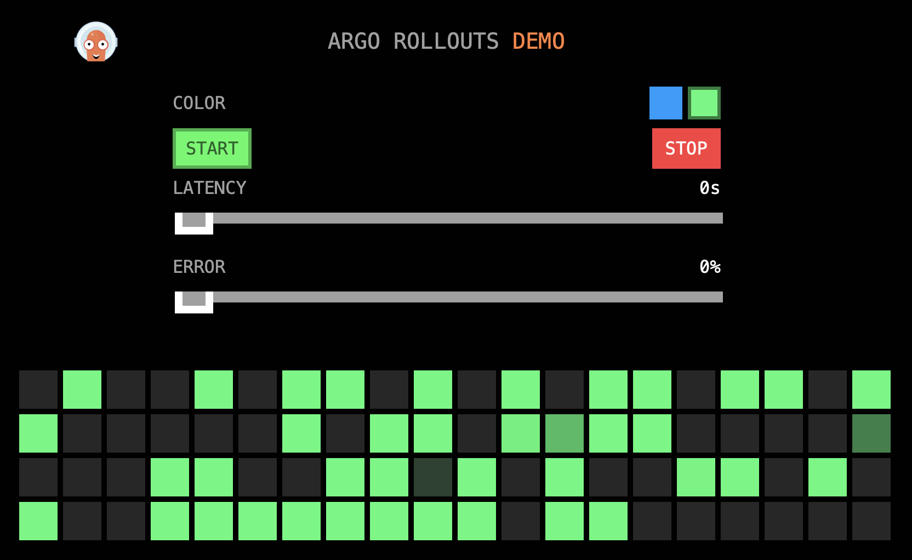

如果推进（Promote）之后出现异常，可以通过 Rollback 按钮进行回滚。

另外，如果你希望只要满足特定条件就允许自动推进，那么可以参考 [Analysis & Progressive Delivery](https://argo-rollouts.readthedocs.io/en/stable/features/analysis/)。


**金丝雀发布**

和蓝绿部署不同，金丝雀发布会涉及更细致的流量控制。针对该需求，Argo Rollouts 支持与多种网关进行集成。譬如， APISIX、Nginx、Kong、Istio，以及 [Getaway API](https://rollouts-plugin-trafficrouter-gatewayapi.readthedocs.io/en/latest/) 等。建议选择 Getaway API，因为它几乎已经成为 K8s 标准。

因为涉及流量控制，所以需要先为示例应用定义网关和路由。
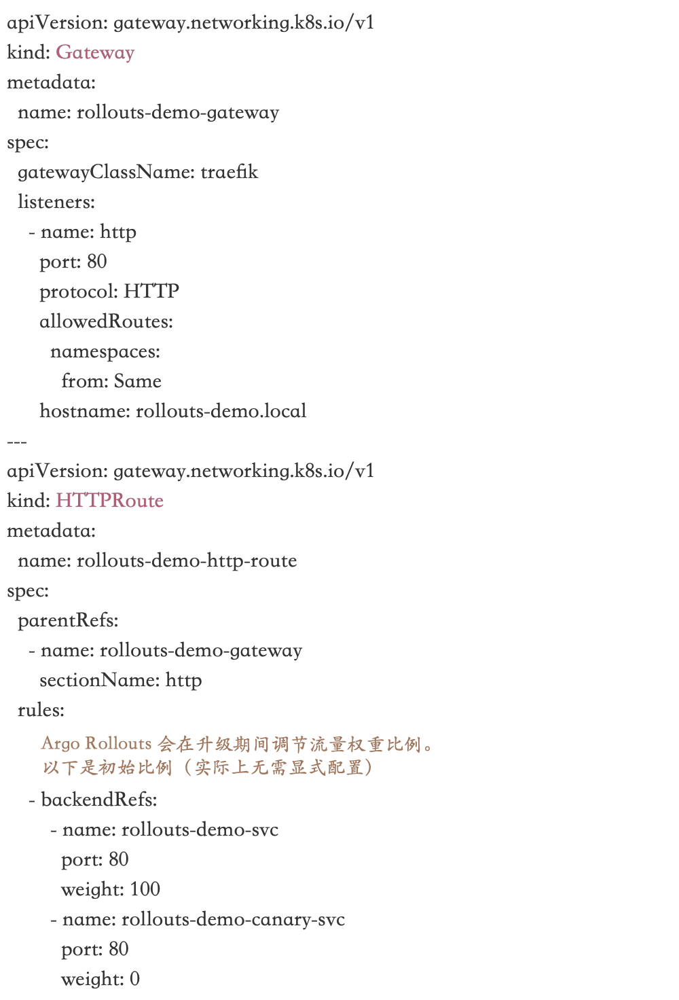

然后定义包含金丝雀发布策略的 Rollout。
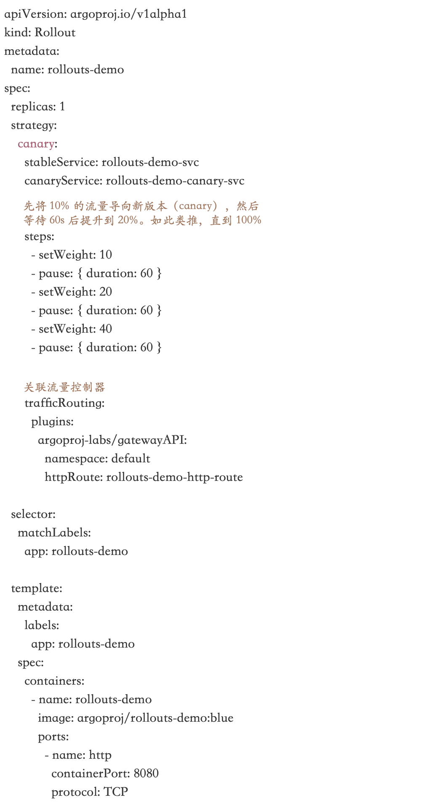

创建成功后，可以在 UI（或 CLI）中看到相关信息。
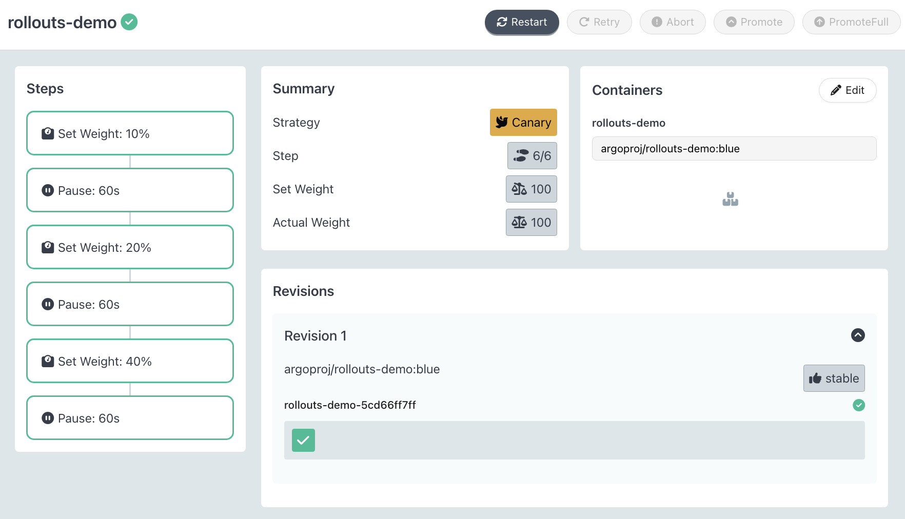

同样地，这里将镜像版本从 *blue* 改为 *green* 以触发升级。

此时观察示例应用，就可以发现流向新版本（canary）的流量正在逐渐增加，最后达到 100%。

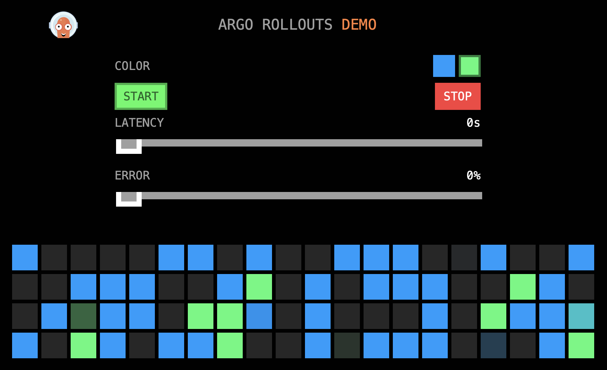


如果中途出现异常，可以通过 Abort 按钮终止升级。此时 Rollout 会变成 degrade 状态。因为在升级时，我将镜像版本改成了 `green`，但又因为触发了终止（Abort）操作，导致内存状态与资源清单定义不一致。解决方法是将 `green` 改回 `blue`。这样 Rollout 就会变回 Healthy 状态。

**拓展：暗发布**

暗发布（Dark Launching）是指，以用户无法感知的方式，将新增（或变更）后的后端行为发布到生产环境。目的是为了验证和改进这些行为。该发布策略通常会结合功能开关一起实现，但不是必须的。

**一个简单例子：渐进式重构**
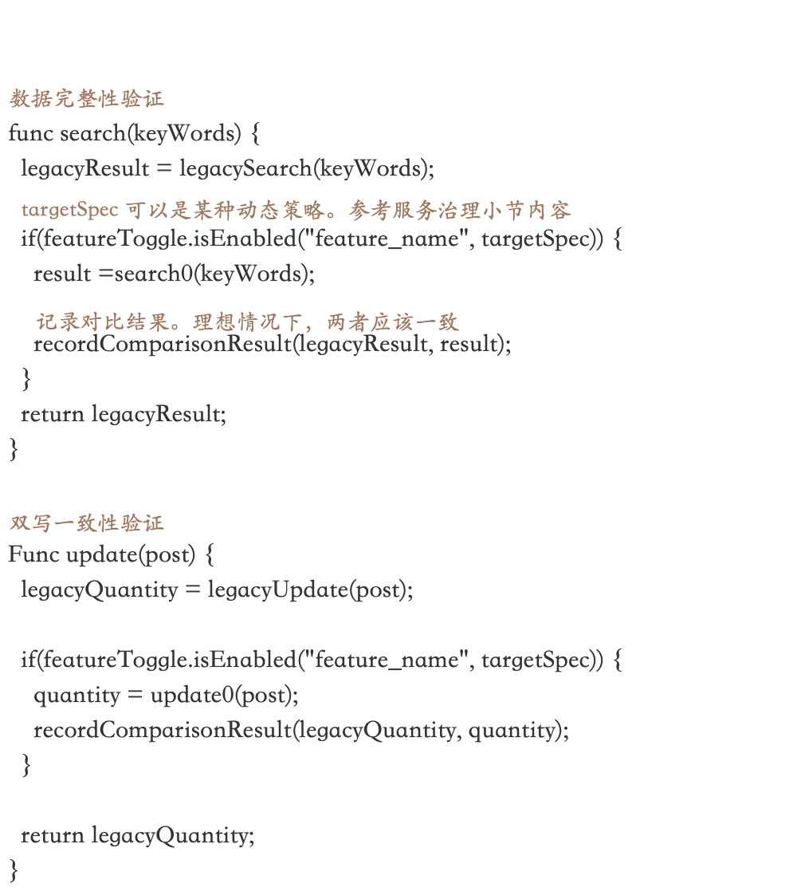

注意，当重构工作涉及数据迁移时。这部份内容，应该在对外发布之前，先进行数据完整性验证。而且最好是先发布给部分用户进行试验（如：特定租户或角色），然后再逐渐扩大范围。

> 如果想了解更多关于解渐进式重构的内容，建议阅读《[大规模重构](https://book.douban.com/subject/36924749/)》一书。


## 站点可靠性工程

### 是什么？

如果说 DevOps 是一种研发团队文化，那么*站点可靠性工程（Site Reliability Engineering，SRE）* 就是加强这种文化的有效途径。

就目前而言，SRE 已经是一个独立的职位。该职位的特别之处是，它需要聘请（额外的）开发人员来负责运维工作。之所以会有这种要求是因为，其初衷认为开发人员会很自然地厌恶手动操作，从而转向致力于让一切都自动化。

> 比较现代的产品研发团队至少会有两种开发人员：Software Engineers（SWEs）和 Site Reliability Engineers（SREs）。前者负责业务代码开发，后者则负责平台代码开发（平台：应用代码之下，基础设施之上的内容）。

如名字所示，SRE 的主要职责是*维护和提高系统的可靠性（在特定条件或时间内，成功处理请求的能力）*。这就是为什么需要聘请额外的开发人员，而不是直接让 SWEs 兼任的原因。因为可靠性相关工作已经超出了传统开发和运维的职责范畴。另外，SRE 发明者 Ben Treynor Sloss（Google）给出的经验法则是：SREs 必须将一半工作时间用于平台代码开发。换言之，如果*运维任务*和*可靠性应急处理*所花费的时间超过了一半，就意味着需要改进 SRE 实践。

> Q/A 和 SRE 的区别在于，前者负责确保正确性，后者负责确保可靠性。

然而，对于中小型企业来说，要想实践 SRE 其实绝非易事。因为 SREs 相当于是全能型人才。不仅需要懂开发和能够理解业务，还需要懂各种分布式理论和实践，而且还要求能够熟练使用和运维各种常见的中间件和数据库。光是招人就已经是一个大问题。特别是国内这种市场，懂面试的人很多，但真懂实践的是少之又少。个人认为，可以考虑让架构师来担任 SREs。当然，架构师未必能够胜任运维工作，所以理应让运维人员与其进行工作配合（如果有运维人员的话）。

> 如果想了解更多关于 SRE 的内容，建议阅读《[SRE: Google运维解密](https://book.douban.com/subject/26875239/)》一书。


### 混沌工程

在系统设计和编码时，相关人员一般会根据经验来判断某个操作是否有可能会发生问题。当认为有问题时，就会做一些防御性工作。譬如，在涉及外部交互的地方增加异常处理来兜底。但身为人类，我们的逻辑思维其实无法做到百分百缜密 —— 否则就不会有 BUG 存在。而[墨菲定律（Murphy's Law）](https://zh.wikipedia.org/zh-cn/%E6%91%A9%E8%8F%B2%E5%AE%9A%E7%90%86)又告诉了我们一个现实 —— 但凡有可能出错，就必然会出错。针对这种难题，*混沌工程（Chaos Engineering）* 就是一种缓解手段。混沌工程可以通过各种（混沌）实验，故意制造问题来发现或验证系统弱点。相关人员能够以此作为依据来提高系统的可靠性。所以这对于 SRE 来说，是一种相当有用的实践。

在制定实验时，可以用 *曾经发生过的问题*、*担心会发生的问题（经验）*，又或者 *系统期望（如：SLA）* 作为参考。而一个比较标准的实验，通常会包含以下步骤：
1. 根据正常负载下的系统表现来定义稳态。譬如 Foo API 能够确保 99% 的请求被处理成功（HTTP 200~300）
2. 为实验提出假设。譬如当故障发生时，系统仍然能够维持稳态
3. 注入故障
4. 验证假设

注意，可观察性是混沌工程的基础。否则将难以定义稳态和验证假设。

工具方面，推荐 [ChaosToolkit](https://chaostoolkit.org/) 和 [Chaos Mesh](https://chaos-mesh.org/zh/)。前者是一个跨平台工具，后者则与 Kubernetes 绑定。如果两者都不合适，可以参考  [Awesome Chaos Engineering](https://github.com/dastergon/awesome-chaos-engineering#notable-tools)。当前项目选择 Chaos Mesh，因为易于使用，而且内置 UI 支持。

**一个简单例子：替换 API 响应内容，并注入延迟**

当前系统有一个 `/health` 接口。它的作用很简单，返回系统的状态信息。
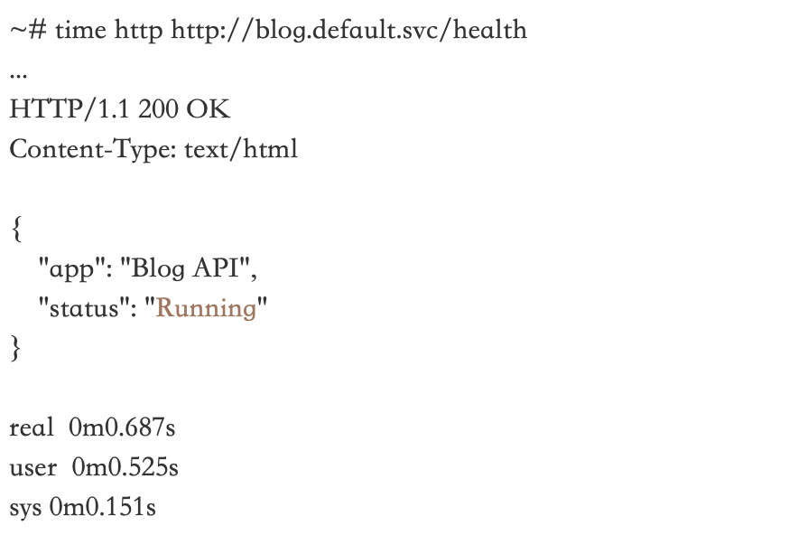

现在针对该接口设置一个实验。
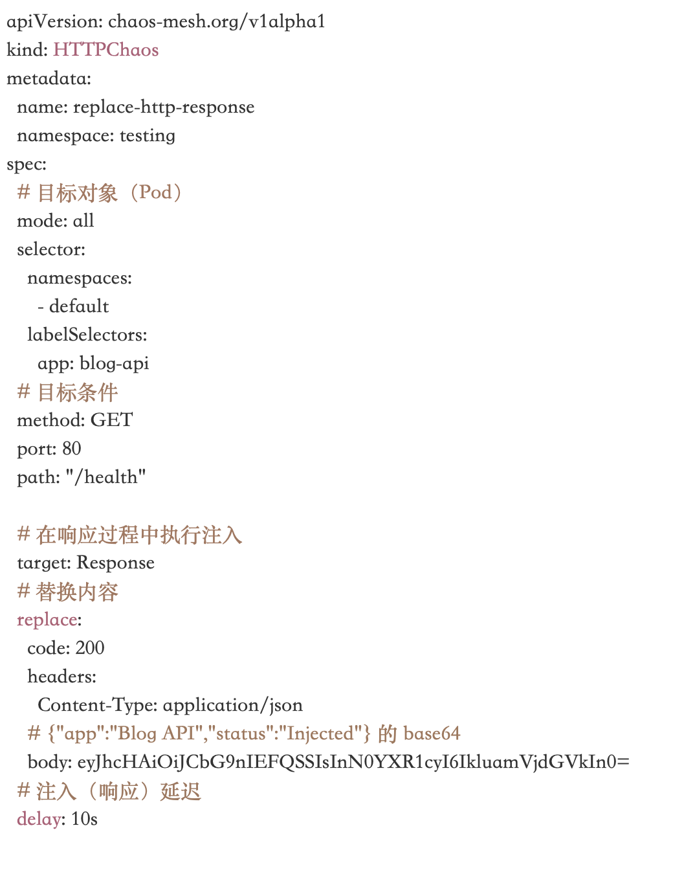

一旦该实验生效（kubectl apply），如无意外就会得到以下结果。
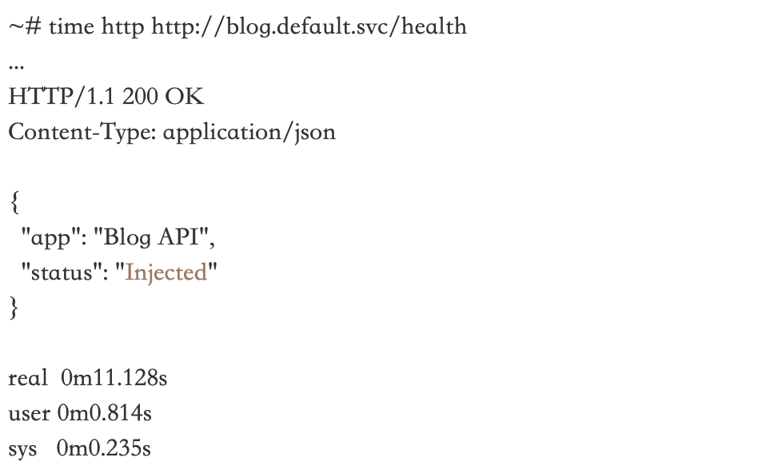

HTTP 故障只是其中一种类型。实际上 Chaos Mesh 还支持模拟 I/O、CPU、Memory、Network、Pod，甚至 JVM 等故障。

> 如果想了解更多关于混沌工程的内容，建议阅读《[混沌工程: 通过可控故障实验提升软件系统可靠性](https://book.douban.com/subject/36243222/)》一书。

### 基础设施即代码

可以这么说，从我学编程到现在，虽然十年过去了，但我仍然十分讨厌做环境搭建相关工作。因为这部分工作稍微不注意就会浪费大量时间和精力，而且通常不会带来任何收获 —— 唯一带来的教训就是要小心翼翼地操作。后来我慢慢开始用脚本（主要是 Bash）替代人手操作。因为当某些操作需要被反复执行时，人工处理通常比较低效，而且难以确保毫无错漏 —— 一致性差。但 Bash 脚本的适用性始终有限。难以跨平台工作（那时 Windows 还不支持 WSL），而且用它编写出来的脚本普遍还难以阅读和维护。所以后来我就迁移到了 Python 平台。Python 可以说是一种“万金油”工具，适用性非常广。例如包括但不限于，网络爬虫、数据分析和处理、自动化测试和运维、Web开发，以及近来兴起的 Agent AI 开发等。从运维角度来说，它比 Bash 更具可读性和可维护性，比 Ruby 生态更好。当然，该小节并非为赞叹 Python 而写，而是表达个人在运维工作方面发生的转变。以及引出一种相当高级的运维方法论：*基础设施即代码（Infrastructure as Code，IaC）*。

虽然 IaC 相关概念早在 09 年左右就已经被提出，但它和其它真正有价值的信息一样，在传播方面存在滞后性。因为到目前为止，仍然有很多人通过手动方式（如：界面操作）置备和配置基础设施。这样不仅低效，而且就算没有任何操作失误也会容易产生雪花服务器（难以，或者根本无法复现相关配置）。若然读者无法理解该问题。那么请试想一下，如果现在叫你把公司系统及其环境配置完全迁移到新设备上，你会怎么做？而且这些环境很可能还不是由你一手建立（这是再正常不过的情况），是不是光想想就头痛。特别是对于开发人员来说，部分公司可能出于某种原因而不让接触生产环境（这种文化并不符合 DevOps 理念，而且会降低问题处理的效率）。所以在缺乏相关知识的前提下，事情就会难上加难。这也是为什么我一直认为，公司代码应该对所有相关人员开放（访问权限），以及 Monorepo、GitOps 和 IaC 为什么会有用的原因。因为它们能够透明化项目知识，这有利于提高后续决策和执行的质量。

言归正传，当有人谈论 `as Code` 时，其实是在说，将编程领域的良好实践应用于某个领域。以 IaC 为例就是，用代码来置备和配置基础设施。但这只是表面含义。实际上一旦使用代码来处理运维工作，除了能够得到自动化能力之外，还能得到更好的版本控制（如：Git）。这不仅利于审计，还方便实现配置回滚。此外，还可以通过应用各种代码设计原则来提高 IaC 的可复用性和可维护性。而个人认为最大的好处是，只要有代码就可以轻而易举地重建整个业务系统环境。
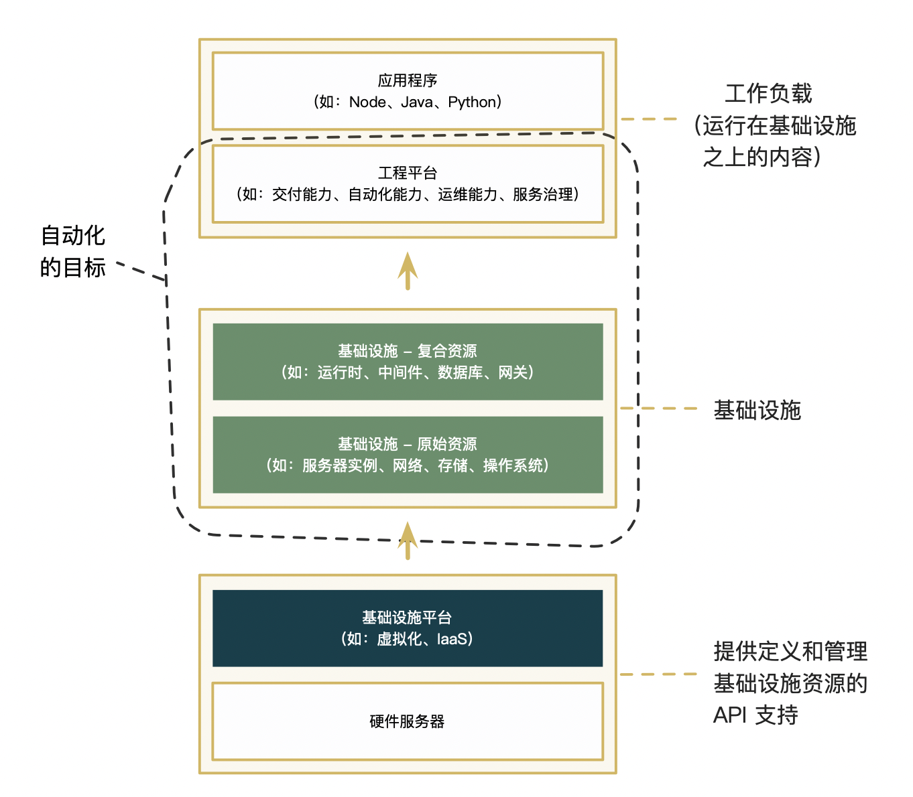

另外，在进一步理解 IaC 之前，先对相关概念进行统一。所谓基础设施，可以简单理解为是，运行业务系统所需的一切资源。但这种定义只是理想中的状态。实际上允许操作哪些资源，完全取决于基础设施平台本身。另外，IaC 主要包含两种类型的任务，*置备（Provisioning）* 和 *配置管理（Configuration Management）*。前者负责从无到有，后者则在前者的基础上使其达到目标状态。区分这两种任务有利于更好地组织代码，以及选择适合的工具。

**基础设施工具**

虽然理论上可以通过 Python 和平台提供的 SDK 实现所有运维工作。但这对于一般团队来说，成本还是有些高。因为据我了解，并非所有公司都会聘请专门的运维人员，更别说什么 SREs 了。换句话说，让开发人员负责所有工作，并试图从中获取最大的灵活性，确实有些不切实际。针对该问题，目前有不少工具可以作为参考，所以无需从头开始用 Python 进行实现。例如置备方面有 Terraform/OpenTofu、Pulumi、Crossplane，而配置管理则有 Ansible 和 SaltStack。

当前项目采用 Pulumi 和 Ansible。其中选择 Pulumi 的原因是，它支持使用通用编程语言来管理基础设施（如：Java、JavaScript、Python 等）。这为 IaC 实践提供了极大的灵活性。因为 Terraform 默认使用 HCL，这是一种声明式 DSL。缺点是，逻辑处理的灵活性较差。虽然有段时间 Terraform 声称不再强制使用 HCL，但我最近发现[相关解决方案已经被弃置](https://developer.hashicorp.com/terraform/cdktf)。而 Crossplane 与 Kubernetes 平台绑定。除非没有更好的选择，否则个人并不推荐与特定平台绑定的工具。

至于 Ansible，它和 Pulumi、Terraform 一样都属于无代理工具 —— 无需在目标服务器上安装任何依赖就可以直接使用。如果要我简单形容一下它到底是什么，我会说它是一个*操作编排工具*。你可以用它来编排需要在目标服务器上执行的命令。

> 有时候置备工具和配置管理工具的职责并不清晰。特别是对于 Ansible 来说。因为它可以做很多事情，这会显得使用置备工具貌似没什么必要。但即便如此，个人并不建议使用 Ansible 来实现置备工作。因为置备工具（如：Pulumi、Terraform）的优势在于内置状态管理。如果硬要用 Ansible 来做，就需要自己管理状态。这会增加开发难度和维护成本。

**使用 Pulumi 置备基础设施**

Pulumi 支持市面上大多数云计算平台。这些平台在 IaC 语境中一般被称为 Provider。你可以在 [Pulumi Registry](https://www.pulumi.com/registry/) 中进行查找。

以虚拟化平台 Proxmox Virtual Environment（PVE）为例。假设现在需要置备两台服务器，那么可以通过以下脚本来实现。
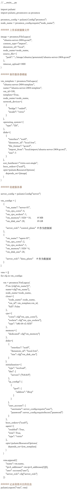

然后执行以下命令。
```
pulumi update --yes
```
如无意外就会得到两台服务器。
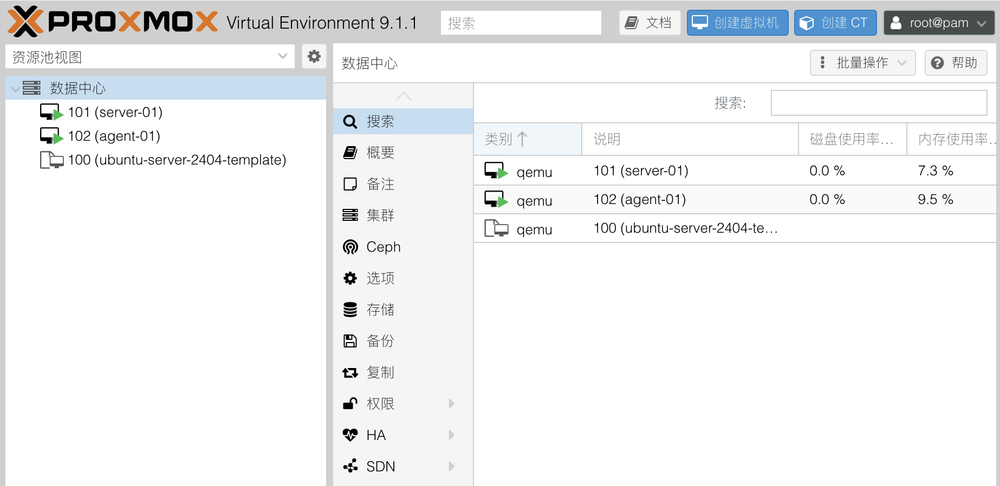

当需要变更配置时，只需修改代码，并再次执行 `pulumi update --yes` 即可。但需要注意，如果变更包含非兼容性配置，这可能会导致原本服务器上的数据被“抹除”。所以在此之前一定要做好备份。

**使用 Ansible 进行配置管理**

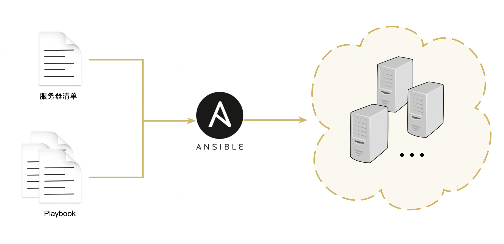

如图所示，Ansible 的使用逻辑其实很简单。

首先定义服务器清单。
> 除非是本地环境，否则该清单不应该手动维护。\
可以用 Python 脚本，根据 `pulumi stack output --json` 自动生成。

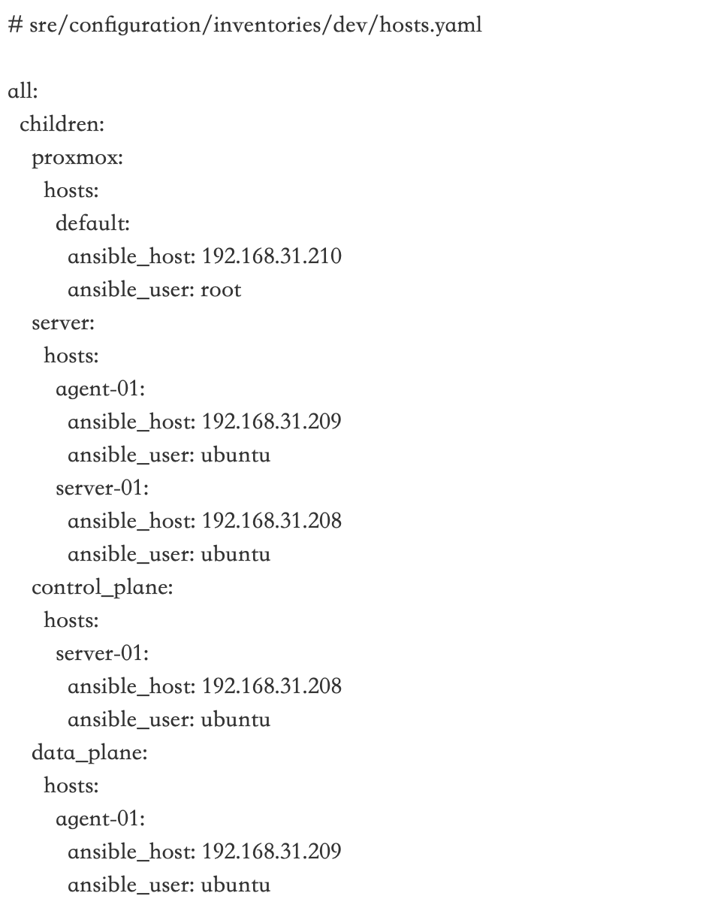

如果有必要，也可以自定义变量。
> Ansible 内置变量，可以参考：[Special Variables](https://docs.ansible.com/projects/ansible/latest/reference_appendices/special_variables.html)

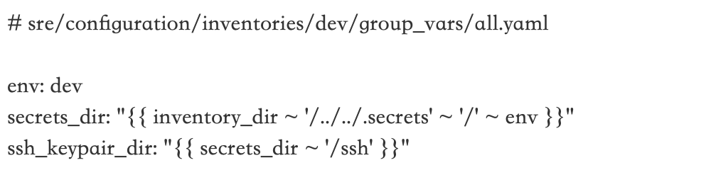

然后根据需求场景定义 Playbook。例如我希望目标服务器支持 SSH 密钥登陆。
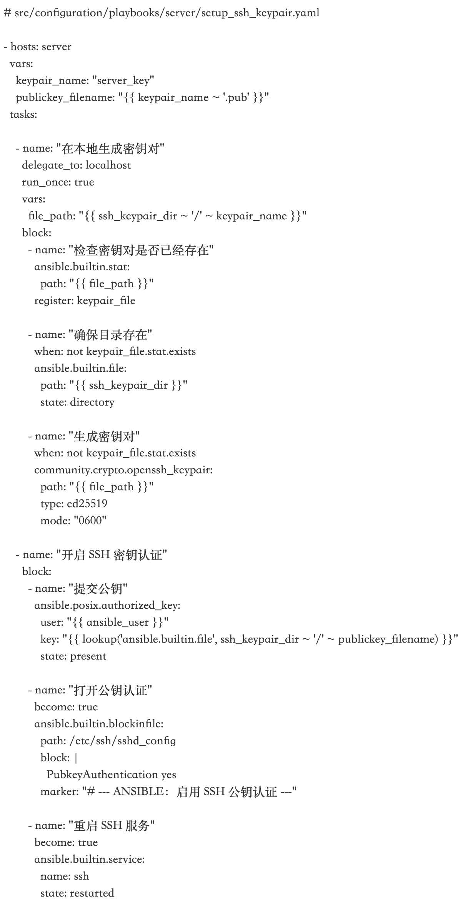

最后执行以下命令即可。
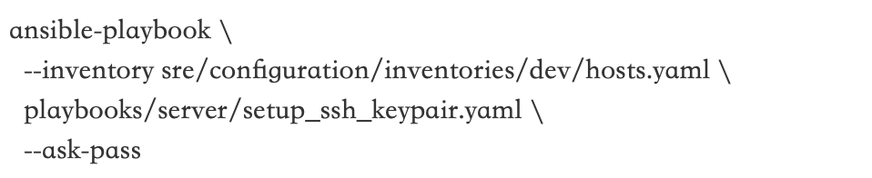

**小结**

因为文章篇幅问题，我难以展示 Ansible 在当前项目中的所有应用。其实我还用它搭建了 Kubernetes 集群。但简而言之，运维人员完全可以基于 IaC 工具做到短短几行命令（甚至一行）就能够搭建好整个业务系统环境。

> 如果想了解更多关于 IaC 的内容，建议阅读 《[基础设施即代码：第二版](https://detail.tmall.com/item.htm?abbucket=16&id=1052605636739&mi_id=0000GBWrrO3V0zfcEdrC1NXPyST7cQ_OFeGmJECsPlOAFN4&ns=1&skuId=6083445117210&spm=a21n57.1.hoverItem.8&utparam=%7B%22aplus_abtest%22%3A%229ebf3f6bd4df50dd6c6bb076e3452c50%22%7D&xxc=taobaoSearch)》或《[Infrastructure as Code, 3rd Edition](https://book.douban.com/subject/38404932/)》。


## Q/A 测试

### 验收测试

一般而言，在交付功能之前都需要先进行验收测试。只有测试通过才会执行发布流程。这项工作主要由测试人员负责。但据我了解，部份测试人员的工作方式其实效率相当低，而且还没有验收标准。一方面是因为大部份测试任务都采用人工操作，而且主要是端到端（E2E）测试。因为 UI 本身并不稳定，一旦改动又要重新进行测试，这样的工作方式成本相当高。而另一方面是，不重视需求文档。相关工作任务甚至可能只是口头交代一下。这种松散的协作方式，会无形地增加开发和测试成本。因为它们通常只是表面上没有标准，而一旦到了交付关节点就会有人跳出来说“要改一下”。这不仅会延误交付时间，还是对其他人不负责任的表现。所以在展开工作之前，工作内容和验收标准最好是明明白白。

鉴于以上问题，所以我在开展编码工作之前就已经和 Chris 确认了验收标准。即便后续他改变需求，但交付延期的责任并不在于我。这就是工作，大家应该用契约来维持关系。

以下是其中一个验收标准，它采用 Gherkin 规范编写。
> 针对 Gherkin 进行的测试叫做行为测试，但反之则不然。如果用行为测试来驱动编码工作，就叫行为驱动开发（BDD），是一种高维度的 TDD。虽然 BDD 并不区分前后端开发，但从验收角度来说，在前端中应用更为适合。因为用户本身只能感知到 UI 操作，所以在编写验收标准时，只会从 UI 角度进行描述。

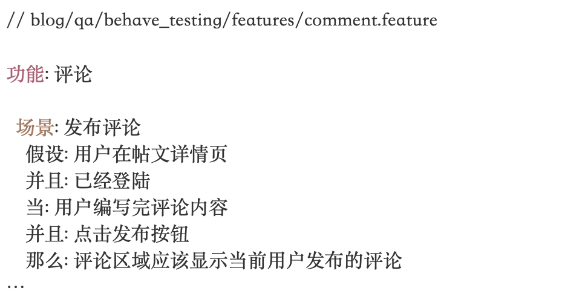

目前使用比较广泛的 Gherkin 测试库是 [Cucumber](https://cucumber.io/docs/installation/)。虽然它支持多种编程语言，但当前项目决定使用 Python。因为语法比较简单，也没有严格的类型系统，更重要是拥有大量易于使用的三方库。所以总体而言比较适合运维和测试人员。

以下是验收测试项目的目录结构。它主要用到两个库，`behave（python cucumber）` 和 `playwright`。前者用于解析 Gherkin，后者用于实现 E2E 测试（模拟用户操作）。
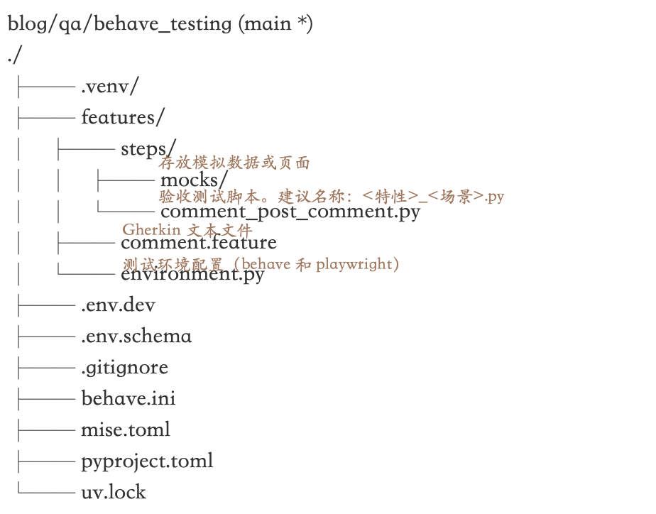
这里主要需要关注 `environment.py` 和 `comment_post_comment.py` 两个脚本。

**environment.py**
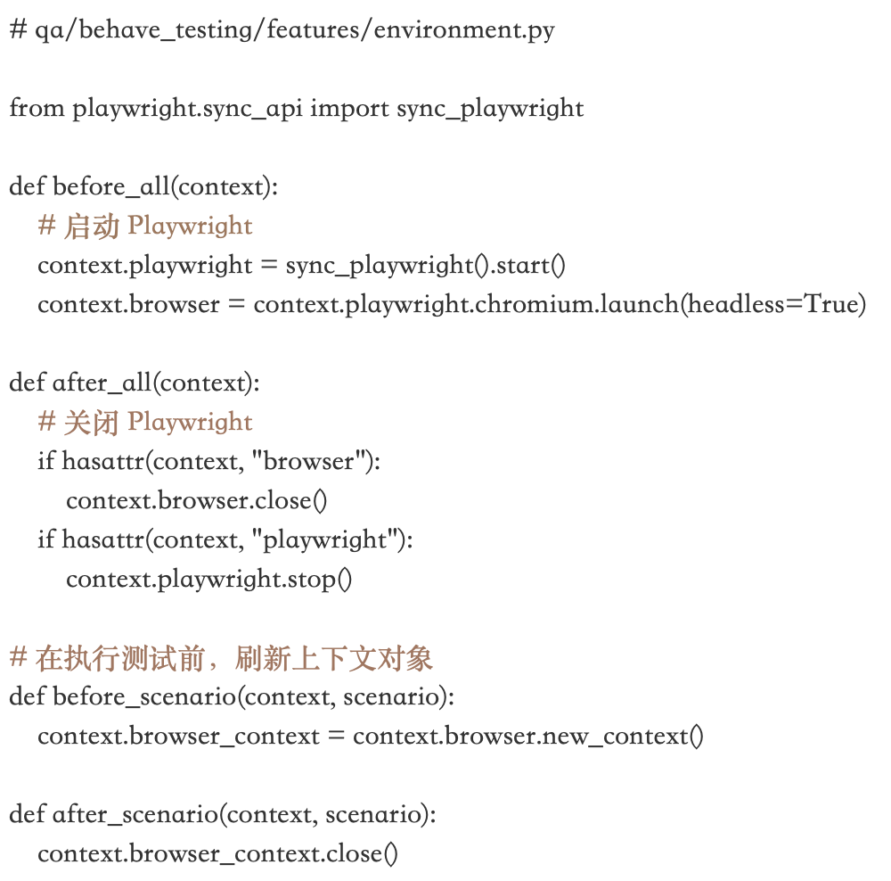

**comment_post_comment.py**
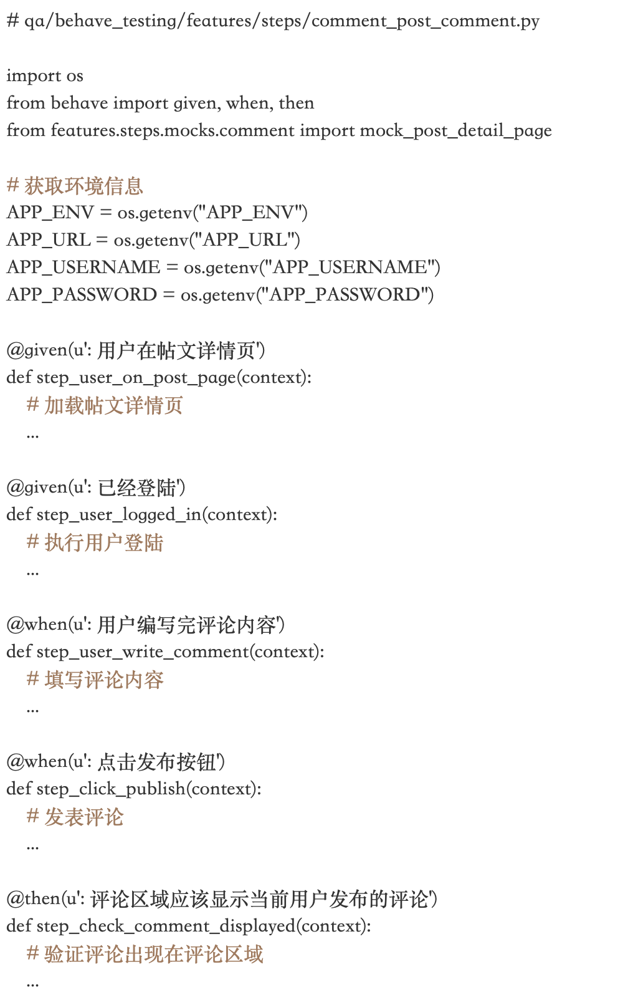

**并行开发**

一般而言，测试脚本的开发工作不需要等待前端提供页面。只要有相关设计文档即可（如：快速原型设计、UI 设计稿）。可以通过 *playwright* 提供的 Mock API 来模拟各种响应。

以“加载帖文详情页”为例。
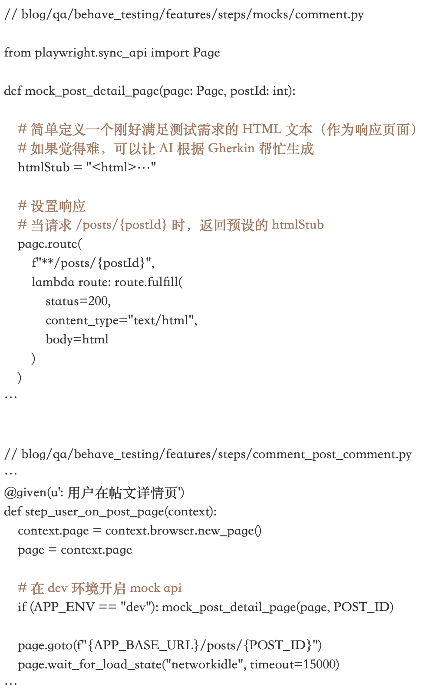

**执行测试**
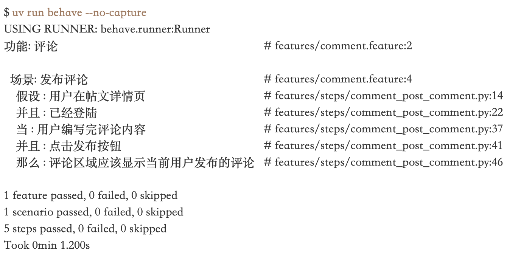

**建议**

可以将验收测试放入前端 CI 构建管道作为构建门禁 —— 只有测试通过才能构建。

### 性能测试

性能测试只是一种统称，实际上它包含*负载测试*和*压力测试*两种类型。负载测试的目的是，评估系统在正常负载下的表现。适合用来查找性能瓶颈（结合可观测性）。压力测试的目的则是，评估系统在极端环境下的稳定性。适合用来排查系统中低可用和低可靠的部份。

压力测试一般没什么要求，只要确保测试环境能够反映生产环境即可。但*负载测试*则不然。在开始*负载测试*之前，测试人员应该先确定期望（如：响应时间、吞吐量，以及资源使用情况等），然后再制定测试场景（如：用户行为和数量）。

目前个人比较推荐的工具是 [Grafana k6](https://grafana.com/docs/k6/latest/)。因为使用比较简单，而且内置测试报告 Dashboard。另外，它还可以将测试指标推送给 OpenTelemetry 或 Prometheus 用于制作仪表盘。虽然 k6 的测试脚本需要用 JavaScript 编写，但只涉及基础语法，门槛相当低。

**一个简单例子**
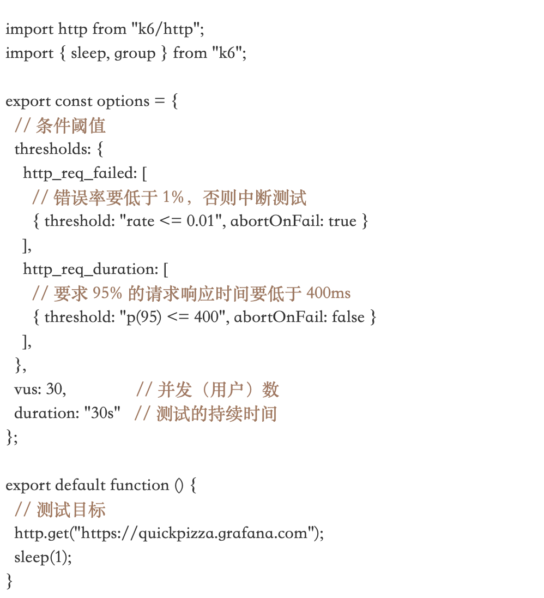

默认情况下，它只会在控制台中打印测试报告。
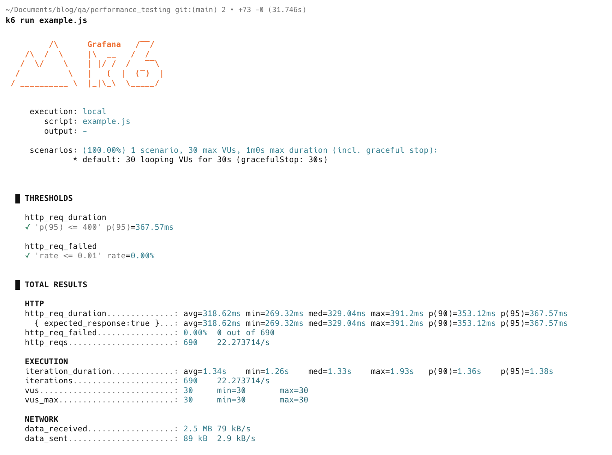

如果想打开 Dashboard，需要添加环境变量 `K6_WEB_DASHBOARD=true`。
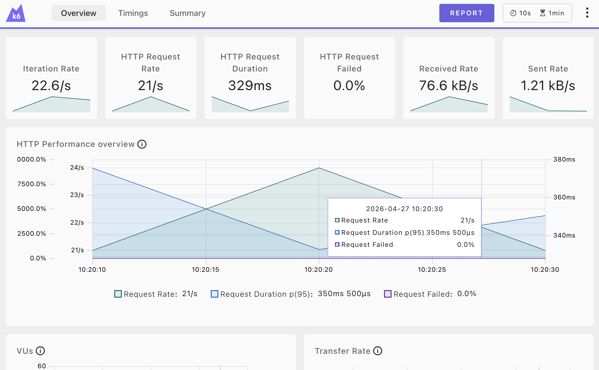

就如前面所说，负载测试是希望在正常负载的情况下评估系统表现。为了做到这点，可以使用 k6 提供的[场景执行器](https://grafana.com/docs/k6/latest/using-k6/scenarios/executors/)。以 Ramping VUs 为例，它能够定义阶段性的并发过程。
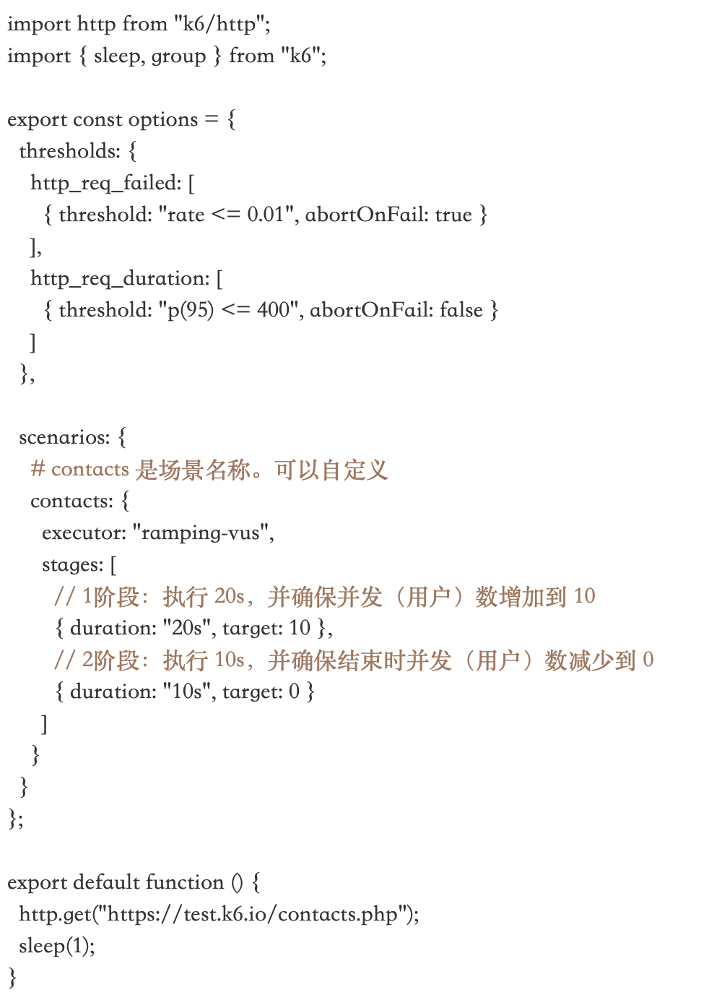

此外，和 JMeter 一样，k6 也支持脚本录制。但需要安装 [k6 Studio](https://github.com/grafana/k6-studio/releases)。


## 文档

### 敏捷开发中的文档

关于敏捷开发，我听过最大的笑话 —— 敏捷开发就是不写文档。

其实并非如此。[敏捷本质上是一系列价值观和工作原则](https://agilemanifesto.org/iso/zhchs/manifesto.html)，它旨在*寻求更好的软件开发方法*。所以它实际上是指导相关人员应该如何去衡量一件事的价值。比方说，因为大部份软件文档普遍都得不到合理的维护。所以与其花大量时间去编写没价值的文档，不如将时间花在提高系统可用性和易用性上更有价值。这种价值观并没有在说不要写文档。它只是强调，如果文档最终体验不出自身价值（如：得不到维护，或者根本不会有人看），那么就不要浪费时间。换言之，如果文档本身是必须的、重要的，那么毫无疑问还是需要写（如：用户手册）。

一些人可能对（敏捷开发中）文档的概念不太了解。其实文档不一定非得是正式的文件，它们也可以是*工单（issue）中的某条留言，或者一段对话*、*一封抄送给团队的邮件*，甚至可以是*发在通信频道中的一张示意图*。而更重要是，需要知道如何让这些内容保持更新和发挥价值。其中一个比较有效的方案是，把相关内容放在显而易见且容易修改的地方。另外，如果读者曾经了解过或者参与过敏捷开发，那么很可能会见过 Jira 和 Slack 两款软件。前者用于*项目生命周期管理*，后者则是一款*以主题为中心的沟通工具*。它们能够很好地集成，相关内容支持互相引用和通知。能够满足几乎所有敏捷协作相关的需求。如果对此类协作方式感兴趣，还可以了解一下 [ChatOps](https://www.geeksforgeeks.org/devops/chatops/) 。

> 值得一次，Slack 在去年（2025）已经停止对大中华区（包括：香港、澳门）进行直营服务。如果打算寻找替代品，可以考虑开源方案 [Mattermost](https://github.com/mattermost/mattermost)。而 Jira 则可以考虑 [Plane](https://github.com/makeplane/plane)。当然，如果确实有必要，也可以考虑国产的飞书和禅道。但个人其实并不是那么推荐国产软件。这并非崇洋媚外。而是作为用户，我更希望使用简单且有效的工具。但国内的产品经理，真实如出一辙。他们根本不理解什么是[少即是多（Less is More）](https://danslegris.com/zh/blogs/journal/less-is-more-or-less-is-a-bore)的产品理念。所以国产软件经常会充斥着各种乱七八糟的功能，以及反人类的设计。

> 如果想了解更多关于敏捷开发文档的内容，建议阅读 《[活文档：与代码共同演进](https://book.douban.com/subject/35372829/)》一书。


### C4 模型

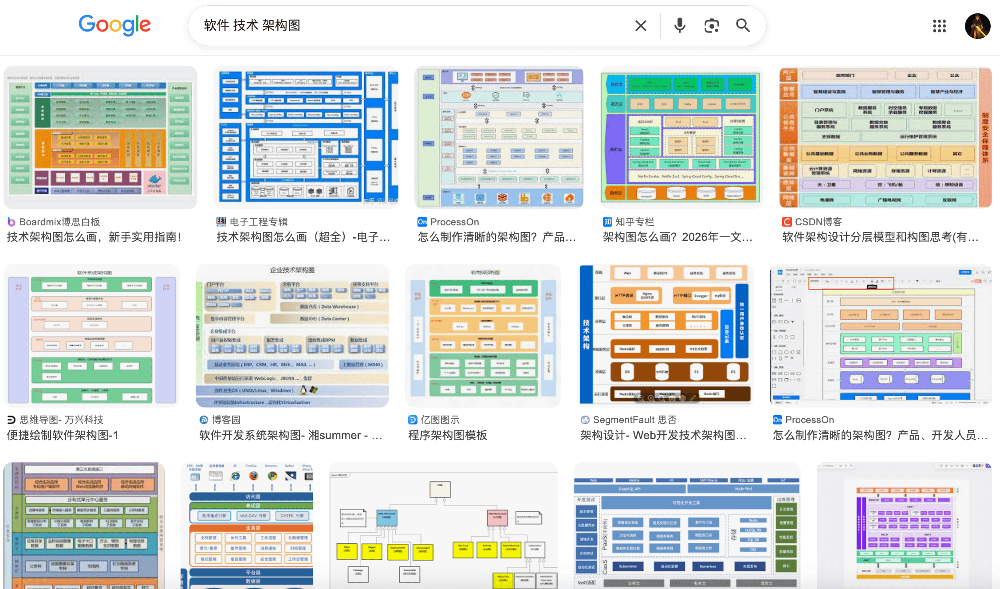

如图所示。多年来我一直有个疑惑，为什么这类垃圾“架构图”会如此普遍？到底是跟谁学的？真有人能够看懂它们吗？我之所以有这种疑惑，并非出于认为自己画图画得好。而是站在客观角度来说，一张好的示意图，应该具备基本逻辑（包含：箭头、关系说明），并且能够做到自描述。除非只是画给自己看，否则更好的做法是，找个外人来问一下。看看别人能不能够看懂，然后再咨询一下有没有改进示意图（可理解性）的建议。另外，不要为了画图而画图。应该先要搞清楚给谁画，为什么要画，然后再根据需求进行绘制。而不是将所有东西放进去。

其实画图方面我非常同意 [Yegor Bugayenko 的观点](https://www.yegor256.com/zh/2015/06/29/simple-diagrams.html) —— 这不是艺术，而是工程学。你不需要给人留下深刻的印象，你只需要传达信息。但我和他的区别是，我不会建议大家使用 UML。或者准确来说，UML 不应该成为首选项。因为它确实存在一定的学习和理解成本 —— 至少对于非技术人员来说是这样。所以个人目前比较推荐 C4 模型。

[C4 模型](https://c4model.com/)的理念很简单 —— 按照抽象层级来绘制示意图。如果要我简单地形容一下它，其实和查看地图没什么区别。从国到省，从省到市，再从市到区。不断放大细节。而且这种示意图的元素较少，几乎不会带来视觉干扰，所以更能够专注于问题本身。
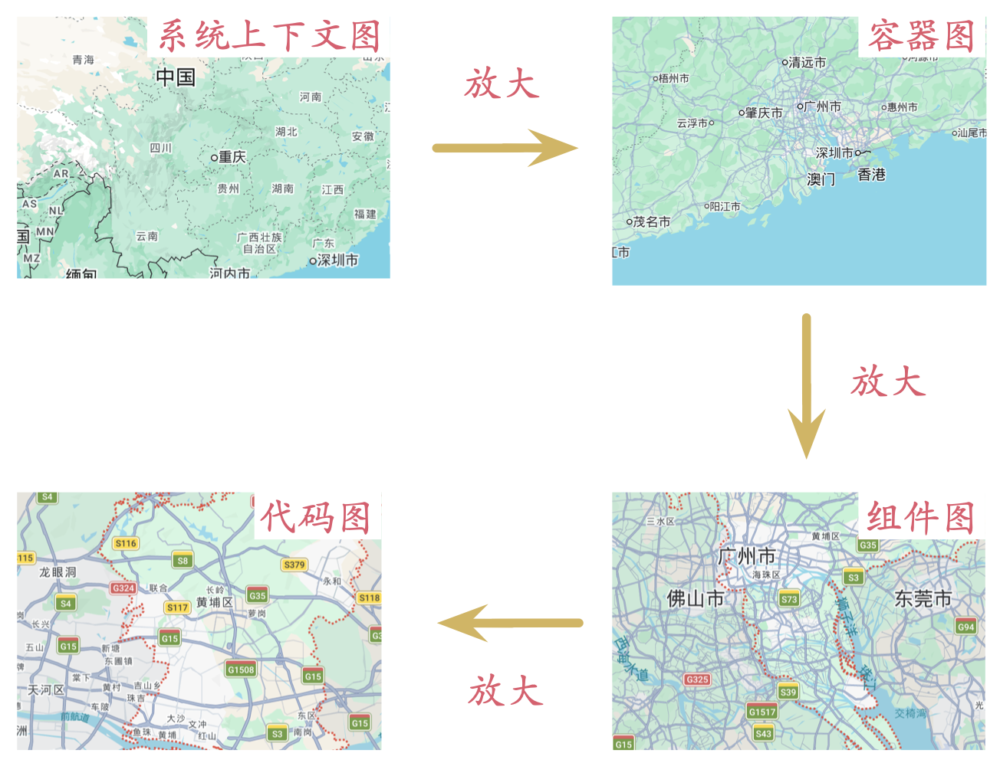

> C4 模型本身与工具无关，你完全可以用自己喜欢的工具来绘制它。甚至可以在白板或者纸张上绘制，因为它足够简单。我在当前项目中使用 D2lang 进行绘制 —— 一种 Diagram as Code（DaC）工具。其它类似的选择还有 PlantUML 和 Mermaid。

以下是 C4 模型的四种示意图（抽象级别从高到低排列）：

**系统上下文图**
* 表达：用户和系统的交互逻辑。强调用户语境，需要从用户角度绘制
* 受众：技术人员、解决方案架构师、非技术人员

以用户订阅博客系统为例。
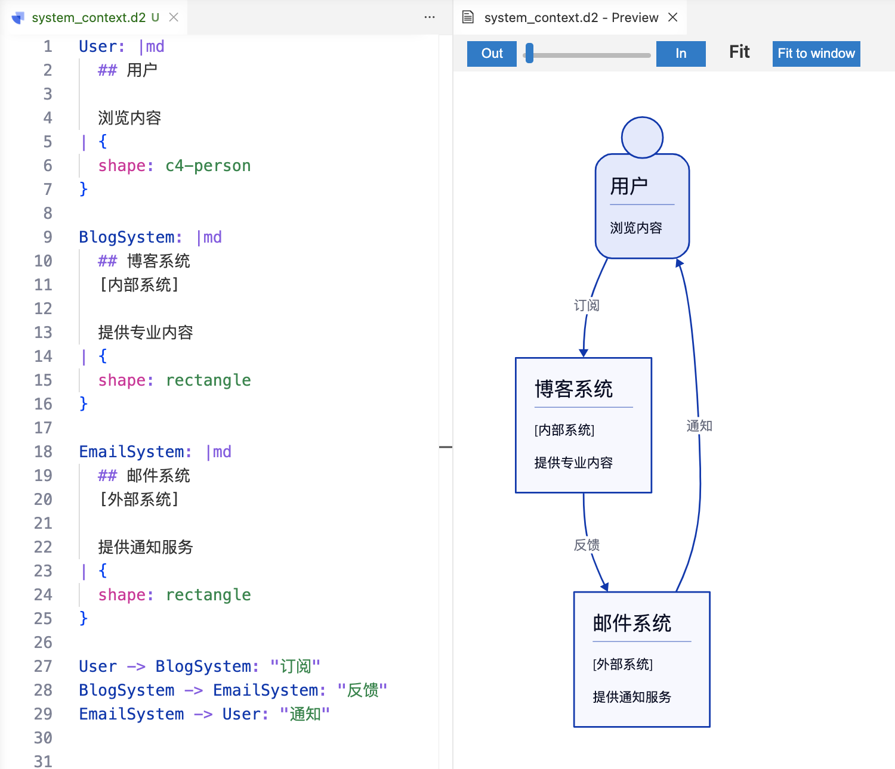


**容器图**
* 表达：系统内部组件之间的交互逻辑
* 受众：技术人员、解决方案架构师
* 注意：容器属于可独立部署单元（如：子系统、服务、数据库、中间件）

以放大博客系统上下文为例。
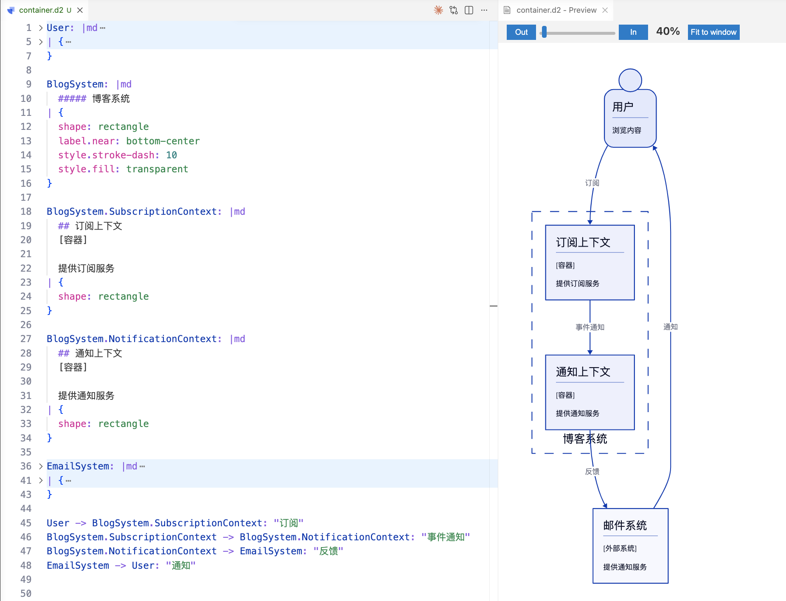

**组件图**
* 表达：容器内部组件之间的交互逻辑
* 受众：技术人员、解决方案架构师
* 注意：组件无法独立部署（如：API、包、模块）

以放大订阅上下文容器为例。
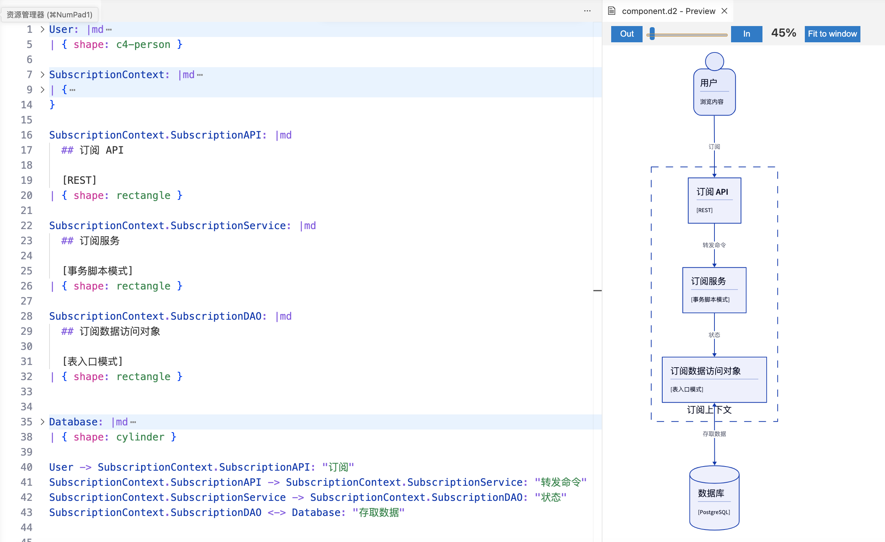

**代码图**
* 表达：代码交互逻辑，或结构
* 受众：技术人员
* 注意：可以用 UML 绘制

以放大订阅组件为例。
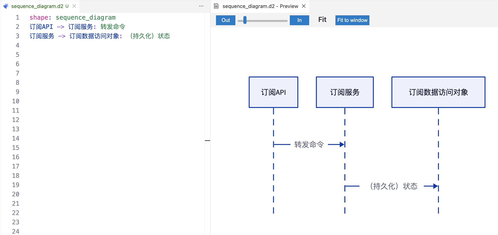

### 架构决策记录

当你新入职一家公司时，作为新员工，你可能希望第一时间了解一下将要接手的工作。所以迫不及待向相关人员要来了项目代码进行查阅。但能力出众的你，很快就发现了各种问题。譬如你不理解为什么项目要自己造轮子，也不理解为什么选择 React 而不是 Angular，也不理解为什么要用分布式。但更大的问题是，你发现没有人可以解答这些问题。因为这个项目已经被好几批人接手过，而且都没有留下有价值的信息。这无疑会令人感到沮丧。

为了预防此类问题，*架构决策记录（ADR）* 是一种有力工具。虽然它本身只是一种轻量级的文档，但它能够强迫相关人员解释决策背后的原因。所以 ADR 可以一定程度防止无脑决策。因为如果无法解释为什么要这样做，那么很可能这个决策本身就是一个问题。

ADR 并没有所谓的规范，但它通常包含如下信息：
* 决策状态
    * 提议：需要进行讨论
    * 接受：正在生效
    * 被取代：被显著修改或者已被替换（需链接到新的 ADR）
* 决策本身：已做出的决定，用简短的几句话概括
* 决策背景：引发该决定的上下文（记录当时处境）
* 考虑选项：简单对比不同方案的优缺点

另外，建议的文件名称格式为：*序号-决策摘要*

**一个简单例子**
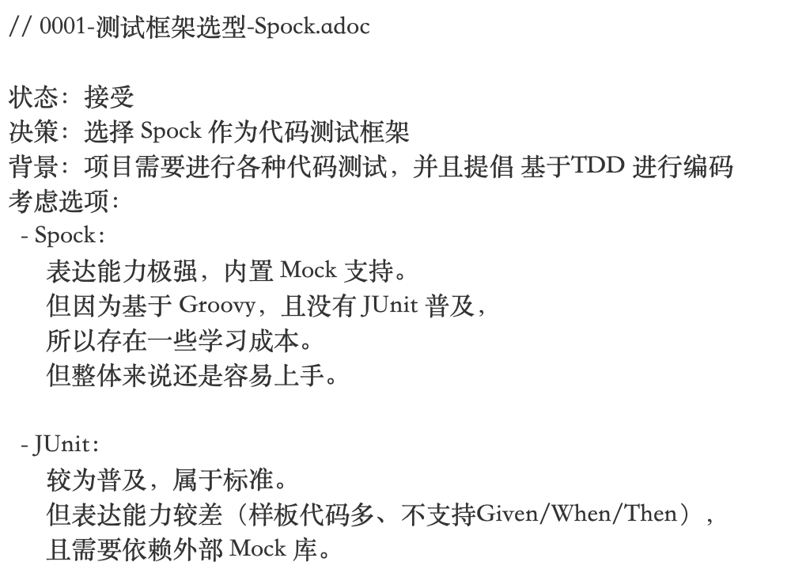

### 上下文画布

在微服务设计中，有种模式叫[设计画布（Design Canvas）](https://dzone.com/articles/streamlined-microservice-design-in-practice)。它主要用来捕捉微服务必要的属性，而这些属性将有助于指导软件开发。但个人认为该模式最大的价值是，它能够暴露当前上下文的复杂度；以及帮助相关人员快速了解上下文状况。

虽然当前项目并非真正意义上的微服务，但其实从架构设计来说已经区别不大。只要愿意，完全可以用较低的成本就能够将其拆分为多个可独立部署的服务。只是以目前系统的复杂度来说，完全没有这个必要 —— 实际上大部分系统都没有这个必要。所以我才建议优先考虑模块化单体架构。不过即便如此，我们仍然可以从该模式中获益。例如，用它来记录复杂度和介绍上下文。

以评论上下文为例。
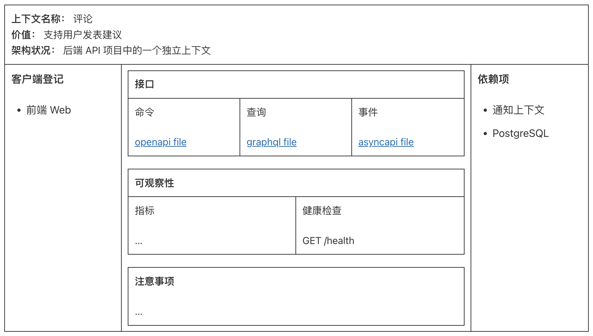

注意，画布的规格并不是固定的。你完全可以根据项目需要来定制它。 

## 拓展技

### 使用 Vagrant 标准化虚拟机

在实际工作中，有时可能会出现“明明在我这里运行正常，但到其他人那里就不行了”。针对该问题，最好的解决方案就是标准化环境。而 HashiCorp Vagrant 就是这么一种工具。

**一个简单例子**
用 Vagrantfile （ruby 脚本）定义虚拟机。
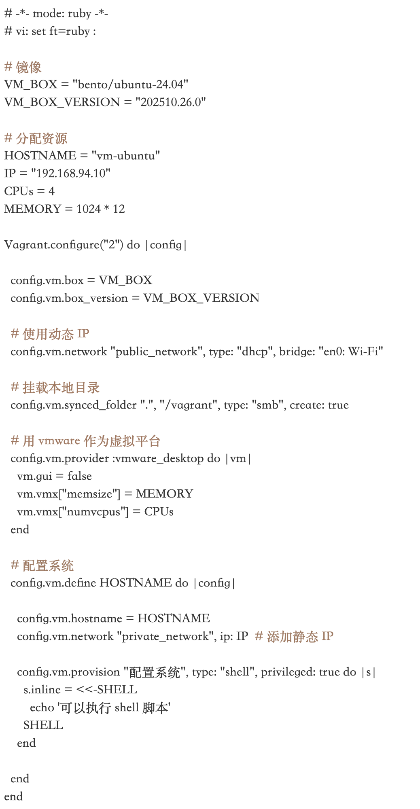

然后执行以下命令。如无意外就会得到一台与配置相符的虚拟机。
```
vagrant up
```
必要时，相关人员只需共享 Vagrantfile 即可。

### 以无人值守方式自动安装操作系统
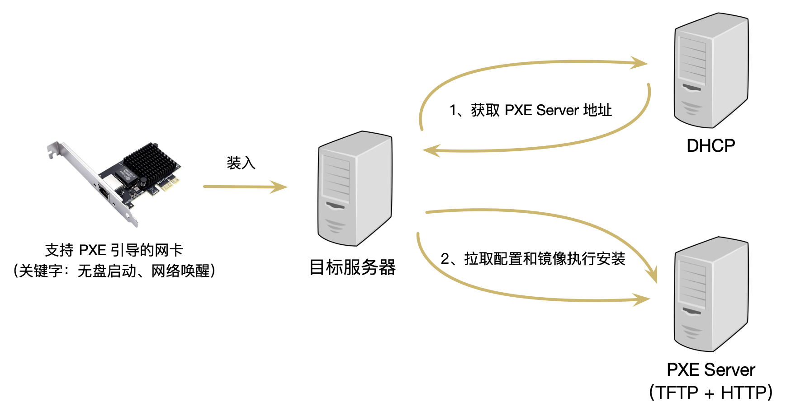

无人值守安装依赖一种叫 *预启动执行环境（Preboot eXecution Environment，PXE）* 的机制。它的客户端被集成在网卡设备上，用于实现无盘引导装机。

以当前项目环境为例，PXE Server 用的是 [netboot.xyz](https://netboot.xyz/)。另外，因为我住这里用的是[软路由](https://diktam.com/posts/helloworld/#%E6%8B%93%E5%B1%95---1%E5%B0%86%E4%BB%A3%E7%90%86%E8%BD%AF%E4%BB%B6%E5%AE%89%E8%A3%85%E5%88%B0wi-fi%E4%B8%8A%E8%AE%A9%E6%89%80%E6%9C%89%E8%BF%9E%E6%8E%A5wi-fi%E7%9A%84%E8%AE%BE%E5%A4%87%E9%83%BD%E8%83%BD%E5%A4%9F%E7%BF%BB%E5%A2%99)，它内置了 DHCP Server，所以我可以直接使用它。否则可能需要搭建专门的 DHCP 服务器。

**基本操作步骤**
1. 准备系统镜像
    * 如果是 Proxmox VE，参考：[Assistant Tool](https://pve.proxmox.com/wiki/Automated_Installation#Assistant_Tool)
    * 如果是 Ubuntu，参考：[Select an image（选择 Netboot tarball）](https://releases.ubuntu.com/24.04/)
2. 编写 PXE 引导脚本
    * 如果是 Proxmox VE，参考下文
    * 如果是 Ubuntu，参考：[PXE Booting the Ubuntu Installer](https://netboot.xyz/docs/kb/pxe/ubuntu)
3. 把系统镜像和引导脚本挂载（或上传）到 PXE Server（netboot.xyz）
    * 建议用 Docker 来部署 netboot.xyz，参考：[Setting up the Container](https://netboot.xyz/docs/docker/usage#starting-up-the-container-with-the-docker-cli)
4. 将 PXE Server 相关信息配置到 DHCP 中
    * 参考：[DHCP Configurations](https://netboot.xyz/docs/docker/dhcp)
5. 让目标主机接入 DHCP 所在的网络，然后打开电源开关即可

**Proxmox VE 相关问题**

Proxmox 貌似没有提供 netboot 形式的镜像，所以才需要用 Assistant Tool（proxmox-auto-install-assistant）工具进行打包（自动安装配置 answer.toml + ISO）。但问题是 proxmox-auto-install-assistant 的打包输出仍然是一个 ISO 文件，而 PXE 引导安装一般至少需要 linux26 和 initrd.img 两个文件。针对该问题，目前我发现有两种解决方案。一是使用 [pve-iso-2-pxe](https://github.com/morph027/pve-iso-2-pxe) 脚本进行提取。二是在本地手动挂载 ISO，然后将 linux26 和 initrd.img 两个文件复制出来使用。如果需要安装新版本的 Proxmox VE（如：9.x），则建议选择后者。因为 pve-iso-2-pxe 会将 ISO 内容追加进 initrd 文件中，这会导致 Proxmox VE 9 无法引导（貌似是超过了引导内存限制）。但如果是 Proxmox VE 8 就不会有该问题。

另外，如果想加速安装过程，最好是自己编写 [iPXE 脚本](https://ipxe.org/cmd)。以引导安装 Proxmox VE 为例。
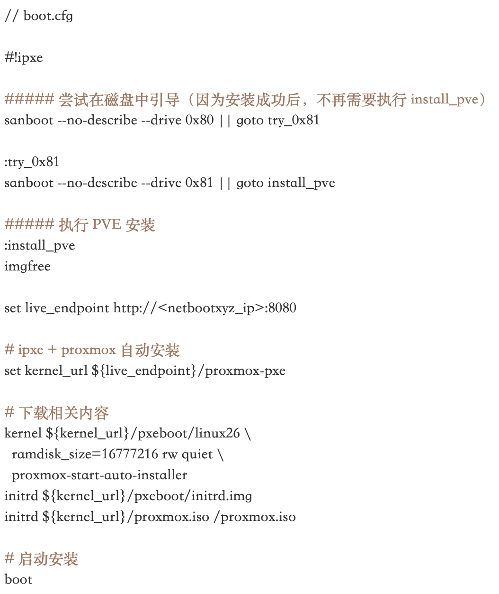

然后将该文件挂载到容器内部即可。
```
-v "./boot.cfg:/config/menus/boot.cfg:ro"
-v "./boot.cfg:/config/menus/local/boot.cfg:ro"
```

### 制作基线系统镜像

在基础设施即代码小节中，我曾向 PVE 上载过一个 Ubuntu 镜像（ubuntu-server-2404.qcow2）。实际上该镜像并非官方原生镜像，而是一个经过二次加工的基线镜像（又叫黄金镜像）。

譬如有时可能会希望，在正式安装操作系统之前，预装一些工具，或者做一些配置环境。如果你是一名设施或者运维人员，甚至可以用基线镜像作为交付手段。譬如直接将业务系统打包进基线镜像，然后再在裸机上正常安装操作系统即可。

以当前项目为例，主要用到的制作工具是 HashiCorp Packer。我需要预装 `qemu-guest-agent`，因为 PVE 依赖该工具来获取虚拟机信息。
> 值得一提，其实预装工具这种需求不一定需要制作基线镜像，也可以通过 [cloud-init](https://cloud-init.io/) 机制进行安装。而内置 cloud-init 机制的系统镜像被称为*云镜像（Cloud Image）*。

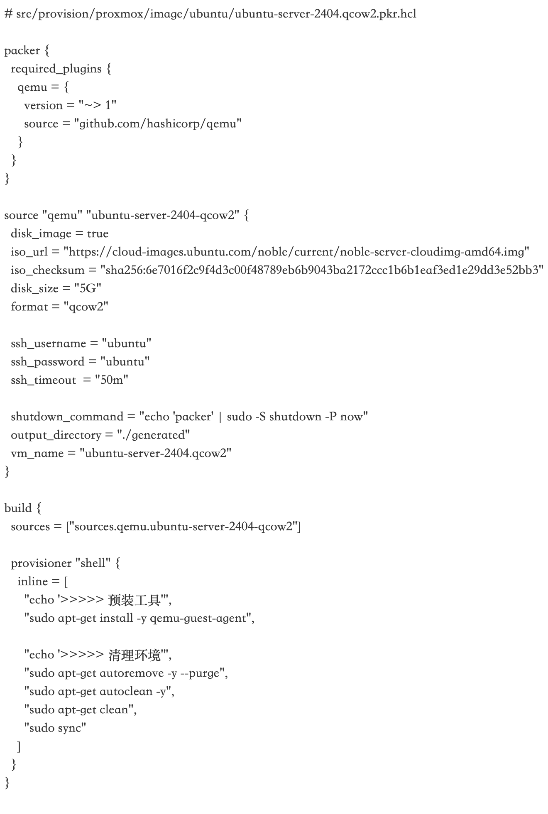

然后执行以下命令，如无意外就会得到一个基线镜像。
```
packer build .
```

## 结束语 

虽然我不知道自己在这个行业还会不会有下一个十年，但我希望自己不会停止这份热爱。

祝大家生活如快。
