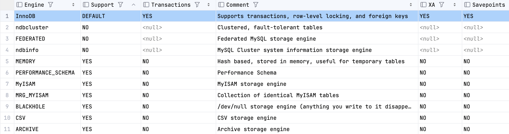

| 用语 
 | 解释 |
| ----------- | ----------- |
| 数据库 | 存取数据的系统。在当前文章中，泛指**关系型数据库**。|
| 查询 | 泛指针对数据记录而执行的操作（，而非特指*select*）。|
| 逻辑单元 | 在功能或语义上紧密相关、共同完成某个特定任务的一组代指令。|
| 数据完整性 | 在数据的整个生命周期内，维护和保证其*准确性*和*一致性*。|
| 数据库对象 | 指 *database*、*table*、*view*、*index*、*procedure*、*function*、*trigger* 这些。 |
| 表空间 | 保存*数据库对象*底层实际数据或结构的存储位置。|
| MVCC | 全称是*多版本并发控制*。一种用于提高事务并发访问性能的机制。|
| ACID | atomicity, consistency, isolation, durability 的简称。 |
| 不变性 | 泛指在某种生命周期内，固定不变（恒成立）的规则。|
| 并发 | 进程之间拥有共享状态，但互相无法感知。|
| 用例 | 系统接收外部请求（例如：用户输入）并做出响应的潜在场景。由一系列操作（或事件）步骤组成。定义了角色与系统之间的交互，以实现某种目标。|

如果不了解*事务*具体的含义。建议先阅读另一篇文章：[浅谈事务理解]({})

**数据库事务**是指<u>（数据库）查询的逻辑单元</u>。它通常由多个查询组成，是一个不可分割的整体。从应用角度而言，它还是<u>一种能够简化编程模型的工具</u>。因为即便任务在执行期间遇到异常，也无需担心*数据完整性*问题。而这完全得益于对 ACID 特性的支持。**ACID** 是数据库对事务作出的承诺。<u>确保事务在*并发*、*异常*、*崩溃*等环境下仍然能够满足数据完整性</u>。

在 MySQL 中，事务机制（包括：Local、[XA](https://en.wikipedia.org/wiki/X/Open_XA)）主要[InnoDB](https://dev.mysql.com/doc/refman/8.4/en/innodb-storage-engine.html)提供支持。它是一个[MVCC](https://dev.mysql.com/doc/refman/8.4/en/innodb-multi-versioning.html)[^1]存储引擎。其 MVCC 实现中，最为关键的概念是[Undo Logs](https://dev.mysql.com/doc/refman/8.4/en/innodb-undo-logs.html)。因为事务的 *并发*、*回滚*、*空间释放* 等都以它为基础。<u>
在事务环境下，MVCC 会为相关记录生成*Undo Logs（链表）*，用于提高*并发性能*和*一致性（如：快照读）*</u>。此外，因为要支持**快照读[^2]**，所以 `delete` 操作实际上并不会马上执行物理删除，而是会等待相关 *Undo Logs* 被完全弃置后才执行（。该任务称为：[purge](https://dev.mysql.com/doc/refman/8.4/en/innodb-purge-configuration.html)）。

通常情况下，人们在谈论*关系型数据库事务*时，本质是在关注<u>对 ACID 特性的理解和应用</u>。所以理解好 ACID 特性其实绝对有利于更好地去*设计编程模型*和*应用数据库*。

<b style="color:#2C5B66">原子性（Atomicity）</b>承诺<u>将事务（中的所有查询）视为一个不可分割的整体</u>。事务单元内的查询要么同时成功，要么同时失败。即便是遇到极端情况（如：电源故障、错误、崩溃）。这种承诺主要依赖于 *Undo Logs* 和 *Redo Log[^3]*。譬如 InnoDB 突然崩溃，但内存状态（Log Buffer）未能及时落盘。那么 MySQL 就会在重启时（接受请求前）进入恢复模式。它会尝试从 *Redo Logs* 中重做已经成功提交的事务，使其恢复到崩溃前的状态。其次还会利用 *Undo Logs* 回滚不完整的事务。

<b style="color:#2C5B66">一致性（Consistency）</b>在不同上下文中会有不同的解释。在当前 ACID 上下文中，可将该承诺理解为<u>确保数据的*约束规则* 不会遭到破坏</u>。这里指的*约束规则*其实就是不变性。譬如 *主键*、*唯一键*、*外键*、*枚举*、*数据类型* 等。事务在执行期间一旦违反不变性就会触发回滚操作，并且会向客户端抛出异常（例如当发生唯一建重复时，就会抛出 DuplicateKeyException）。该承诺同样依赖 *Undo Logs* 和 *Redo Log* 来实现。另外需要重点注意，***ACID一致性*仅能确保<u>（同库）数据定义</u>层面的不变性，而无法确保<u>用例逻辑</u>层面的不变性**。后者只能在*应用代码*中施加设计策略来解决。例如*将操作限制在单个本地事务中*，或*引入分布式事务来确保原子性*。

理解例子：用户`a`、`b`共用一个电子钱包（假设余额为100元），而且他们在相互不知情的情况下同时消费（假设`a`消费了70元，而`b`消费了50元）。在该场景下，其数据库事务会存在*并发性*。虽然感观上人们会认为不会发生<u>消费额度大于余额</u>的情况。但事实上，在编程的世界中所有的任务都会被编排成明确的步骤。就消费这一现实行为，其实就等同于(1)读取余额值，然后(2)从余额值中减去消费额度，最后(3)将剩余额度作为余额值。所以该案例最终会因为事务并发而出现不可预计的结果。譬如**最终余额小于0**或**储蓄机构损失20元**。而且这两种可能性其实潜藏着不同的一致性概念：<u>ACID一致性（确保数据不变性）</u>、<u>逻辑一致性（确保逻辑不变性</u>。对于当前上下文而言，就是不应该发生“超额消费”和“让储蓄机构造成损失”等情况）。*最终余额小于0*本质上是**脏读问题[^4]**，事务本身就能够解决。可以给余额字段添加约束规则（譬如改用无符号数值类型）并使用`READ COMMITTED`以上的*ACID隔离性*即可。而*储蓄机构损失20元*则属于**更新覆盖问题**。因为是*先读后写*，所以一旦`a`事务先于`b`事务更新余额就会发生该问题。解决方案通常有两种：使用*排他锁[^5]*对余额进行读写互斥 或 应用*乐观锁[^6]*策略对记录进行版本控制。重点注意，即便使用*串行化（Serializable）ACID隔离性*也无法解决*更新覆盖问题*。因为[串行化下读操作仍然存在并发性](https://dev.mysql.com/doc/refman/8.4/en/innodb-transaction-isolation-levels.html#isolevel_serializable)。所以它即不能避免*先读后写*，亦无法解决覆盖更新（。因为*更新覆盖问题*并没有违反数据不变性）。

<b style="color:#2C5B66">隔离性（Isolation）</b>可用于控制并发事务（计算结果）之间的可见性。承诺<u>事务在并发期间可做到相互隔离[^7]</u>。InnoDB 为事务提供了`4`种隔离性。用隔离强度由低到高排列后如下：
- `READ UNCOMMITTED` 隔离级别最低，但并发性能最好。因为不会使用快照读，所以能够读取到其他并发事务未提交的计算结果，存在*脏读*隐患。
- `READ COMMITTED` 通过应用*Undo Logs快照*能够解决*脏读*问题。但它会引出另一种隐患，*不可重复读[^8]*。因为该级别下的查询会始终读取最新版本的快照，而该版本的快照可能是其他并发事务所生成的（，所以相当于存在提交级别的脏读）。
- `REPEATABLE READ` 是 InnoDB 默认的隔离级别。能够解决*不可重复读*问题，因为该级别下的查询会始终读取（相同SQL）第一次查询所生成的版本快照。注意，InnoDB 在该隔离级别下并不会出现*幻读[^9]* 问题。因为默认会使用[next-key lock](https://dev.mysql.com/doc/refman/8.4/en/glossary.html#glos_next_key_lock)来锁定记录（行）和范围间隙。
- `SERIALIZABLE` 与 `REPEATABLE READ` 大致相同。区别在于关闭 [autocommit](https://dev.mysql.com/doc/refman/8.4/en/server-system-variables.html#sysvar_autocommit) 后，前者会自动为查询谓语（where）添加 `for share（即lock in share mode）`，从<u>一致性非锁定读</u>转为<u>一致性锁定读</u>。所以实际上事务之间并不会真正地串行执行。该级别的隔离性最好的，但性能较差。

除了 *Undo Logs* 之外，还可以使用锁来进行隔离。
| 锁 
 | 级别 
 | 描述 |
| ----------- | ----------- | ----------- | ----------- |
| record | 行 | 锁定记录行对应的索引。参考：[共享锁（S）- select ... for share 或 select ... lock in share mode](https://dev.mysql.com/doc/refman/8.4/en/innodb-locking-reads.html)、[独占锁（X）- select ... for update](https://dev.mysql.com/doc/refman/8.4/en/innodb-locking-reads.html) | 
| gap | 行 | 允许范围查询时在索引之间进行锁定。可用于防止并发插入。注意，`gap` 在 `READ COMMITTED` 隔离级别下会有所限制（具体参考：[Gap Locks](https://dev.mysql.com/doc/refman/8.4/en/innodb-locking.html#innodb-gap-locks)）。|
| next-key | 行 | 实际上是`record`和`gap`的组合，用于范围查询场景。[在 `REPEATABLE READ` 隔离级别下会自动启用](https://dev.mysql.com/doc/refman/8.4/en/innodb-locking.html#innodb-next-key-locks)。 |
| table | 表 | 独占锁（X），[lock tables ... write](https://dev.mysql.com/doc/refman/8.4/en/lock-tables.html) |
| intention | 表 | 解决`record`和`table`的兼容问题。会应用级别锁，所以用户无需理会。|
| auto-inc | 表 | 控制`AUTO_INCREMENT`列值，受[innodb_autoinc_lock_mode](https://dev.mysql.com/doc/refman/8.4/en/innodb-parameters.html#sysvar_innodb_autoinc_lock_mode)控制 |

<b style="color:#2C5B66">持久性（Durability）</b>是判断一个数据库系统是否可靠的重要指标。它承诺<u>一旦事务被成功提交，即便发生故障（例如：断电、崩溃）也会将其状态持久化</u>。
")
在 InnoDB 中，用于确保*ACID持久性*的机制主要是 *Doublewrite Buffer* 和 *Redo Log*。
当发生意外退出时，InnoDB 就会执行崩溃恢复流程。它会先尝试用 *Doublewrite Buffer* 来修复损坏的数据页（例如：崩溃前未能写入文件的数据页），以确保数据最终能被正确持久化。
能这样做因为 <u>InnoDB 将 *Buffer Pool[^10]* 数据落盘之前，会先将其写到 *Doublewrite Buffer*。而 *Doublewrite Buffer* 则会以大块顺序的方式写入日志文件中（，所以会非常高效）</u>。
但若果 *Doublewrite Buffer* 无法用于修复的话，那么崩溃恢复就会改用 *Redo Log* 来重做事务。
但极端情况下，可能 *Redo Log* 也无法解决问题。此时数据就可能会永久丢失。但这种情况其实比较罕见，除非基础设施的质量非常差。
所以为了以防万一，最好是定期进行数据备份。

## 拓展：为什么只读场景也需要开启数据库事务？
确保读一致性。

## 参考
- [Distributed transaction](https://en.wikipedia.org/wiki/Distributed_transaction)
- [ACID](https://en.wikipedia.org/wiki/ACID)
- [MySQL Glossary](https://dev.mysql.com/doc/refman/8.4/en/glossary.html)
- [The InnoDB Storage Engine](https://dev.mysql.com/doc/refman/8.4/en/innodb-storage-engine.html)
- [InnoDB Storage Engine: What Is New in MySQL 9.0](https://dev.mysql.com/doc/refman/9.0/en/mysql-nutshell.html)
- [MySQL Server Logs](https://dev.mysql.com/doc/refman/8.4/en/server-logs.html)
- [START TRANSACTION, COMMIT, and ROLLBACK Statements](https://dev.mysql.com/doc/refman/8.4/en/commit.html)

[^1]: 不同类型的关系型数据库对于 MVCC 的实现和支持会有所差异。
[^2]: 快照读也称为[一致性非锁定读](https://dev.mysql.com/doc/refman/8.4/en/innodb-consistent-read.html)，它会从 *Undo Logs* 中读取记录的快照版本。另外，`for update`、`for share（或lock in share mode）`、`update`、`delete` 这些称为[一致性锁定读](https://dev.mysql.com/doc/refman/8.4/en/innodb-locking-reads.html)。
[^3]: Redo Log 是一种用于崩溃恢复的逻辑日志（属于[预写日志记录](https://en.wikipedia.org/wiki/Write-ahead_logging)，即WAL），用于重做*未提交事务*的状态。InnoDB 会透过[后台线程](https://dev.mysql.com/doc/refman/8.4/en/innodb-parameters.html#sysvar_innodb_log_writer_threads)将事务信息（Log Buffer）持续并顺序地写入到日志文件（如：#innodb_redo）。该日志文件并不会持续膨胀，它会根据[*checkpoint*](https://dev.mysql.com/doc/refman/8.4/en/innodb-checkpoints.html)对旧内容进行截断。这里的“旧内容”是指那些已经提交并落盘的事务状态。实际上 Redo Log 主要记录的是两次 checkpoint 之间的事务状态，并在崩溃恢复时回滚没有提交标识的事务以确保持久性和原子性。
[^4]: 脏读：事务并发期间，读取到其他未提交事务的计算结果。
[^5]: 排他锁：泛指`for update`操作。
[^6]: 乐观锁：为记录添加一个版本标识字段，然后对编程模型进行约束。约束规则：1）更新记录时需要先读取版本标识。2）只有标识没有被改变过的情况下才更新记录（这一点通常依赖于ACID一致性）。
[^7]: *ACID隔离性*仅能控制**并发期间**的可见性，所以它无法解决与事务提交相关的问题（如*更新覆盖*）。此外，*ACID隔离性*是 MVCC 的主要应用场所，因为 MVCC 本身就是一种用来提高事务并发性能的机制。
[^8]: 不可重复读：重复执行相同的查询，但出现结果不一致的情况。
[^9]: 幻读：一种特殊的*不可重复读*，主要针对`insert`和`delete`操作。指<u>对前后两次相同查询的结果进行比较，出现或消失了部份记录</u>。
[^10]: Buffer Pool：用于缓存表和索引的数据（，以提高查询效率）。在专用服务器上，通常建议占 80% 的物理内存。配置参考：[Buffer Pool Configuration](https://dev.mysql.com/doc/refman/8.4/en/innodb-buffer-pool.html#innodb-buffer-pool-configuration)