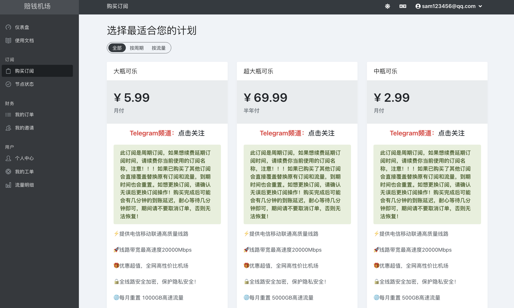

<b style="color:#2C5B66">内容修订</b>
- 2025/05/24：添加“墙中墙”的知识

| 用语 
 | 解释 |
| ----------- | ----------- |
| 防火长城（简称：GFW） | 泛指政府用来监管或限制网络访问的一切技术。 |
| 翻墙 | 突破政府对网络的监管或限制。有时也会被叫作*科学上网*、*魔法上网*、*破网*、*爬梯子*等等，其实是同一个意思。 |
| 墙内 | 泛指被 GFW 限制了*网络访问自由*的地方。 |
| 墙中墙 | 地区政府在区域内实施 GFW（如：新疆、河南）。参考：[墙中之墙：中国地区性审查的兴起](https://gfw.report/publications/sp25/zh/)|
| VPN（Virtual Private Network） | 一种网络通讯技术。但现今通常用来指代那些提供*翻墙*服务的软件。|
| 机场 | 提供*翻墙*服务的网站或组织。|
| （机场）节点 | 由*机场*提供的*翻墙*线路。连上这些线路后就可以实现*翻墙*。 |
| 代理软件 | 一种用来连接*机场节点*的软件。可简单理解为是*机场*专用的VPN软件。 |
| 订阅链接 | 一个可以让*代理软件*获取*机场节点*的链接。该链接通常由*机场*提供。 |
| 人道主义 | 泛指一切强调人的价值，维护人的尊严及权利的思潮和理论。 |
| 健全人格 | 心理学认为可以从五个维度来定义一个人的人格是否健全，心理是否健康 —— *性格（内外倾）*、*人格品质（善恶）*、*责任感*、*情绪稳定性*、*思维开放性*。 |

## 为什么翻墙？

首先我不太想在这对政府的行为进行任何评价，所以接下来的内容都只会站在*人道主义*立场来讲述相关问题。

个人认为*翻墙*最大的价值在于让人**可以更自由地获取信息**。这对于*学习*和*认知*都非常有益处。

人很容易对某种事物产生偏见。但通常这并非人类本身意愿所为。
现今的网络充斥着各种别有用心的人。它们透过散播片面信息来误导读者，以此来达到*操控舆论*或*谋取利益*的目的。所以光是这么一点就已经值得所有成年人去学习*翻墙*。
当然，这其中其实牵涉着一些深层次的问题。就算一个人得到了所有的信息，但如果不知道应该如何过滤的话，那么意义也不见得有多大。但即便如此，也比蒙在鼓里要好得多。

据我自己网上冲浪多年的经验之谈。平心而论，国内（几乎所有）社交媒体的内容质量真是每况愈下。充斥着大量*负面情绪*、*虚假*、*偏激*、*反智*、*内卷*、*快餐文化*等内容，令人不适。
最直观的感受就是容易影响人心情，所以近年来我已经陆续卸载了好几个社交媒体APP。直到目前为止感觉精神轻松了不少。
因此，**为了能够有一个更加健全的人格**，真心奉劝大家还是少用一些国内的社交媒体。
这并非在表达“国外的月亮比较圆”，而是建议大家尽可能远离一些令人不安的文化和环境。这种建议并不区分国内外。而*翻墙*无疑可以让人有更多的选择空间。
尝试去接触和理解其他地方的文化，绝对有利于培养健全人格。

此外，*翻墙*之后几乎所有内容都会变得毫无遮掩。譬如 *暴力*、*血腥*、*色情*、*谣言*、*阴谋论* 等等。应有尽有。至于应该如何面对这些内容，只能说是见仁见智。其实个人认为**不敢面对人性，本身就是一种丑陋**。

## 开始翻墙

### 第1步：找机场

对于没经验的人来说，这一步应该是最困难的。

首先机场大体可以分为两种，一种是**免费的公益机场**，但稳定性和速度都比较差，所以只适合临时使用。另一种是**付费机场**，顾名思义就是用钱买服务，所以稳定性和速度都相对较好些。个人推荐**日常选择*付费机场*，然后再用*公益机场*来应对不时之需**。因为不管是*公益机场*还是*付费机场*，其实都无法确保百分百稳定（，而只能说是相对稳定）。因为*机场*本身并非合法生意。如果是*付费机场*的话，甚至还可能存在携款跑路的风险。所以较好的办法是按月付费，而不是一次过购买几个月。

[GitHub（https://github.com/search）](https://github.com/search) 是现今仍然存在（介乎于墙内外之间）的灰色地带。该网站本身是一个著名的*软件开发者社区*。
因为对整个软件行业有着巨大的影响力，以至于到目前为止 GFW 还没有正面地对它下死手。所以现今有些人会利用这一特点在上面存放一些平时无法在墙内发布的内容。
而我们则可以利用它在不*翻墙*的情况下查找到相关*机场*的信息。例如可以直接搜索“[公益机场](https://github.com/search?q=%E5%85%AC%E7%9B%8A%E6%9C%BA%E5%9C%BA&type=repositories)”就会得到类似如下的内容：

<!--  -->

鉴于对大家的关怀（考虑到一些人甚至可能不怎么熟悉电脑），我已经整理出了几个*机场*
- 公益机场：[https://free.datiya.com](https://free.datiya.com)
- 公益机场：[https://github.com
/KaWaIDeSuNe/dijiajichang/blob/main
/free.md](https://github.com/KaWaIDeSuNe/dijiajichang/blob/main/free.md)
- 付费机场：[https://dash.pqjc.site](https://dash.pqjc.site)
- 付费机场：[https://xn--9kq10e0y7h.site](https://xn--9kq10e0y7h.site)

如果上面的*机场*都无法访问，则可以到 [https://github.com/DiningFactory/panda-vpn-pro](https://github.com/DiningFactory/panda-vpn-pro) 或 [https://tuijianvpn.com](https://tuijianvpn.com/) 中挑选一个。使用方面大同小异。

### 第2步：注册并购买节点套餐

建议先选择*付费机场*。因为*付费机场*通常带有*代理软件*的安装教程，这对于第一次操作的人来说比较友好。例如[https://dash.pqjc.site](https://dash.pqjc.site)。

注意，注册*机场*帐号通常无需填写真实的手机或邮箱信息。可以随便填写，只要能记住即可。

注册完登陆后，就可以购买节点套餐了。一般可以选择*微信*或*支付宝*来进行支付。几乎所有机场都是同样的操作模式。

<!--  -->

### 第3步：安装代理软件

节点套餐购买好后，就可以根据自己设备类型来选择具体的代理软件。

<!--  -->

以下是个人建议：
- **iPhone（或iPad）** 可以选择`Shadowrocket`或`Potatso`。前者是一个（一次性）付费App，后者则免费。但无论选择哪一个，`iPhone`操作起来都会较为麻烦一些。因为这些App位于`美区app store`，所以首先得有一个`美区apple id`（，或者也可以将现有的`apple id`切换到美区）。经过我自己测试，发现`Potatso`无法订阅当前例子这个*机场*，而`Shadowrocket`就可以。所以建议是购买`Shadowrocket`。方法是先买一个美区`Shadowrocket`的兑换码（。可到[桃子商店](https://shop.tz.ci/buy/1)购买一个。注意，该店铺和本人没有任何关系，纯粹建议而已），然后使用兑换码兑换`Shadowrocket`后再下载即可
- **安卓**选择`Clash Meta For Android`。下载地址：[https://github.com
/MetaCubeX/ClashMetaForAndroid
/releases/download/v2.11.9/
cmfa-2.11.9-meta-universal-release.apk](https://github.com/MetaCubeX/ClashMetaForAndroid/releases/download/v2.11.9/cmfa-2.11.9-meta-universal-release.apk)
- **Windows系统**选择`Clash Verge`。下载地址：[https://github.com/clash-verge-rev/clash-verge-rev/releases/download
/v2.2.3/Clash.Verge_2.2.3_x64-setup.exe](https://github.com/clash-verge-rev/clash-verge-rev/releases/download/v2.2.3/Clash.Verge_2.2.3_x64-setup.exe)
- **MacOS**选择`Clash Verge`。下载地址：[https://github.com/clash-verge-rev/clash-verge-rev/releases/download
/v2.2.3/Clash.Verge_2.2.3_x64.dmg](https://github.com/clash-verge-rev/clash-verge-rev/releases/download/v2.2.3/Clash.Verge_2.2.3_x64.dmg)

### 第4步：订阅机场节点，实现翻墙

下载好*代理软件*后，就可以在机场中获取节点的订阅链接。

<!--  -->
以`iPhone`设备下的`Shadowrocket`为例（。其他设备和*代理软件*操作上大同小异）。

<!--  -->
接下来就可以进行*翻墙*测试了。

这里有条来自 `youtube.com` 的视频，正常情况下是无法播放的。
完成上面所有步骤后，需要刷新当前页面。如果能够正常显示和播放（或提示“在YouTube上观看”），则说明已经*翻墙*成功了。
<iframe 
width="100%" height="315" 
src="https://www.youtube.com/embed/J76S5q_ETfo?si=3W97uqky995htYSA" 
title="YouTube video player" 
frameborder="0" 
allow="accelerometer; autoplay; clipboard-write; encrypted-media; gyroscope; picture-in-picture; web-share" referrerpolicy="strict-origin-when-cross-origin" 
allowfullscreen></iframe>

👆当前文字正上方有条视频。没有翻墙成功可能会显示空白。

### 第5步：最后建议

在成功*翻墙*后，应该偶尔地去留意一下时下的*翻墙*技术（。一般可以在 [youtube.com](https://www.youtube.com) 或 [tuijianvpn.com](https://tuijianvpn.com/) 上得到相关知识）。因为“道高一尺，魔高一丈”；除非政府有意放宽，不然 GFW 就会随着时间而被加强，而现时的*翻墙*方案可能不再有效。所以为了自己*方便*和*安全*，这点儿功夫是不应该节省的。

除此之外，不管你持有何种立场都切勿*恶意激起仇恨*或*散发虚假信息*。希望大家能将*翻墙*这门技术用于提升自我，而不是颠倒是非黑白。枪打出头鸟，应该要小心。

## 翻墙后可以做什么？

- 不要再用百度了，[google.com](https://www.google.com.au) 比它强得多。只需注册一个`Google`帐号，就可以用于登陆（注册）大部分境外网站。此外，`Google`搜索引擎还提供了一个分析工具 [trends.google.com](https://trends.google.com)，可用它来查询或分析时下的热点趋势
- 通过 [voice.google.com](https://voice.google.com/) 能够创建一个虚拟电话号。可用于日后注册场景使用。例如用它来接收验证码从而一定程度避免实名制。但现今创建难度较大。办法是到淘宝购买一个带有`voice`的`Gogole`帐号，然后再将`voice`转到自己`Gogole`帐号名下即可。而[earth.google.com](https://earth.google.com)提供了3D地球服务，可用它来“游历”世界各国的景点。建议使用*手机App*或*电脑桌面版*([earth versions](https://www.google.com/earth/about/versions))。如果是安卓设备，`Google`相关的App也可以通过[Gogole Play](https://play.google.com/store/apps/details?id=com.google.android.gms&hl=zh)来安装
- 百科全书 [wikipedia.org（英文）](wikipedia.org)、[zh.wikipedia.org（中文）](zh.wikipedia.org)
- 最好用的`ChatAI` [grok.com](grok.com)、[chatgpt.com](chatgpt.com)。注意，因为政策原因部份 AI 会屏蔽中国地区的访问（包含香港），所以尽可能使用非中国地区节点。
- 可用于个人音乐制作的`AI` [suno.com](suno.com)
- 全球最大的视频网站 [youtube.com](https://www.youtube.com)，只要有足够的好奇心就可以学到很多东西
- 以图片和短视频为主的社交媒体 [instagram.com](https://instagram.com)，有很多有趣的内容
- 近年兴起，以贴文为主的社交媒体 [threads.com](https://www.threads.com)。有很多港台人士。如果你想了解他们对大陆人都有哪些不满，我想这是一个不错的入口
- 匿名社交软件 [telegram.org](https://telegram.org)，有很多人在上面爆料。有黄有暴力有血腥，是我见过尺度最大的社交平台
- 地球上最知名的色情网站 [pornhub.com](https://cn.pornhub.com)，以及日本动作大片 [missav.ai](http://missav.ai/)。我不认为“性”是一件不能被提及的事情
- 中国新闻 [香港01-中国](https://www.hk01.com/zone/5/%E4%B8%AD%E5%9C%8B)、[星岛网-中国](https://std.stheadline.com/realtime/china/%E5%8D%B3%E6%99%82-%E4%B8%AD%E5%9C%8B)、[华尔街日报-中国](https://cn.wsj.com/zh-hans/news/china)
- 互联网记忆 [archive.org](https://archive.org/)，可用来考古互联网
- 高质问答网站 [reddit.com](https://www.reddit.com)
- 大型博客网站 [medium.com](https://medium.com)
- 图片网站 [pinterest.com](https://pinterest.com)，有很多有趣和漂亮的图片
- 实况直播网站 [twitch.tv](twitch.tv)
- 版权最多的音乐软件 [spotify.com](spotify.com)，可到淘宝购买会员资格
- 电子书网站 [Z-Library（z-library-project.com）](https://z-library-project.com/) 和 [Anna’s Archive（zh.annas-archive.org）](https://zh.annas-archive.org)。可以在这找到大部分书籍（包括中文书，除非太新可能会找不到之外）
- 影视作品 [iKanBot（ikanbot.com）](https://ikanbot.com/)、[Ago影院（agoys.com）](https://www.agoys.com/)、[Gimy剧迷（gimy.ai）](https://gimy.ai/)、[纽约影院（nycvod.com）](https://www.nycvod.com)、[美剧屋（mjwu.cc）](https://www.mjwu.cc)、[美剧窝（mjwo.net）](https://www.mjwo.net)、[韩剧网（321tw.com）](https://321tw.com)、[OnDemandChina（ondemandchina.com）](https://www.ondemandchina.com/zh-Hans)、[独播库（duboku.tv）](https://www.duboku.tv/)、[AGE动漫（www.agefans.la）](https://www.agefans.la/)、[西瓜卡通（xgcartoon.com）](https://www.xgcartoon.com/)、[奈飞工厂（netflixgc.com）](https://www.netflixgc.com/)、[人人影视（kuaizi.cc）](https://kuaizi.cc/)。注意，很多影视网站会因为逃避版权追查而屏蔽特定地区的访问。当出现*无法访问（譬如提示地区被封锁）* 时，可以尝试通过切换节点来解决问题

## 拓展：将代理软件安装到Wi-Fi上，让所有连接Wi-Fi的设备都能够翻墙

当设备比较多时，要在每个设备上都安装*代理软件*显然比较麻烦。所以最好是将*代理软件*安装在*路由*或*Wi-Fi*上。这样设备仅需要连接上*Wi-Fi*，就能够实现翻墙。

要想安装*代理软件*，普通的路由器是不行的；需要一种称为**软路由**的设备才可以。
*软路由*本质上是一台小型服务器，它安装的是[OpenWRT（github.com/openwrt/openwrt）](https://github.com/openwrt/openwrt)系统。通过在*OpenWRT*上安装[OpenClash（github.com/vernesong/OpenClash）](https://github.com/vernesong/OpenClash)插件就能够订阅机场链接了。

<!--  -->

通常情况下，在购买软路由时，可以叫卖家预装*OpenWRT*，甚至*OpenClash*。
")
<!--  -->

## 参考
- [GFW Report](https://gfw.report/zh/)
- [人道主义](https://baike.baidu.com/item/%E4%BA%BA%E9%81%93%E4%B8%BB%E4%B9%89/1460878)
- [健全人格](https://baike.baidu.com/item/%E5%81%A5%E5%85%A8%E4%BA%BA%E6%A0%BC/22262993)
- [突破网络审查](https://zh.wikipedia.org/wiki/%E7%AA%81%E7%A0%B4%E7%BD%91%E7%BB%9C%E5%AE%A1%E6%9F%A5)
- [Invidious](https://docs.invidious.io/)
