防御性编程（Defensive programming）是指在编写代码时，试图捕获和处理因客户端不当调用而引发的异常。
换句话说，一些问题本不应该发生，但出于对健壮性[^1]的考量而额外引入一些代码来防止异常情况。
有人认为这种前瞻性源自于开发人员自身的经验。因为曾经遇到过某种意外情况，所以在处理类似问题上会下意识地保护自己的代码。

理解例子 1）
<pre style="color:#808080">
# user_service.py
def register_user(username, password, email_address) -> str:
    <span style="color:#404040">
    # 防御性代码
    # 显而易见在当前函数中这些参数都是必须的。而邮箱地址的合法性也不应该成为问题
    # ，因为函数签名已经强调它应该是一个邮箱地址；客户端有义务确保该前置条件，
    # 否则当前函数就没有义务正确履行相关职责。但正如前面所说，
    # 为了防范客户端（开发人员）错误地使用函数就可能会下意识地添加此类代码。
    if is_blank(username):
        raise ValueError('账号不能为空')
    if is_blank(password):
        raise ValueError('密码不能为空')
    if is_blank(email_address):
        raise ValueError('邮箱地址不能为空')
    if is_invalid_email_address(email_address):
        raise ValueError(f"邮箱地址无效：{email_address}")</span>
    
    # 应用逻辑（系统的使用规则）
    if len(password) < User.PASSWORD_MINIMUM_LENGTH:
        raise ValueError(f"密码长度不能小于 {User.PASSWORD_MINIMUM_LENGTH}")
    if password.lower() in username.lower():
        raise ValueError('账号不能包含密码')
    
    # 功能代码
    user_id = _next_identity()
    salt = _random_salt()
    password_hash = _password_hash(password + salt)
    repository.save(
        User(user_id, username, password_hash, salt, email_address)
    )
    return user_id
</pre>

理解例子 2）
<pre style="color:#808080">
# payment_service.py
def payment_service_strategies(payment_method) -> <span style="color:#404040">Optional[PaymentService]</span>:
    match payment_method:
        case 'ALI_PAY': return ali_pay
        case 'WECHAT_PAY': return wechat_pay<span style="color:#404040">
    # 有人可能会惊讶，返回空也属于防御？
    # 因为系统支持哪几种付款方式是明确的，所以根本不应该有意外情况。
    # 换句话说，不论是返回空还是抛异常，其实下面这条语句永远都不应该执行。
    # 否则就说明客户端正在以错误的方式来使用当前函数。针对该问题，动态语言的解决方案比较有限。
    # 但在静态语言中可通过型检查和模式匹配来解决（如 Java 的 seald + switch）。
    return None</span>
</pre>

适当的防御性编程可以提高代码的健壮性，但过度防御性编程则会带来一些问题：
- 会掩盖客户端程序（没有遵循契约来调用代码）的缺陷。注意，不要局限于上面两个简单的例子，一些防御性编程甚至会试图修复客户端的调用错误，而不是通知它们。这种处理方式会导致客户端的可靠性下降，因为它无法察觉问题的存在。
- 大量的检查语句会导致代码可读性下降。
- 防御性代码可能永远都不会起作用。此时这些代码不仅会影响执行性能，还会加重维护负担。因为其他人根本不知道它们是否有用，导致不敢删不敢改。
- 如果所有人都认为别人的代码不可靠，就会编写出现大量重复的检查语句（这种编程方式称为鲁棒编程（Robust programming））。这会导致开发效率和代码的可维护性下降。

编程在很多时候都是带有主观性质的，所以才有人说编程其实是一种艺术（。艺术与科学的区别在于前者具有强烈的主观性，而后者则具有客观性）。我发现确实有人认为上面提到的都不是问题，可能较为稳健的人会更趋向于尽可能地保护自己的代码。但根据经验而言，大量的防御性代码会影响可读性和可维护性。该问题曾困扰我好一段时间，这也是为什么会有这篇博客的原因。

有两种比较有效的方式可以防止过度地防御性编程，而且它们可以结合使用。
- 进攻性编程（Offensive programming）：本质上还是防御性编程，但强调只在程序无法控制的地方进行防御（主要位于外部输入位置。如：Controller/Router、持久层的客户端）。
- 契约式设计（Design by contract）：设计者需要精确地定义接口规范，以表达出 前置条件、后置条件和不变性 等信息。客户端需要在调用目标（接口规范实现）之前满足前置条件，而目标响应则必须满足后置条件和不变性。值得注意，遵循契约式设计可以让程序实现“快速失败”，因为客户端一旦发现前置条件不满足就不会继续调用目标。

进攻性编程的概念较简单，这里主要讲一下契约式设计。所谓“接口”并非指编程语言的特性（如：Java interface），而是指程序之间的交互边界（如：函数/方法签名、程序入口）。所以下面这个函数签名其实就是一个接口。客户端应该遵循该接口的规范来进行调用函数，否则函数没有义务确保能够正常地履行职责。这就是契约精神。
```
def register_user(username: str, password: str, email_address: str) -> str
    """
    注册用户。

    Args:
        username: 用户名
        password: 密码
        email_address: 邮箱地址
    Returns:
        用户ID
    Raises:
        ValueError: 用户名重复
    """
```
该函数的前置条件是参数 username, password, email_address 都是必须的，而且客户端应该确保 email_address 符合规格（即它确实是一个邮箱地址）。而后置条件和不变性则是返回一个用户ID，但如果用户名发生重复则会抛出一个 ValueError 异常。

表达“可选”语义：
<pre style="color:#808080">
# <span style="color:#404040">使用默认参数值</span>（这种语法特性多见于动态语言。Java 可用方法重载或建造者模式来实现）
def register_user(username: str, password: str, 
                        <span style="color:#404040">email_address: str = None</span>) -> str

# <span style="color:#404040">使用类型提示</span>（Java 可用 Optional 类型来实现）
def register_user(username: str, password: str, 
                        <span style="color:#404040">email_address: Optional[str]</span>) -> <span style="color:#404040">Optional[str]</span>
</pre>

使用断言消除内部防御性代码，并将其转移到程序入口：
<pre style="color:#808080">
# user_service.py
def register_user(username: str, password: str, email_address: str) -> str
    ...<span style="color:#404040;">
    # 断言是一种编程语言特性，它可以被运行时优化掉（相关代码可以只在开发和测试期间有效）。
    # 其功能和普通异常捕获基本一样，区别只是断言失败时抛出的是 AssertionError
    # 使用技巧：用断言来声明不应该发生的事；用异常来处理可能发生的事。
    # 在 Python 中断言是默认开启是，可通过 python -O 优化。
    # 在 Java 中断言是默认关闭的，可通过 java -ea 开启。
    assert is_not_blank(username)
    assert is_not_blank(password)
    assert is_not_blank(email_address)
    assert is_valid_email_address(email_address)</span><span style="text-decoration: line-through;">
    if is_blank(username):
        raise ValueError('账号不能为空')
    if is_blank(password):
        raise ValueError('密码不能为空')
    if is_blank(email_address):
        raise ValueError('邮箱地址不能为空')
    if is_invalid_email_address(email_address):
        raise ValueError(f"邮箱地址无效：{email_address}")</span>
    ...

# user_router.py
@router.post("/register")
def register_user(req: CreateUserRequest):<span style="color:#404040;">

    if is_blank(req.username):
        raise ValueError('账号不能为空')
    if is_blank(req.password):
        raise ValueError('密码不能为空')
    if is_blank(req.email_address):
        raise ValueError('邮箱地址不能为空')
    if is_invalid_email_address(req.email_address):
        raise ValueError(f"邮箱地址无效：{req.email_address}")</span>

    return StandardResponseFormatter.ok(
        user_service.register_user(**asdict(req))
    )
</pre>
实际项目的“程序入口”在哪里需要视情况而定。如果系统只有单个用户界面（或相关逻辑无需复用时），可以像例子一样直接将防御性代码放在 Controller 或 Router 中。但稍微复杂一点的系统通常不只有一个用户界面，譬如需要同时支持多种网络通信协议。此时则可以将防御性代码放在应用层中。

引入应用层后，可以将所有应用逻辑放在该层中进行组织。
<pre style="color:#808080">
# user_router.py
@router.post("/register")
def register_user(req: CreateUserRequest):
    return StandardResponseFormatter.ok(
        user_application.register_user(toCommand(req))
    )<span style="color:#404040;">

# user_application.py
def register_user(cmd: CreateUserCommand) -> str:
    👉 限流（通常只建议在流量入口中实现。譬如网关或反向代理）...
    👉 认证和鉴权...
    👉 参数的基础校验...
    if is_blank(cmd.username):
        raise ValueError('账号不能为空')
    if is_blank(cmd.password):
        raise ValueError('密码不能为空')
    if is_blank(cmd.email_address):
        raise ValueError('邮箱地址不能为空')
    if is_invalid_email_address(cmd.email_address):
        raise ValueError(f"邮箱地址无效：{cmd.email_address}")
    
    👉 系统使用层面的规则校验...
    if len(cmd.password) < PASSWORD_MINIMUM_LENGTH:
        raise ValueError(f"密码长度不能小于 {PASSWORD_MINIMUM_LENGTH}")
    if cmd.password.lower() in cmd.password.lower():
        raise ValueError('账号不能包含密码')

    👉 协调组件和事务控制...
    return user_service.register_user(**asdict(cmd))</span>

# user_service.py
def register_user(username, password, email_address) -> str:
    ...
    assert is_not_blank(username)
    assert is_not_blank(password)
    assert is_not_blank(email_address)
    assert is_valid_email_address(email_address)

    user_id = _next_identity()
    salt = _random_salt()
    password_hash = _password_hash(password + salt)
    repository.save(
        User(user_id, username, password_hash, salt, email_address)
    )
    return user_id
</pre>

多说一句。个人真不建议太过依赖技术框架。虽然它们确实提供了不少便利性功能，但这些所谓的“便利”并不是没有代价的。
譬如参数校验，当系统需要同时支持多个用户界面或网络通信协议时，这部份逻辑通常无法实现复用。其次一些技术框架还会对面向切面编程（AOP）进行支持，而 Spring Framework 就是代表之一。AOP 主要是透过对代码进行垂直切割来实现复用，但这会导致代码逻辑变得离散，从而严重影响程序本身的可理解性（。简而言之开发出来的系统就是东拼西凑的感觉）。而且框架本身利用 AOP 做了很多工作，因为这部份内容开发者根本没有参与和思考（就像如今 Vibe Coding 一样），久而久之相关知识就会被弱化，导致编程能力下降。


## 参考资料
- [Defensive programming](https://en.wikipedia.org/wiki/Defensive_programming)
- [Design by contract](https://en.wikipedia.org/wiki/Design_by_contract)
- [Fail-fast system](https://en.wikipedia.org/wiki/Fail-fast_system)
- [Contracts Undefined Behavior and Defensive Programming](https://bloomberg.github.io/bde-resources/pdfs/Contracts_Undefined_Behavior_and_Defensive_Programming.pdf)
- [Does TDD make defensive programming redundant?](https://softwareengineering.stackexchange.com/questions/331864/does-tdd-make-defensive-programming-redundant)


[^1]: 健壮性（又称“鲁棒性”）是一种软件质量属性。用于衡量系统在遇到异常输入时，仍能保持正确或可接受行为的能力。