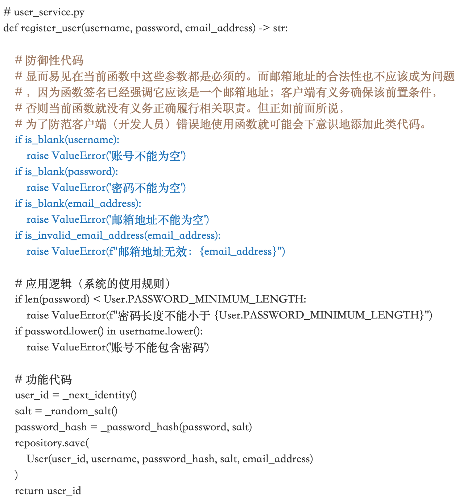
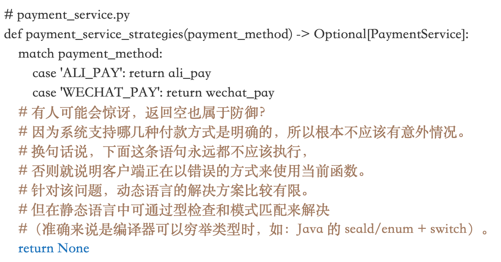
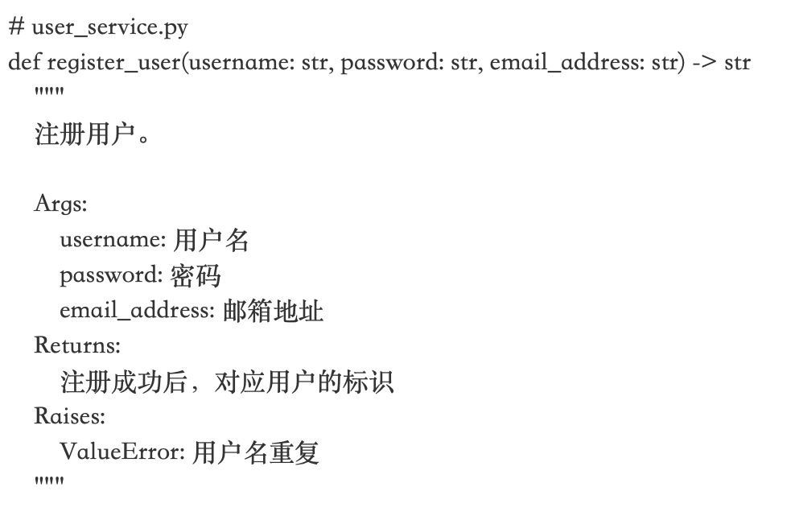
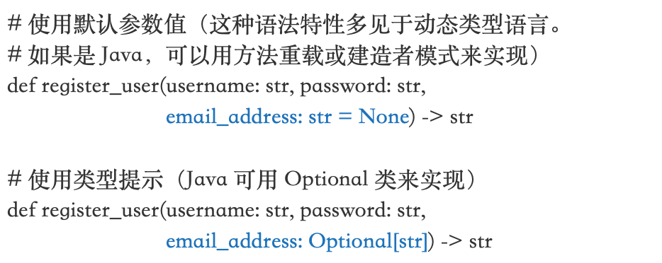
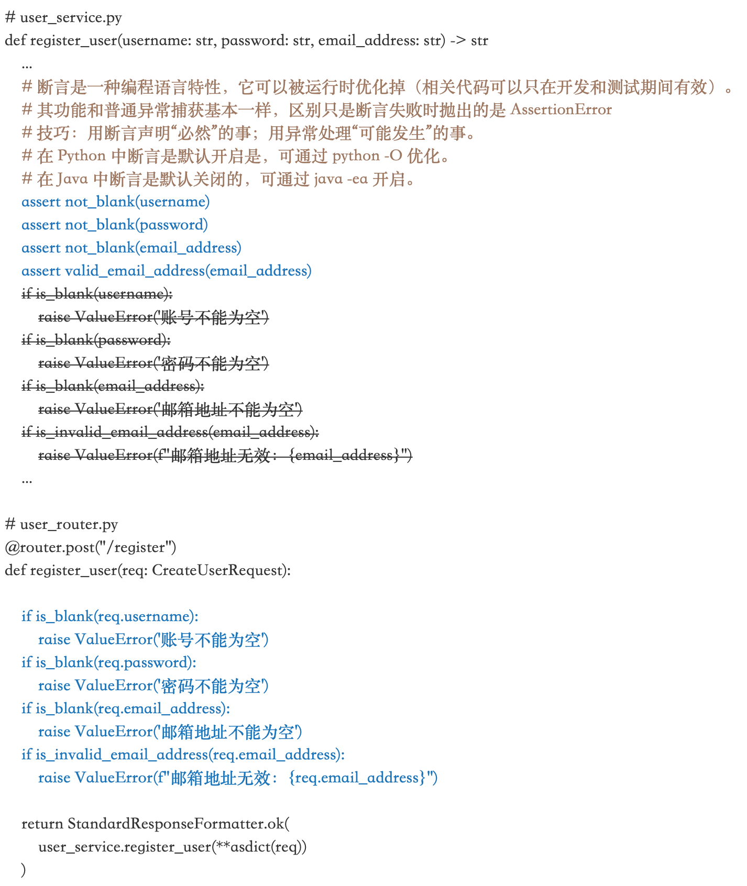
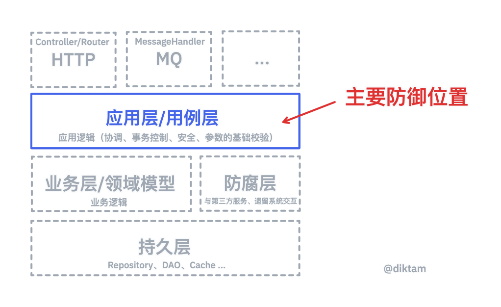
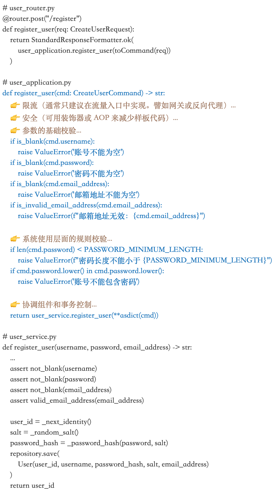

*防御性编程（Defensive programming）* 是指，在编写代码时，试图捕获和处理因客户端不当调用而引发的异常。
换句话说，一些问题本不应该发生，但出于对健壮性[^1]的考量而额外引入一些代码来防止异常情况。
有人认为这种前瞻性源自于开发人员自身的经验。因为曾经遇到过某种意外情况，所以在处理类似问题上会下意识地保护自己的代码。

例子 - 1

例子 - 2

适当的防御性编程可以提高代码的健壮性，但过度防御性编程则会带来一些问题：
- 会掩盖客户端程序（没有遵循契约来调用代码）的缺陷。注意，不要局限于上面两个简单的例子，一些防御性编程甚至会试图修复客户端的调用错误，而不是通知它们。这种处理方式会导致客户端的可靠性下降，因为它无法察觉问题的存在。
- 大量的检查语句会导致代码可读性下降。
- 防御性代码可能永远都不会起作用。此时这些代码不仅会影响执行性能，还会加重维护负担。因为其他人根本不知道它们是否有用，导致不敢删不敢改。
- 如果所有人都认为别人的代码不可靠，就会编写出现大量重复的检查语句。这会导致开发效率和代码的可维护性下降。

编程在很多时候都是带有主观性质的，所以才有人说编程其实是一种艺术（艺术与科学的区别在于前者具有强烈的主观性，而后者则具有客观性）。我发现确实有人认为上面提到的都不是问题，可能较为稳健的人会更趋向于尽可能地保护自己的代码。但根据经验而言，大量的防御性代码会影响可读性和可维护性。该问题曾困扰我好一段时间，这也是为什么会有这篇博客的原因。

有两种比较有效的方式可以防止过度地防御性编程，而且它们可以结合使用。
- *进攻性编程（Offensive programming）* ：本质上还是防御性编程，但强调只在程序无法控制的地方进行防御（主要位于外部输入位置。如：Controller/Router、持久层的客户端）。
- *契约式设计（Design by contract）* ：设计者需要精确地定义接口规范，以表达出 前置条件、后置条件和不变性 等信息。客户端需要在调用目标（接口规范实现）之前满足前置条件，而目标响应则必须满足后置条件和不变性。值得注意，遵循契约式设计可以让程序实现“快速失败”，因为客户端一旦发现前置条件不满足就不会继续调用目标。

进攻性编程的概念较简单，这里主要讲一下契约式设计。所谓“接口”并非指编程语言的特性（如：Java interface），而是指程序之间的交互边界（如：函数/方法签名、程序入口）。所以下面这个函数签名其实就是一个接口。客户端应该遵循该接口的规范来进行调用函数，否则函数没有义务确保能够正常地履行职责。这就是契约精神。

对于该函数而言，前置条件是，参数 username、password、email_address 都是必须的（因为没有任何表达“可选”语义的迹象），而且都是 str 数据类型。另外，email_address 还必须符合邮箱地址规格。后置条件是，在注册成功后返回对应的用户标识，它是一个 str 数据类型。而不变性则是，用户名发生重复时会抛出一个 ValueError 异常。

表达“可选”语义：

使用断言消除内部防御性代码，并将其转移到程序入口：

实际项目的“程序入口”在哪里需要视情况而定。如果系统只有单个用户界面（或相关逻辑无需复用时），可以像例子一样直接将防御性代码放在 Controller 或 Router 中。但稍微复杂一点的系统通常不只有一个用户界面或网络通信协议，此时可以将其放在应用层中。

引入应用层后，可以将所有应用逻辑放在该层中进行组织。

多说一句。个人真不建议太过依赖技术框架。虽然它们确实提供了不少便利性功能，但这些所谓的“便利”并不是没有代价的。
以参数校验为例，当系统需要同时支持多个用户界面或网络通信协议时，这部份逻辑通常无法实现复用。另外，一些技术框架还会对面向切面编程（AOP）进行支持，其中 Spring Framework 就以此闻名。AOP 主要是透过对代码进行横向切割来实现复用，但这会导致代码逻辑变得离散，从而严重影响程序本身的可理解性。简而言之开发出来的系统就是东拼西凑的感觉。而且框架本身利用 AOP 做了很多工作，但这部份内容开发者根本没有参与或思考过（就像如今 Vibe Coding 一样）。所以久而久之相关知识就会被弱化，从而导致编程能力下降。

## 参考资料
- [Defensive programming](https://en.wikipedia.org/wiki/Defensive_programming)
- [Design by contract](https://en.wikipedia.org/wiki/Design_by_contract)
- [Fail-fast system](https://en.wikipedia.org/wiki/Fail-fast_system)
- [Contracts Undefined Behavior and Defensive Programming](https://bloomberg.github.io/bde-resources/pdfs/Contracts_Undefined_Behavior_and_Defensive_Programming.pdf)
- [Does TDD make defensive programming redundant?](https://softwareengineering.stackexchange.com/questions/331864/does-tdd-make-defensive-programming-redundant)
- [Boilerplate code](https://en.wikipedia.org/wiki/Boilerplate_code)
- [Is AOP a type of decorator pattern?](https://stackoverflow.com/questions/8112111/is-aop-a-type-of-decorator-pattern)
- [Aspect-Oriented Programming](https://news.ycombinator.com/item?id=36308806)

[^1]: 健壮性（又称“鲁棒性”）是一种软件质量属性。用于衡量系统在遇到异常输入时，仍能保持正确或可接受行为的能力。