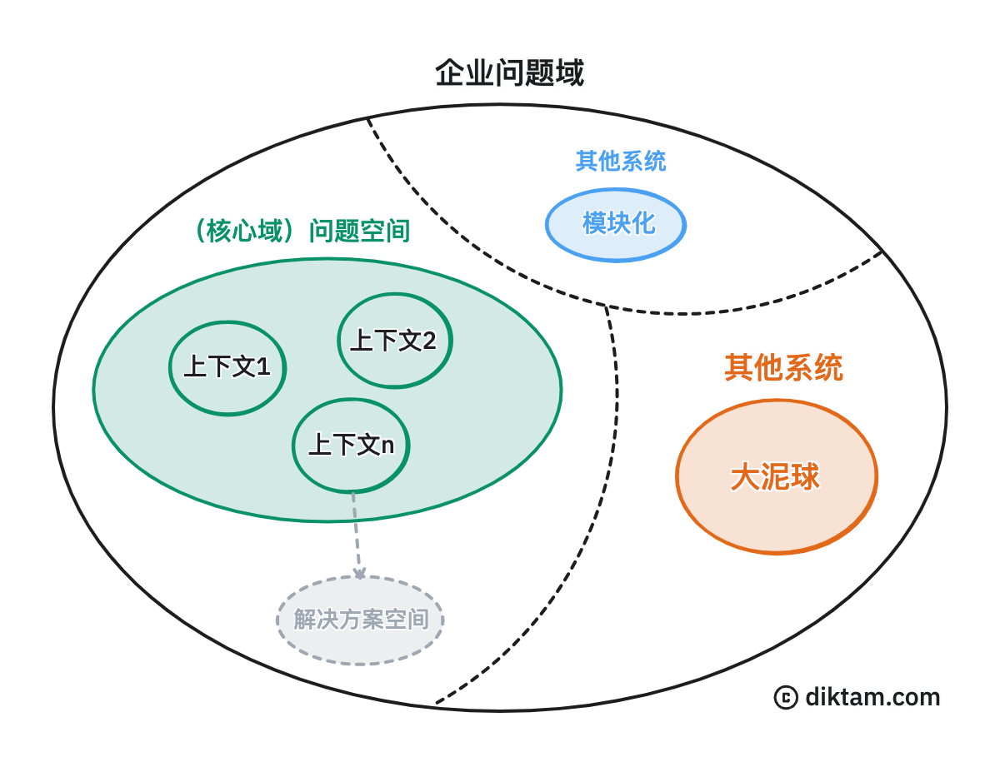

| 用语 
 | 解释 |
| ----------- | ----------- |
| 实体 | 从唯心主义哲学角度可将其理解为“能被意识到的对象”，这种对象本身可以客观存在或主观存在。在业务建模上下文中实体通常用来指代某种具有商业价值的概念。在编程上下文中则通常用来指代那些具有唯一性的对象。|
| 领域 | 人类知识和活动的逻辑边界。|
| 问题域 | 与领域的概念一致。但强调问题的存在，以及问题所处的上下文。使用该字眼时，通常意味着特定领域存在待解决的问题。|
| 形式化 | 将自然语言的句子或思维过程，转化为由符号表示的、具有清晰逻辑结构的人工语言的过程。|
| 以人为本 | 强调在处理问题时应优先考虑人的需求、价值和利益，而不是将“人”视为实现其他目标的工具。|

在软件工程中，理解概念模型[^1]非常重要。因为软件的价值本质上完全取决其概念模型的正确性和完整性（。该观点建立在“软件的最终目标是为了解决现实问题”的基础共识之上）。换句话说，用户真正关心的事是软件能不能解决他们正面临的问题。而**概念模型是在分析和探索问题域期间抽象出来的形式化产物，它与具体实现细节无关**。该过程可以得知软件需要解决的真正问题是什么，有哪些。此外，因为概念模型属于形式化产物（通常还是可视化的），所以它有利于让相关人员更好地理清和理解问题，以及在特定问题上达成共识。

> 进行概念建模时，需要用到一些高度抽象的工具来形式化问题域。解决方案通常是用[面向对象分析（OOA）]({})和各种[示意图（Diagram）](https://zh.wikipedia.org/wiki/%E5%9B%BE%E8%A7%A3)来达到目的。

在 1985 年，图灵奖得奖者 Fred Brooks 发布了一篇对软件工程领域影响深远的论文《没有银弹》[^2]。在该论文中，他提出了将软件复杂性划分为根本复杂性和次要复杂性的观点。
**根本复杂性源自于分析、探索和抽象概念模型的过程**。该过程基本上无法被简化，因为软件需求本身通常是模糊、抽象和复杂的，只有反复迭代才能慢慢趋向于完整和正确。所以 Fred Brooks 认为这是软件复杂性的主要瓶颈所在[^3]。而次要复杂性则源自将概念模型映射为机器语言的过程。但该部份复杂性可以运用科学的软件开发过程和技术手段来简化[^4]。

简而言之，软件工程中最为重要的是对问题域进行分析和建模，而非写代码。只有得到一个正确的概念模型后，其他活动才会有意义。而写代码仅仅只是解决问题的其中一种方案。该价值观应该始终放在首位。

### 问题空间

问题空间从字面上解释是指问题所能涉及的（业务）广度。换言之，这其实是一个关于分析和探索业务的过程。因为在企业上下文中，问题空间通常用来指代那些被重点关注的业务领域；而且还会以产品（或系统平台）级别的问题形式出现。例如在新能源问题域中，关于充电桩的管理和运营就可以是一个问题空间。站在软件工程角度，这通常意味着需要先对问题空间进行深入分析和探索，然后再构思出一个符合企业要求的解决方案。

在深入分析和探索问题空间的期间，各种业务问题会得到识别、理解和定义，所以概念模型会慢慢趋向于完整。只有当问题空间足够清晰后，真正的业务需求和痛点才会浮现。而要想做到这点，开发团队就应该与领域专家建立一种紧密且持续的合作关系。期间开发团队应该持续不断地向领域专家提出各种问题和假设，透过收集各种信息反馈来逐步校对和完善概念模型（。另外，与领域专家保持紧密的合作的另一个好处是可以更快地在各种问题上达成共识，以减少理解偏差）。

在领域驱动设计（DDD）中，问题空间通常属于子域级别（而且一般还是核心域）。换言之，透过对问题空间进行分析和探索就可以分解出一到多个上下文[^5]。

### 解决方案空间

当问题空间的概念模型足够清晰后，就可以开始为其寻找适合的解决方案了。所谓解决方案空间其实是指“所有可行或有助于解决问题的方法或手段”。譬如假设“如何从家里到公司上班”是一个问题空间，那么根据当前条件（如：时间、交通）进行思考，发现可行的解决方案包括但不限于步行、骑车、乘坐交通工具等。而这些方法（及其必须的支撑行为）就构成了一个解决方案空间。

和问题空间一样，解决方案空间同样需要进行分析、探索和分解。而且针对解决方案空间而进行的相关活动应该强依赖于问题空间的概念模型。因为只有在真正理解问题后才会有一个正确的思维基础。透过关注点分离，问题空间专注于剖析问题和需求，而解决方案空间则专注于寻求与之匹配的解决途径。所以绝不应该轻视与问题空间相关的工作。所以在展开解决方案空间相关工作之前通常已经对问题空间有了一个较为清晰的理解，加上企业的期望和资源条件通常是事前可知的，所以分析和探索解决方案空间的成本通常要比问题空间低得多。另外从企业角度而言，解决方案空间通常不只有“写代码”一种解决方案。在条件允许的情况下，也可以通过外包、开源系统、现有的旧系统、购买现成系统，甚至是由人工处理等方式来解决问题。

在领域驱动设计中，每个上下文都会有各自的解决方案空间。但这种多样性通常需要依赖分布式架构，因为单体架构的灵活性和扩展性非常有限。

[^1]: 概念模型、业务模型和领域模型，本质上是同一个东西。但值得注意，这里的领域模型并非指 DDD 领域模型模式中的领域模型。后者属于实现细节。
[^2]:《没有银弹》这篇论文后来被收录在 Fred Brooks 著作的《[人月神话](https://book.douban.com/subject/1105381/)》第 16 章中。
[^3]: 针对软件的根本复杂性，被证明有效的方案是快速原型设计。另外，敏捷开发提倡与客户一共工作，也可以达到同样目的。因为频繁地进行低成本的交流，可以更好地构建概念模型。
[^4]: 降低软件次要复杂性的方案参考：（1）落实敏捷开发，可以加速响应需求变化的效率（。需要摆脱官僚主义和明白以人为本）。（2）基于快速原型开发来验证概念模型。因为用户很可能只有在看到具体“实物”后才会有更多想法。（3）DevOps 可以加速反馈循环，能及早验证和暴露问题（。需要有完善的自动化测试套件和 CI/CD 管道）。（4）在复杂性较低，但重复性强的地方运行代码生成技术（如：低代码平台、人工智能助手），可以提高生产效率。
[^5]: 限界上下文（bounded context）是 DDD 的一种建模工具，用于明确 ubiquitous language（有时会翻译为“统一语言”或“通用语言”）的适用边界。从架构层面来说，限界上下文可作为软件的最大有效单体（物理）边界；在该边界内，模型的职责满足明确和唯一语义。
